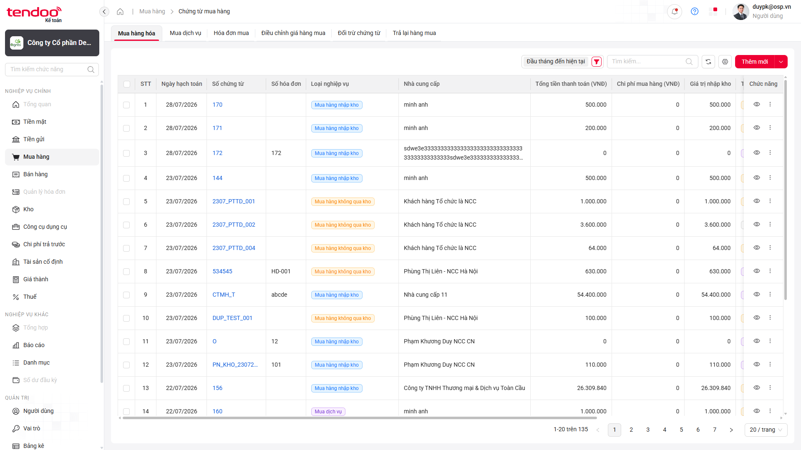

# 📋 Báo cáo kiểm thử — Danh sách Chứng từ mua hàng

> **Kết luận:** 🔴 Bộ kiểm thử **chưa đạt** — có **1/30 test FAIL** và **23/30 test SKIP** do thiếu dữ liệu kiểm soát hoặc UI chưa có control đúng theo manual testcase.

## Thông tin lần chạy

| Hạng mục | Chi tiết |
|---|---|
| 🗓️ Thời gian | 30/07/2026, 10:53–10:55 — Asia/Saigon |
| 🧪 Test suite | `src/tests/mua-hang/chung-tu-mua-hang.spec.ts` |
| 🌐 Trình duyệt | Chromium — headed mode |
| ⚙️ Cấu hình | `workers=1` · `retries=0` · reporter `line` |
| ⏱️ Thời lượng | 106,8 giây — khoảng 1 phút 47 giây |

## Tổng quan kết quả

| Tổng test | ✅ PASS | ❌ FAIL | ⏭️ SKIP | Tỷ lệ PASS |
|:---:|:---:|:---:|:---:|:---:|
| **30** | **6** | **1** | **23** | **20,0%** |

> Trong 7 test thực sự được thực thi đến assertion cuối, có 6 PASS và 1 FAIL — tỷ lệ PASS trên số test đã thực thi là **85,7%**.

<a id="dieu-huong-nhanh"></a>

### Điều hướng nhanh

- [Kết quả từng test case](#kết-quả-chi-tiết)
- [Phân tích các test SKIP](#phân-tích-các-test-skip)
- [Tổng hợp nhóm lỗi](#tổng-hợp-nhóm-lỗi)
- [BUG-CTMH-01 — Chứng từ Chưa ghi sổ không được highlight](#bug-ctmh-01--chứng-từ-chưa-ghi-sổ-không-được-highlight)

---

## Kết quả chi tiết

| TC ID | Kết quả | Nội dung chính |
|---|---|---|
| `CL-UAT-U-00506-01` | ✅ PASS | Hiển thị đầy đủ 15 cột theo expected |
| `CL-UAT-U-00506-02` | ❌ FAIL | Dòng Chưa ghi sổ có định dạng giống dòng Đã ghi sổ |
| `CL-UAT-U-00506-03` | ✅ PASS | Loại nghiệp vụ thuộc danh mục hợp lệ |
| `CL-UAT-U-00506-04` | ✅ PASS | Số hóa đơn nhiều/không có hóa đơn hiển thị đúng |
| `CL-UAT-U-00506-05` | ✅ PASS | Ngày, tiền và hyperlink Số chứng từ đúng định dạng |
| `CL-UAT-U-00506-06` | ⏭️ SKIP | Chưa có bộ dữ liệu kiểm soát để đối chiếu dòng Tổng cộng |
| `CL-UAT-U-00506-07` | ⏭️ SKIP | Chưa có dữ liệu truy vết chứng từ không có CPMH |
| `CL-UAT-U-00506-08` | ⏭️ SKIP | Chưa có dữ liệu CPMH ở trạng thái Chưa phân bổ |
| `CL-UAT-U-00506-09` | ⏭️ SKIP | Chưa có dữ liệu CPMH Phân bổ một phần |
| `CL-UAT-U-00506-10` | ⏭️ SKIP | Chưa có dữ liệu CPMH Hoàn thành phân bổ |
| `CL-UAT-U-00506-11` | ⏭️ SKIP | Manual yêu cầu nút Tìm kiếm, UI hiện chỉ xác minh được nút Lọc |
| `CL-UAT-U-00506-12` | ⏭️ SKIP | Chưa xác minh được control Ngày hạch toán = Hôm nay |
| `CL-UAT-U-00506-13` | ⏭️ SKIP | UI không có ô Số chứng từ riêng theo manual |
| `CL-UAT-U-00506-14` | ⏭️ SKIP | UI không có ô Số hóa đơn riêng theo manual |
| `CL-UAT-U-00506-15` | ⏭️ SKIP | UI không có ô Nhà cung cấp riêng theo manual |
| `CL-UAT-U-00506-16` | ⏭️ SKIP | UI không có control lọc Loại nghiệp vụ |
| `CL-UAT-U-00506-17` | ⏭️ SKIP | UI không có control lọc Hình thức |
| `CL-UAT-U-00506-18` | ⏭️ SKIP | UI không có control lọc Trạng thái chứng từ |
| `CL-UAT-U-00506-19` | ⏭️ SKIP | UI không có control lọc Trạng thái nhận hóa đơn |
| `CL-UAT-U-00506-20` | ⏭️ SKIP | UI không có control lọc Trạng thái thanh toán |
| `CL-UAT-U-00506-21` | ⏭️ SKIP | UI không có control lọc Tình trạng phân bổ |
| `CL-UAT-U-00506-22` | ⏭️ SKIP | Thiếu ba control để kiểm tra tìm kiếm kết hợp AND |
| `CL-UAT-U-00506-23` | ✅ PASS | Từ khóa unique không trả dữ liệu và hiển thị đúng thông báo |
| `CL-UAT-U-00506-24` | ⏭️ SKIP | UI không có đầy đủ điều kiện và nút Xóa bộ lọc theo manual |
| `CL-UAT-U-00506-25` | ⏭️ SKIP | Chưa có các control để kiểm tra giữ bộ lọc sau Làm mới |
| `CL-UAT-U-00506-26` | ⏭️ SKIP | UI chỉ có search chung, không có ba ô text theo manual |
| `CL-UAT-U-00506-27` | ✅ PASS | Mặc định 20 dòng và chuyển trang thành công |
| `CL-UAT-U-00506-28` | ⏭️ SKIP | Không có cột Thời gian tạo để xác minh sắp xếp mặc định |
| `CL-UAT-U-00506-29` | ⏭️ SKIP | Chưa có locator đã xác minh cho điều khiển sort |
| `CL-UAT-U-00506-30` | ⏭️ SKIP | Chưa có bằng chứng bộ lọc hiện tại là Ngày chứng từ |

[⬆️ Lên đầu](#dieu-huong-nhanh)

---

## Phân tích các test SKIP

| Nhóm nguyên nhân | Test case | Số lượng | Ghi chú |
|---|---|:---:|---|
| Thiếu dữ liệu kiểm soát/truy vết | TC06–TC10 | 5 | Cần dữ liệu xác định rõ Tổng cộng và các trạng thái CPMH |
| UI thiếu hoặc khác control so với manual | TC11–TC22, TC24–TC26, TC28–TC30 | 18 | Script không thay thế control hoặc suy diễn bước khác manual |

23 test SKIP là trạng thái có chủ đích trong code để tuân thủ manual testcase; không phải lỗi runtime và không được tính là PASS.

[⬆️ Lên đầu](#dieu-huong-nhanh)

---

## Tổng hợp nhóm lỗi

| Bug | Mức độ | Test ảnh hưởng | Tần suất | Mô tả ngắn |
|---|:---:|:---:|:---:|---|
| `BUG-CTMH-01` | 🟡 Medium | 1 | 1/1 | Dòng Chưa ghi sổ không có định dạng khác dòng Đã ghi sổ |

### 1. Sai khác trạng thái hiển thị — 1 test

- TC02 yêu cầu chứng từ **Chưa ghi sổ** phải được highlight để phân biệt với chứng từ **Đã ghi sổ**.
- Trong lần chạy, chữ, màu nền, font, border và decoration thu được từ hai loại dòng là giống nhau.
- Đây là kết quả so sánh computed style trực tiếp trên UI, không phải lỗi locator.

[⬆️ Lên đầu](#dieu-huong-nhanh)

---

## Chi tiết lỗi

<a id="bug-ctmh-01--chứng-từ-chưa-ghi-sổ-không-được-highlight"></a>

### BUG-CTMH-01 — Chứng từ Chưa ghi sổ không được highlight

> 🟡 **Medium** · UI/Functional · Tái hiện **1/1**

#### Thông tin chung của bug

| Thuộc tính | Giá trị |
|---|---|
| Test case | `CL-UAT-U-00506-02` |
| Module | Mua hàng → Chứng từ mua hàng → Danh sách |
| Phân loại | UI/Functional |
| Mức độ đề xuất | 🟡 Medium |
| Trạng thái | 🔵 Open |

#### Điều kiện ban đầu

- Đã đăng nhập bằng tài khoản có quyền Kế toán viên.
- Đang ở màn hình danh sách Chứng từ mua hàng.
- Danh sách đồng thời có chứng từ ở trạng thái **Đã ghi sổ** và **Chưa ghi sổ**.

#### Các bước tái hiện

1. Đăng nhập hệ thống bằng tài khoản Kế toán viên.
2. Truy cập **Mua hàng → Chứng từ mua hàng**.
3. Quan sát danh sách chứng từ sau khi tải hoàn tất.
4. Xác định một dòng có Trạng thái chứng từ **Chưa ghi sổ**.
5. Xác định một dòng có Trạng thái chứng từ **Đã ghi sổ**.
6. So sánh màu nền, màu chữ, font weight, border và text decoration giữa hai dòng.

#### So sánh kết quả

| Hạng mục | Expected | Actual |
|---|---|---|
| Định dạng dòng Chưa ghi sổ | Có định dạng/highlight khác dòng Đã ghi sổ để người dùng phân biệt trạng thái | Computed style của dòng Chưa ghi sổ và Đã ghi sổ giống nhau |
| Màu nền chính | Có khác biệt trực quan theo manual testcase | Cả hai cùng `rgba(0, 0, 0, 0)` trên các cell và nền trắng ở cell cuối |
| Màu chữ/font | Có ít nhất một thuộc tính tạo khác biệt | Cả hai cùng màu `rgba(0, 0, 0, 0.88)` và font weight `400` |

Người dùng không thể nhận biết chứng từ chưa ghi sổ bằng highlight trên danh sách như yêu cầu.

#### Tần suất bug

- **1/1 lần (100%)** trong lần chạy này.
- Chạy với `retries=0`; không sử dụng retry để che kết quả.

#### Dữ liệu test

| Trường dữ liệu | Giá trị |
|---|---|
| Trạng thái so sánh 1 | `Chưa ghi sổ` |
| Trạng thái so sánh 2 | `Đã ghi sổ` |
| Nguồn dữ liệu | Các dòng hiện có trên trang 1 của danh sách |

#### Ảnh bằng chứng



*Ảnh 1 — Danh sách có cả trạng thái Chưa ghi sổ và Đã ghi sổ nhưng không có khác biệt highlight.*  
[🔍 Mở ảnh gốc](./evidence/chung-tu-mua-hang-2026-07-30-105540/BUG-CTMH-01-TC02.png)

[⬆️ Lên đầu](#dieu-huong-nhanh)

---

## Thông tin kỹ thuật

### Lệnh đã chạy

```powershell
npx playwright test src/tests/mua-hang/chung-tu-mua-hang.spec.ts --headed --workers=1 --retries=0 --reporter=line
```

### Artifacts

- Evidence lâu dài: `report/evidence/chung-tu-mua-hang-2026-07-30-105540/`
- Artifacts tạm: `test-results/`, `playwright-report/`, `allure-results/`

> [!NOTE]
> Báo cáo phản ánh nguyên trạng lần chạy với `retries=0`. Không sửa expected hoặc automation chỉ để làm thay đổi kết quả báo cáo.
