
# BÁO CÁO KẾT QUẢ KIỂM THỬ — THÊM MỚI VẬT TƯ HÀNG HÓA

> **Kết luận:** Kết quả sau khi rerun riêng TC212: 219 PASS, 50 FAIL và 29 BLOCK. PASS rate 73.49%. Ghi nhận 14 nhóm bug sản phẩm.

## Thông tin lần chạy

| Trường | Giá trị |
|---|---|
| Thời gian bắt đầu | 11/08/2026 14:43:09 (Asia/Saigon) |
| Thời gian kết thúc | 11/08/2026 15:11:55 (Asia/Saigon) |
| Test suite | `src/tests/danh-muc/pmkt-u-00106_vat_tu/them-moi-vat-tu-hang-hoa.spec.ts` |
| Trình duyệt | Chromium headless, 1 worker, retries=0 |
| Thời lượng | 28 phút 48 giây |

## Tổng quan kết quả

| Tổng | PASS | FAIL | SKIP/BLOCK | PASS rate |
|---:|---:|---:|---:|---:|
| 298 | 219 | 50 | 29 (toàn bộ là BLOCK) | 73.49% |

## Điều hướng nhanh

- [Kết quả chi tiết](#kết-quả-chi-tiết)
- [Tổng hợp nhóm lỗi](#tổng-hợp-nhóm-lỗi)
- [BUG-VTHH-01 — Mô tả tính chất Bán thành phẩm không khớp testcase](#bug-vthh-01)
- [BUG-VTHH-02 — Nội dung validate trường bắt buộc không khớp testcase](#bug-vthh-02)
- [BUG-VTHH-03 — Phím Up/Down không làm thay đổi vùng chọn trên combogrid](#bug-vthh-03)
- [BUG-VTHH-04 — Tài khoản full quyền không thấy nút Thêm nhanh Đơn vị tính](#bug-vthh-04)
- [BUG-VTHH-05 — Tài khoản Ngừng hoạt động có trong DB nhưng không hiển thị trên combogrid](#bug-vthh-05)
- [BUG-VTHH-06 — Thông báo bắt buộc Phương pháp tính giá khác testcase](#bug-vthh-06)
- [BUG-VTHH-07 — Thuế nhập khẩu/xuất khẩu không reset khi đổi sang Nguyên vật liệu](#bug-vthh-07)
- [BUG-VTHH-08 — Nhãn Thuế Tài nguyên sai kiểu chữ so với testcase](#bug-vthh-08)
- [BUG-VTHH-09 — Dropdown Thuế Tài nguyên không hiển thị cấu trúc combogrid bốn cột](#bug-vthh-09)
- [BUG-VTHH-10 — Lưới Đơn vị quy đổi sai tên cột và thiếu dấu bắt buộc](#bug-vthh-10)
- [BUG-VTHH-11 — Dropdown Đơn vị quy đổi thiếu header và không tìm được dữ liệu theo trạng thái](#bug-vthh-11)
- [BUG-VTHH-12 — Không hiện xác nhận khi chọn Đơn vị quy đổi Ngừng hoạt động](#bug-vthh-12)
- [BUG-VTHH-13 — Lưới Đơn vị quy đổi không hiển thị thông báo validate](#bug-vthh-13)
- [BUG-VTHH-14 — Giá trị thuế suất hiển thị 0 trên UI nhưng lưu NULL trong DB](#bug-vthh-14)

## Kết quả chi tiết

| TC ID | Kết quả | Nội dung chính |
|---|---|---|
| `TC_PMKT-U-00106-4` | ❌ FAIL | hiển thị popup chọn tính chất với đủ 6 loại vật tư — BUG-VTHH-01 |
| `TC_PMKT-U-00106-5` | ✅ PASS | đóng popup Chọn tính chất bằng icon X |
| `TC_PMKT-U-00106-6` | ✅ PASS | chọn Hàng hóa và hiển thị form thông tin tương ứng |
| `TC_PMKT-U-00106-7` | ❌ FAIL | Thay đổi tính chất hiển thị lại popup đủ 6 lựa chọn — BUG-VTHH-01 |
| `TC_PMKT-U-00106-8` | ✅ PASS | đóng popup thay đổi và giữ nguyên Hàng hóa cùng dữ liệu đang nhập |
| `TC_PMKT-U-00106-9` | ✅ PASS | thay đổi tính chất từ Hàng hóa sang Dịch vụ |
| `TC_PMKT-U-00106-10` | ✅ PASS | hiển thị TextBox Mã vật tư bắt buộc |
| `TC_PMKT-U-00106-11` | ✅ PASS | nhập Mã vật tư dài 49 ký tự |
| `TC_PMKT-U-00106-12` | ✅ PASS | nhập Mã vật tư dài tối đa 50 ký tự |
| `TC_PMKT-U-00106-13` | ✅ PASS | chặn ký tự thứ 51 của Mã vật tư |
| `TC_PMKT-U-00106-14` | ❌ FAIL | validate bỏ trống Mã vật tư khi Lưu — BUG-VTHH-02 |
| `TC_PMKT-U-00106-15` | ✅ PASS | validate trùng Mã vật tư đã tồn tại |
| `TC_PMKT-U-00106-16` | ✅ PASS | hiển thị TextBox Tên vật tư bắt buộc |
| `TC_PMKT-U-00106-17` | ✅ PASS | nhập Tên vật tư dài 254 ký tự |
| `TC_PMKT-U-00106-18` | ✅ PASS | nhập Tên vật tư dài tối đa 255 ký tự |
| `TC_PMKT-U-00106-19` | ✅ PASS | chặn ký tự thứ 256 của Tên vật tư |
| `TC_PMKT-U-00106-20` | ❌ FAIL | validate bỏ trống Tên vật tư khi Lưu — BUG-VTHH-02 |
| `TC_PMKT-U-00106-21` | ✅ PASS | hiển thị Dropdown Nhóm vật tư không bắt buộc |
| `TC_PMKT-U-00106-22` | ✅ PASS | hiển thị đúng dữ liệu và thứ tự Dropdown Nhóm vật tư |
| `TC_PMKT-U-00106-23` | ✅ PASS | Nhóm vật tư Ngừng hoạt động hiển thị chữ màu xám |
| `TC_PMKT-U-00106-24` | ✅ PASS | chọn một Nhóm vật tư |
| `TC_PMKT-U-00106-25` | ✅ PASS | chọn đồng thời hai Nhóm vật tư |
| `TC_PMKT-U-00106-26` | ✅ PASS | xóa riêng tag Nhóm vật tư thứ hai |
| `TC_PMKT-U-00106-27` | ✅ PASS | xóa nhanh toàn bộ Nhóm vật tư đã chọn |
| `TC_PMKT-U-00106-28` | ✅ PASS | hiển thị Select Loại hàng hóa đặc trưng không bắt buộc |
| `TC_PMKT-U-00106-29` | ✅ PASS | hiển thị các option Loại hàng hóa đặc trưng của Hàng hóa |
| `TC_PMKT-U-00106-30` | ✅ PASS | hiển thị Combogrid Đơn vị tính chính bắt buộc |
| `TC_PMKT-U-00106-31` | ✅ PASS | hiển thị đúng cột, dữ liệu và thứ tự Đơn vị tính chính |
| `TC_PMKT-U-00106-32` | ✅ PASS | Đơn vị tính Ngừng hoạt động hiển thị chữ màu xám |
| `TC_PMKT-U-00106-33` | ✅ PASS | xác nhận sử dụng Đơn vị tính Ngừng hoạt động |
| `TC_PMKT-U-00106-34` | ✅ PASS | hủy sử dụng Đơn vị tính Ngừng hoạt động |
| `TC_PMKT-U-00106-35` | ✅ PASS | chọn Đơn vị tính chính Hoạt động không hiển thị cảnh báo |
| `TC_PMKT-U-00106-36` | ✅ PASS | tìm kiếm Đơn vị tính chính theo Mã |
| `TC_PMKT-U-00106-37` | ✅ PASS | tìm kiếm Đơn vị tính chính theo Tên |
| `TC_PMKT-U-00106-38` | ✅ PASS | tìm kiếm Đơn vị tính chính theo Trạng thái |
| `TC_PMKT-U-00106-39` | ✅ PASS | phím Enter chọn dòng đầu tiên của kết quả tìm kiếm |
| `TC_PMKT-U-00106-40` | ❌ FAIL | phím Up và Down di chuyển vùng chọn — BUG-VTHH-03 |
| `TC_PMKT-U-00106-41` | ✅ PASS | phím ESC đóng dropdown và giữ nguyên giá trị |
| `TC_PMKT-U-00106-42` | ✅ PASS | icon X xóa nhanh Đơn vị tính chính đã chọn |
| `TC_PMKT-U-00106-43` | ❌ FAIL | hiển thị nút thêm nhanh Đơn vị tính với tài khoản full quyền — BUG-VTHH-04 |
| `TC_PMKT-U-00106-44` | 🟣 BLOCK | giao diện form thêm nhanh Đơn vị tính rút gọn — BLOCK bởi TC43: không có nút Thêm nhanh Đơn vị tính |
| `TC_PMKT-U-00106-45` | 🟣 BLOCK | validate bắt buộc form thêm nhanh Đơn vị tính — BLOCK bởi TC43: không có nút Thêm nhanh Đơn vị tính |
| `TC_PMKT-U-00106-46` | 🟣 BLOCK | validate trùng Mã form thêm nhanh Đơn vị tính — BLOCK bởi TC43: không có nút Thêm nhanh Đơn vị tính |
| `TC_PMKT-U-00106-47` | 🟣 BLOCK | boundary Mã form thêm nhanh Đơn vị tính — BLOCK bởi TC43: không có nút Thêm nhanh Đơn vị tính |
| `TC_PMKT-U-00106-48` | 🟣 BLOCK | boundary Tên form thêm nhanh Đơn vị tính — BLOCK bởi TC43: không có nút Thêm nhanh Đơn vị tính |
| `TC_PMKT-U-00106-49` | 🟣 BLOCK | lưu thêm nhanh Đơn vị tính và tự động điền — BLOCK bởi TC43: không có nút Thêm nhanh Đơn vị tính |
| `TC_PMKT-U-00106-50` | 🟣 BLOCK | hủy form thêm nhanh Đơn vị tính — BLOCK bởi TC43: không có nút Thêm nhanh Đơn vị tính |
| `TC_PMKT-U-00106-51` | ✅ PASS | validate bắt buộc Đơn vị tính chính |
| `TC_PMKT-U-00106-52` | ✅ PASS | hiển thị checkbox Giảm thuế theo quy định không bắt buộc |
| `TC_PMKT-U-00106-53` | ✅ PASS | checkbox Giảm thuế mặc định false và thay đổi được |
| `TC_PMKT-U-00106-54` | ✅ PASS | hiển thị Numeric Thời hạn bảo hành không bắt buộc |
| `TC_PMKT-U-00106-55` | ✅ PASS | nhập thời hạn bảo hành nguyên dương và chọn Tháng |
| `TC_PMKT-U-00106-56` | ✅ PASS | validate thời hạn bảo hành với số âm, số 0 và số thập phân |
| `TC_PMKT-U-00106-57` | ✅ PASS | ẩn thời hạn bảo hành khi đổi sang Dịch vụ |
| `TC_PMKT-U-00106-58` | ✅ PASS | reset thời hạn bảo hành khi đổi sang Nguyên vật liệu |
| `TC_PMKT-U-00106-59` | ✅ PASS | hiển thị TextArea Mô tả không bắt buộc |
| `TC_PMKT-U-00106-60` | ✅ PASS | boundary Mô tả 499 ký tự |
| `TC_PMKT-U-00106-61` | ✅ PASS | boundary Mô tả 500 ký tự |
| `TC_PMKT-U-00106-62` | ✅ PASS | boundary Mô tả 501 ký tự |
| `TC_PMKT-U-00106-63` | ✅ PASS | hiển thị TextBox Tên vật tư khi mua không bắt buộc |
| `TC_PMKT-U-00106-64` | ✅ PASS | boundary Tên vật tư khi mua 254 ký tự |
| `TC_PMKT-U-00106-65` | ✅ PASS | boundary Tên vật tư khi mua 255 ký tự |
| `TC_PMKT-U-00106-66` | ✅ PASS | boundary Tên vật tư khi mua 256 ký tự |
| `TC_PMKT-U-00106-67` | ✅ PASS | hiển thị TextBox Tên vật tư khi bán không bắt buộc |
| `TC_PMKT-U-00106-68` | ✅ PASS | boundary Tên vật tư khi bán 254 ký tự |
| `TC_PMKT-U-00106-69` | ✅ PASS | boundary Tên vật tư khi bán 255 ký tự |
| `TC_PMKT-U-00106-70` | ✅ PASS | boundary Tên vật tư khi bán 256 ký tự |
| `TC_PMKT-U-00106-71` | ✅ PASS | Tên vật tư khi mua tự điền và cho phép sửa độc lập |
| `TC_PMKT-U-00106-72` | ✅ PASS | Tên vật tư khi bán tự điền và cho phép sửa độc lập |
| `TC_PMKT-U-00106-73` | ✅ PASS | hiển thị control Ảnh không bắt buộc |
| `TC_PMKT-U-00106-74` | ✅ PASS | tải ảnh JPG 1.5MB |
| `TC_PMKT-U-00106-75` | ✅ PASS | tải ảnh JPG 2MB |
| `TC_PMKT-U-00106-76` | ✅ PASS | chặn ảnh JPG 2.1MB |
| `TC_PMKT-U-00106-77` | ✅ PASS | tải ảnh PNG 1.5MB |
| `TC_PMKT-U-00106-78` | ✅ PASS | tải ảnh PNG 2MB |
| `TC_PMKT-U-00106-79` | ✅ PASS | chặn ảnh PNG 2.1MB |
| `TC_PMKT-U-00106-80` | ✅ PASS | tải ảnh WEBP 1.5MB |
| `TC_PMKT-U-00106-81` | ✅ PASS | tải ảnh WEBP 2MB |
| `TC_PMKT-U-00106-82` | ✅ PASS | chặn ảnh WEBP 2.1MB |
| `TC_PMKT-U-00106-83` | ✅ PASS | chặn file PDF không phải định dạng ảnh hợp lệ |
| `TC_PMKT-U-00106-84` | ✅ PASS | ẩn trường Ảnh khi đổi sang Dịch vụ |
| `TC_PMKT-U-00106-85` | ✅ PASS | reset ảnh khi đổi sang Nguyên vật liệu |
| `TC_PMKT-U-00106-86` | ✅ PASS | hiển thị Toggle Trạng thái bắt buộc |
| `TC_PMKT-U-00106-87` | ✅ PASS | Trạng thái mặc định Hoạt động và thay đổi được |
| `TC_PMKT-U-00106-88` | ✅ PASS | tự điền 7 tài khoản theo cấu hình Hàng hóa trong DB |
| `TC_PMKT-U-00106-89` | ✅ PASS | hiển thị Combogrid Tài khoản vật tư không bắt buộc |
| `TC_PMKT-U-00106-90` | ❌ FAIL | hiển thị đúng cột, dữ liệu và thứ tự Tài khoản vật tư — BUG-VTHH-05 |
| `TC_PMKT-U-00106-91` | ❌ FAIL | Tài khoản vật tư Ngừng hoạt động hiển thị chữ màu xám — BUG-VTHH-05 |
| `TC_PMKT-U-00106-92` | 🟣 BLOCK | xác nhận sử dụng Tài khoản vật tư Ngừng hoạt động — BLOCK do testcase tiền điều kiện tài khoản Ngừng hoạt động thất bại |
| `TC_PMKT-U-00106-93` | 🟣 BLOCK | hủy sử dụng Tài khoản vật tư Ngừng hoạt động — BLOCK do testcase tiền điều kiện tài khoản Ngừng hoạt động thất bại |
| `TC_PMKT-U-00106-94` | ✅ PASS | chọn Tài khoản vật tư Hoạt động không hiển thị cảnh báo |
| `TC_PMKT-U-00106-95` | ✅ PASS | tìm Tài khoản vật tư theo Số hiệu TK |
| `TC_PMKT-U-00106-96` | ✅ PASS | tìm Tài khoản vật tư theo Tên TK |
| `TC_PMKT-U-00106-97` | ❌ FAIL | tìm Tài khoản vật tư theo Trạng thái — BUG-VTHH-05 |
| `TC_PMKT-U-00106-98` | ✅ PASS | Enter chọn dòng Tài khoản vật tư đầu tiên |
| `TC_PMKT-U-00106-99` | ❌ FAIL | phím Up và Down di chuyển từng dòng Tài khoản vật tư — BUG-VTHH-03 |
| `TC_PMKT-U-00106-100` | ✅ PASS | ESC đóng dropdown Tài khoản vật tư không đổi giá trị |
| `TC_PMKT-U-00106-101` | ✅ PASS | icon X xóa nhanh Tài khoản vật tư |
| `TC_PMKT-U-00106-102` | ✅ PASS | ẩn Tài khoản vật tư khi đổi sang Dịch vụ |
| `TC_PMKT-U-00106-103` | ✅ PASS | reset Tài khoản vật tư khi đổi sang Nguyên vật liệu |
| `TC_PMKT-U-00106-104` | ✅ PASS | hiển thị combogrid Tài khoản giá vốn không bắt buộc |
| `TC_PMKT-U-00106-105` | ❌ FAIL | hiển thị đúng cột, dữ liệu và thứ tự Tài khoản giá vốn — BUG-VTHH-05 |
| `TC_PMKT-U-00106-106` | ❌ FAIL | Tài khoản giá vốn Ngừng hoạt động hiển thị chữ màu xám — BUG-VTHH-05 |
| `TC_PMKT-U-00106-107` | 🟣 BLOCK | xác nhận sử dụng Tài khoản giá vốn Ngừng hoạt động — BLOCK do testcase tiền điều kiện tài khoản Ngừng hoạt động thất bại |
| `TC_PMKT-U-00106-108` | 🟣 BLOCK | hủy sử dụng Tài khoản giá vốn Ngừng hoạt động — BLOCK do testcase tiền điều kiện tài khoản Ngừng hoạt động thất bại |
| `TC_PMKT-U-00106-109` | ✅ PASS | chọn Tài khoản giá vốn Hoạt động không hiển thị cảnh báo |
| `TC_PMKT-U-00106-110` | ✅ PASS | tìm Tài khoản giá vốn theo Số hiệu TK |
| `TC_PMKT-U-00106-111` | ✅ PASS | tìm Tài khoản giá vốn theo Tên TK |
| `TC_PMKT-U-00106-112` | ✅ PASS | tìm Tài khoản giá vốn theo Trạng thái |
| `TC_PMKT-U-00106-113` | ✅ PASS | Enter chọn dòng Tài khoản giá vốn đầu tiên |
| `TC_PMKT-U-00106-114` | ❌ FAIL | phím Up và Down di chuyển từng dòng Tài khoản giá vốn — BUG-VTHH-03 |
| `TC_PMKT-U-00106-115` | ✅ PASS | ESC đóng dropdown Tài khoản giá vốn không đổi giá trị |
| `TC_PMKT-U-00106-116` | ✅ PASS | icon X xóa nhanh Tài khoản giá vốn |
| `TC_PMKT-U-00106-117` | ✅ PASS | ẩn Tài khoản giá vốn khi đổi sang Dịch vụ |
| `TC_PMKT-U-00106-118` | ✅ PASS | reset Tài khoản giá vốn khi đổi sang Nguyên vật liệu |
| `TC_PMKT-U-00106-119` | ✅ PASS | hiển thị combogrid Tài khoản doanh thu không bắt buộc |
| `TC_PMKT-U-00106-120` | ❌ FAIL | hiển thị đúng cột, dữ liệu và thứ tự Tài khoản doanh thu — BUG-VTHH-05 |
| `TC_PMKT-U-00106-121` | ❌ FAIL | Tài khoản doanh thu Ngừng hoạt động hiển thị chữ màu xám — BUG-VTHH-05 |
| `TC_PMKT-U-00106-122` | 🟣 BLOCK | xác nhận sử dụng Tài khoản doanh thu Ngừng hoạt động — BLOCK do testcase tiền điều kiện tài khoản Ngừng hoạt động thất bại |
| `TC_PMKT-U-00106-123` | 🟣 BLOCK | hủy sử dụng Tài khoản doanh thu Ngừng hoạt động — BLOCK do testcase tiền điều kiện tài khoản Ngừng hoạt động thất bại |
| `TC_PMKT-U-00106-124` | ✅ PASS | chọn Tài khoản doanh thu Hoạt động không hiển thị cảnh báo |
| `TC_PMKT-U-00106-125` | ✅ PASS | tìm Tài khoản doanh thu theo Số hiệu TK |
| `TC_PMKT-U-00106-126` | ✅ PASS | tìm Tài khoản doanh thu theo Tên TK |
| `TC_PMKT-U-00106-127` | ✅ PASS | tìm Tài khoản doanh thu theo Trạng thái |
| `TC_PMKT-U-00106-128` | ✅ PASS | Enter chọn dòng Tài khoản doanh thu đầu tiên |
| `TC_PMKT-U-00106-129` | ❌ FAIL | phím Up và Down di chuyển từng dòng Tài khoản doanh thu — BUG-VTHH-03 |
| `TC_PMKT-U-00106-130` | ✅ PASS | ESC đóng dropdown Tài khoản doanh thu không đổi giá trị |
| `TC_PMKT-U-00106-131` | ✅ PASS | icon X xóa nhanh Tài khoản doanh thu |
| `TC_PMKT-U-00106-132` | ✅ PASS | hiển thị combogrid Tài khoản hàng bán trả lại không bắt buộc |
| `TC_PMKT-U-00106-133` | ❌ FAIL | hiển thị đúng cột, dữ liệu và thứ tự Tài khoản hàng bán trả lại — BUG-VTHH-05 |
| `TC_PMKT-U-00106-134` | ❌ FAIL | Tài khoản hàng bán trả lại Ngừng hoạt động hiển thị chữ màu xám — BUG-VTHH-05 |
| `TC_PMKT-U-00106-135` | 🟣 BLOCK | xác nhận sử dụng Tài khoản hàng bán trả lại Ngừng hoạt động — BLOCK do testcase tiền điều kiện tài khoản Ngừng hoạt động thất bại |
| `TC_PMKT-U-00106-136` | 🟣 BLOCK | hủy sử dụng Tài khoản hàng bán trả lại Ngừng hoạt động — BLOCK do testcase tiền điều kiện tài khoản Ngừng hoạt động thất bại |
| `TC_PMKT-U-00106-137` | ✅ PASS | chọn Tài khoản hàng bán trả lại Hoạt động không hiển thị cảnh báo |
| `TC_PMKT-U-00106-138` | ✅ PASS | tìm Tài khoản hàng bán trả lại theo Số hiệu TK |
| `TC_PMKT-U-00106-139` | ✅ PASS | tìm Tài khoản hàng bán trả lại theo Tên TK |
| `TC_PMKT-U-00106-140` | ✅ PASS | tìm Tài khoản hàng bán trả lại theo Trạng thái |
| `TC_PMKT-U-00106-141` | ✅ PASS | Enter chọn dòng Tài khoản hàng bán trả lại đầu tiên |
| `TC_PMKT-U-00106-142` | ❌ FAIL | phím Up và Down di chuyển từng dòng Tài khoản hàng bán trả lại — BUG-VTHH-03 |
| `TC_PMKT-U-00106-143` | ✅ PASS | ESC đóng dropdown Tài khoản hàng bán trả lại không đổi giá trị |
| `TC_PMKT-U-00106-144` | ✅ PASS | icon X xóa nhanh Tài khoản hàng bán trả lại |
| `TC_PMKT-U-00106-145` | ✅ PASS | hiển thị combogrid Tài khoản chi phí không bắt buộc |
| `TC_PMKT-U-00106-146` | ❌ FAIL | hiển thị đúng cột, dữ liệu và thứ tự Tài khoản chi phí — BUG-VTHH-05 |
| `TC_PMKT-U-00106-147` | ❌ FAIL | Tài khoản chi phí Ngừng hoạt động hiển thị chữ màu xám — BUG-VTHH-05 |
| `TC_PMKT-U-00106-148` | 🟣 BLOCK | xác nhận sử dụng Tài khoản chi phí Ngừng hoạt động — BLOCK do testcase tiền điều kiện tài khoản Ngừng hoạt động thất bại |
| `TC_PMKT-U-00106-149` | 🟣 BLOCK | hủy sử dụng Tài khoản chi phí Ngừng hoạt động — BLOCK do testcase tiền điều kiện tài khoản Ngừng hoạt động thất bại |
| `TC_PMKT-U-00106-150` | ✅ PASS | chọn Tài khoản chi phí Hoạt động không hiển thị cảnh báo |
| `TC_PMKT-U-00106-151` | ✅ PASS | tìm Tài khoản chi phí theo Số hiệu TK |
| `TC_PMKT-U-00106-152` | ✅ PASS | tìm Tài khoản chi phí theo Tên TK |
| `TC_PMKT-U-00106-153` | ✅ PASS | tìm Tài khoản chi phí theo Trạng thái |
| `TC_PMKT-U-00106-154` | ✅ PASS | Enter chọn dòng Tài khoản chi phí đầu tiên |
| `TC_PMKT-U-00106-155` | ❌ FAIL | phím Up và Down di chuyển từng dòng Tài khoản chi phí — BUG-VTHH-03 |
| `TC_PMKT-U-00106-156` | ✅ PASS | ESC đóng dropdown Tài khoản chi phí không đổi giá trị |
| `TC_PMKT-U-00106-157` | ✅ PASS | icon X xóa nhanh Tài khoản chi phí |
| `TC_PMKT-U-00106-158` | ✅ PASS | hiển thị combogrid Tài khoản chiết khấu không bắt buộc |
| `TC_PMKT-U-00106-159` | ❌ FAIL | hiển thị đúng cột, dữ liệu và thứ tự Tài khoản chiết khấu — BUG-VTHH-05 |
| `TC_PMKT-U-00106-160` | ❌ FAIL | Tài khoản chiết khấu Ngừng hoạt động hiển thị chữ màu xám — BUG-VTHH-05 |
| `TC_PMKT-U-00106-161` | 🟣 BLOCK | xác nhận sử dụng Tài khoản chiết khấu Ngừng hoạt động — BLOCK do testcase tiền điều kiện tài khoản Ngừng hoạt động thất bại |
| `TC_PMKT-U-00106-162` | 🟣 BLOCK | hủy sử dụng Tài khoản chiết khấu Ngừng hoạt động — BLOCK do testcase tiền điều kiện tài khoản Ngừng hoạt động thất bại |
| `TC_PMKT-U-00106-163` | ✅ PASS | chọn Tài khoản chiết khấu Hoạt động không hiển thị cảnh báo |
| `TC_PMKT-U-00106-164` | ✅ PASS | tìm Tài khoản chiết khấu theo Số hiệu TK |
| `TC_PMKT-U-00106-165` | ✅ PASS | tìm Tài khoản chiết khấu theo Tên TK |
| `TC_PMKT-U-00106-166` | ✅ PASS | tìm Tài khoản chiết khấu theo Trạng thái |
| `TC_PMKT-U-00106-167` | ✅ PASS | Enter chọn dòng Tài khoản chiết khấu đầu tiên |
| `TC_PMKT-U-00106-168` | ❌ FAIL | phím Up và Down di chuyển từng dòng Tài khoản chiết khấu — BUG-VTHH-03 |
| `TC_PMKT-U-00106-169` | ✅ PASS | ESC đóng dropdown Tài khoản chiết khấu không đổi giá trị |
| `TC_PMKT-U-00106-170` | ✅ PASS | icon X xóa nhanh Tài khoản chiết khấu |
| `TC_PMKT-U-00106-171` | ✅ PASS | hiển thị combogrid Tài khoản giảm giá không bắt buộc |
| `TC_PMKT-U-00106-172` | ❌ FAIL | hiển thị đúng cột, dữ liệu và thứ tự Tài khoản giảm giá — BUG-VTHH-05 |
| `TC_PMKT-U-00106-173` | ❌ FAIL | Tài khoản giảm giá Ngừng hoạt động hiển thị chữ màu xám — BUG-VTHH-05 |
| `TC_PMKT-U-00106-174` | 🟣 BLOCK | xác nhận sử dụng Tài khoản giảm giá Ngừng hoạt động — BLOCK do testcase tiền điều kiện tài khoản Ngừng hoạt động thất bại |
| `TC_PMKT-U-00106-175` | 🟣 BLOCK | hủy sử dụng Tài khoản giảm giá Ngừng hoạt động — BLOCK do testcase tiền điều kiện tài khoản Ngừng hoạt động thất bại |
| `TC_PMKT-U-00106-176` | ✅ PASS | chọn Tài khoản giảm giá Hoạt động không hiển thị cảnh báo |
| `TC_PMKT-U-00106-177` | ✅ PASS | tìm Tài khoản giảm giá theo Số hiệu TK |
| `TC_PMKT-U-00106-178` | ✅ PASS | tìm Tài khoản giảm giá theo Tên TK |
| `TC_PMKT-U-00106-179` | ✅ PASS | tìm Tài khoản giảm giá theo Trạng thái |
| `TC_PMKT-U-00106-180` | ✅ PASS | Enter chọn dòng Tài khoản giảm giá đầu tiên |
| `TC_PMKT-U-00106-181` | ❌ FAIL | phím Up và Down di chuyển từng dòng Tài khoản giảm giá — BUG-VTHH-03 |
| `TC_PMKT-U-00106-182` | ✅ PASS | ESC đóng dropdown Tài khoản giảm giá không đổi giá trị |
| `TC_PMKT-U-00106-183` | ✅ PASS | icon X xóa nhanh Tài khoản giảm giá |
| `TC_PMKT-U-00106-184` | ✅ PASS | ẩn Tab Thông tin kho khi đổi từ Hàng hóa sang Dịch vụ |
| `TC_PMKT-U-00106-185` | ✅ PASS | hiển thị lại Tab Thông tin kho khi đổi từ Dịch vụ sang Hàng hóa |
| `TC_PMKT-U-00106-186` | ✅ PASS | hiển thị combogrid Kho mặc định không bắt buộc |
| `TC_PMKT-U-00106-187` | ✅ PASS | hiển thị đúng cột, dữ liệu và thứ tự Kho mặc định |
| `TC_PMKT-U-00106-188` | ✅ PASS | Kho Ngừng hoạt động hiển thị chữ màu xám |
| `TC_PMKT-U-00106-189` | ✅ PASS | xác nhận sử dụng Kho Ngừng hoạt động |
| `TC_PMKT-U-00106-190` | ✅ PASS | hủy sử dụng Kho Ngừng hoạt động |
| `TC_PMKT-U-00106-191` | ✅ PASS | chọn Kho Hoạt động |
| `TC_PMKT-U-00106-192` | ✅ PASS | tìm Kho mặc định theo Mã kho |
| `TC_PMKT-U-00106-193` | ✅ PASS | tìm Kho mặc định theo Tên kho |
| `TC_PMKT-U-00106-194` | ✅ PASS | tìm Kho mặc định theo Trạng thái |
| `TC_PMKT-U-00106-195` | ✅ PASS | Enter chọn dòng Kho đầu tiên |
| `TC_PMKT-U-00106-196` | ❌ FAIL | Up và Down di chuyển từng dòng Kho — BUG-VTHH-03 |
| `TC_PMKT-U-00106-197` | ✅ PASS | ESC đóng dropdown Kho mặc định |
| `TC_PMKT-U-00106-198` | ✅ PASS | icon X xóa Kho mặc định |
| `TC_PMKT-U-00106-199` | 🟣 BLOCK | hiển thị nút Thêm nhanh Kho theo quyền — BLOCK do môi trường không có tài khoản đáp ứng tiền điều kiện |
| `TC_PMKT-U-00106-200` | ✅ PASS | giao diện form Thêm nhanh Kho |
| `TC_PMKT-U-00106-201` | ✅ PASS | validate bắt buộc form Thêm nhanh Kho |
| `TC_PMKT-U-00106-202` | ✅ PASS | validate trùng Mã kho khi Thêm nhanh |
| `TC_PMKT-U-00106-203` | ✅ PASS | boundary Mã kho tối đa 50 ký tự |
| `TC_PMKT-U-00106-204` | ✅ PASS | boundary Tên kho tối đa 255 ký tự |
| `TC_PMKT-U-00106-205` | ✅ PASS | lưu Thêm nhanh Kho và tự động điền |
| `TC_PMKT-U-00106-206` | ✅ PASS | hủy form Thêm nhanh Kho |
| `TC_PMKT-U-00106-207` | ✅ PASS | hiển thị control Tồn tối thiểu |
| `TC_PMKT-U-00106-208` | ✅ PASS | validate Tồn tối thiểu không nhận số âm |
| `TC_PMKT-U-00106-209` | ✅ PASS | hiển thị control Tồn tối đa |
| `TC_PMKT-U-00106-210` | ✅ PASS | validate Tồn tối đa không nhận số âm |
| `TC_PMKT-U-00106-211` | ✅ PASS | validate Tồn tối đa nhỏ hơn Tồn tối thiểu |
| `TC_PMKT-U-00106-212` | ✅ PASS | hiển thị control Phương pháp tính giá bắt buộc — rerun PASS sau khi cập nhật locator |
| `TC_PMKT-U-00106-213` | ✅ PASS | danh sách Phương pháp tính giá đầy đủ |
| `TC_PMKT-U-00106-214` | ✅ PASS | chọn Bình quân gia quyền tức thời |
| `TC_PMKT-U-00106-215` | ✅ PASS | thay đổi Phương pháp tính giá |
| `TC_PMKT-U-00106-216` | ❌ FAIL | validate bắt buộc Phương pháp tính giá — BUG-VTHH-06 |
| `TC_PMKT-U-00106-219` | ✅ PASS | hiển thị checkbox Theo dõi lô không bắt buộc |
| `TC_PMKT-U-00106-220` | ✅ PASS | checkbox Theo dõi lô mặc định false và tích chọn được |
| `TC_PMKT-U-00106-221` | ✅ PASS | hiển thị checkbox Theo dõi mã vạch không bắt buộc |
| `TC_PMKT-U-00106-222` | ✅ PASS | checkbox Theo dõi mã vạch mặc định false và tích chọn được |
| `TC_PMKT-U-00106-223` | ✅ PASS | hiển thị select Thuế suất GTGT mặc định không bắt buộc |
| `TC_PMKT-U-00106-224` | ✅ PASS | danh sách Thuế suất GTGT mặc định đầy đủ |
| `TC_PMKT-U-00106-225` | ✅ PASS | chọn Thuế suất GTGT mặc định bằng 5 |
| `TC_PMKT-U-00106-226` | ✅ PASS | xóa nhanh Thuế suất GTGT mặc định |
| `TC_PMKT-U-00106-227` | ✅ PASS | hiển thị numeric Giá trị thuế suất GTGT không bắt buộc |
| `TC_PMKT-U-00106-228` | ✅ PASS | tự động điền Giá trị thuế suất GTGT theo mức 10 và 8 |
| `TC_PMKT-U-00106-229` | ✅ PASS | KCT tự động điền Giá trị thuế suất GTGT bằng 0 |
| `TC_PMKT-U-00106-230` | ✅ PASS | KKKNT tự động điền Giá trị thuế suất GTGT bằng 0 |
| `TC_PMKT-U-00106-231` | ✅ PASS | KHAC cho phép nhập Giá trị thuế suất GTGT |
| `TC_PMKT-U-00106-232` | ✅ PASS | đổi KHAC về mức 8 cập nhật giá trị và read-only |
| `TC_PMKT-U-00106-233` | ✅ PASS | hiển thị numeric Thuế nhập khẩu không bắt buộc |
| `TC_PMKT-U-00106-234` | ✅ PASS | nhập Thuế nhập khẩu hợp lệ bằng 5.5 |
| `TC_PMKT-U-00106-235` | ✅ PASS | đổi Hàng hóa sang Dịch vụ ẩn Thuế nhập khẩu |
| `TC_PMKT-U-00106-236` | ❌ FAIL | đổi sang Nguyên vật liệu reset Thuế nhập khẩu — BUG-VTHH-07 |
| `TC_PMKT-U-00106-237` | ✅ PASS | hiển thị numeric Thuế xuất khẩu không bắt buộc |
| `TC_PMKT-U-00106-238` | ✅ PASS | nhập Thuế xuất khẩu hợp lệ bằng 2 |
| `TC_PMKT-U-00106-239` | ✅ PASS | đổi Hàng hóa sang Dịch vụ ẩn Thuế xuất khẩu |
| `TC_PMKT-U-00106-240` | ❌ FAIL | đổi sang Nguyên vật liệu reset Thuế xuất khẩu — BUG-VTHH-07 |
| `TC_PMKT-U-00106-241` | ❌ FAIL | hiển thị combogrid Thuế Tài nguyên không bắt buộc — BUG-VTHH-08 |
| `TC_PMKT-U-00106-242` | ❌ FAIL | hiển thị đúng cột, dữ liệu và thứ tự Thuế Tài nguyên — BUG-VTHH-09 |
| `TC_PMKT-U-00106-257` | ✅ PASS | hiển thị combogrid Thuế tiêu thụ đặc biệt không bắt buộc |
| `TC_PMKT-U-00106-258` | ❌ FAIL | hiển thị đúng cột, dữ liệu và thứ tự Thuế tiêu thụ đặc biệt — BUG-VTHH-09 |
| `TC_PMKT-U-00106-271` | ✅ PASS | đổi sang Dịch vụ ẩn tab Đơn vị quy đổi |
| `TC_PMKT-U-00106-272` | ✅ PASS | đổi từ Dịch vụ về Hàng hóa hiện lại tab Đơn vị quy đổi |
| `TC_PMKT-U-00106-273` | ✅ PASS | đổi sang Dịch vụ hiện tab Đơn vị tính khác |
| `TC_PMKT-U-00106-274` | ✅ PASS | đổi từ Dịch vụ về Hàng hóa ẩn tab Đơn vị tính khác |
| `TC_PMKT-U-00106-275` | ❌ FAIL | hiển thị đúng control trên dòng lưới Đơn vị quy đổi — BUG-VTHH-10 |
| `TC_PMKT-U-00106-276` | ✅ PASS | thêm dòng Đơn vị quy đổi với thông tin đầy đủ |
| `TC_PMKT-U-00106-277` | ❌ FAIL | combogrid Đơn vị tính quy đổi khớp cột dữ liệu DB và thứ tự trạng thái — BUG-VTHH-11 |
| `TC_PMKT-U-00106-278` | ✅ PASS | Đơn vị tính quy đổi Ngừng hoạt động hiển thị chữ màu xám |
| `TC_PMKT-U-00106-279` | ❌ FAIL | xác nhận sử dụng Đơn vị tính quy đổi Ngừng hoạt động — BUG-VTHH-12 |
| `TC_PMKT-U-00106-280` | ❌ FAIL | hủy sử dụng Đơn vị tính quy đổi Ngừng hoạt động — BUG-VTHH-12 |
| `TC_PMKT-U-00106-281` | ✅ PASS | chọn Đơn vị tính quy đổi Hoạt động không hiển thị cảnh báo |
| `TC_PMKT-U-00106-282` | ✅ PASS | tìm Đơn vị tính quy đổi theo Mã |
| `TC_PMKT-U-00106-283` | ✅ PASS | tìm Đơn vị tính quy đổi theo Tên |
| `TC_PMKT-U-00106-284` | ❌ FAIL | tìm Đơn vị tính quy đổi theo Trạng thái — BUG-VTHH-11 |
| `TC_PMKT-U-00106-285` | ✅ PASS | Enter chọn dòng Đơn vị tính quy đổi đầu tiên |
| `TC_PMKT-U-00106-286` | ✅ PASS | Up Down di chuyển dòng Đơn vị tính quy đổi |
| `TC_PMKT-U-00106-287` | ✅ PASS | ESC đóng dropdown Đơn vị tính quy đổi không đổi giá trị |
| `TC_PMKT-U-00106-288` | ✅ PASS | icon X xóa nhanh Đơn vị tính quy đổi |
| `TC_PMKT-U-00106-289` | ❌ FAIL | hiển thị nút Thêm nhanh Đơn vị tính quy đổi theo quyền — BUG-VTHH-04 |
| `TC_PMKT-U-00106-290` | 🟣 BLOCK | giao diện form Thêm nhanh Đơn vị tính quy đổi — BLOCK bởi TC289: không có nút Thêm nhanh Đơn vị quy đổi |
| `TC_PMKT-U-00106-291` | 🟣 BLOCK | validate bắt buộc form Thêm nhanh Đơn vị tính quy đổi — BLOCK bởi TC289: không có nút Thêm nhanh Đơn vị quy đổi |
| `TC_PMKT-U-00106-292` | 🟣 BLOCK | validate trùng Mã form Thêm nhanh Đơn vị tính quy đổi — BLOCK bởi TC289: không có nút Thêm nhanh Đơn vị quy đổi |
| `TC_PMKT-U-00106-293` | 🟣 BLOCK | boundary Mã form Thêm nhanh Đơn vị tính quy đổi — BLOCK bởi TC289: không có nút Thêm nhanh Đơn vị quy đổi |
| `TC_PMKT-U-00106-294` | 🟣 BLOCK | boundary Tên form Thêm nhanh Đơn vị tính quy đổi — BLOCK bởi TC289: không có nút Thêm nhanh Đơn vị quy đổi |
| `TC_PMKT-U-00106-295` | 🟣 BLOCK | lưu Thêm nhanh Đơn vị tính quy đổi và tự động điền — BLOCK bởi TC289: không có nút Thêm nhanh Đơn vị quy đổi |
| `TC_PMKT-U-00106-296` | 🟣 BLOCK | hủy form Thêm nhanh Đơn vị tính quy đổi — BLOCK bởi TC289: không có nút Thêm nhanh Đơn vị quy đổi |
| `TC_PMKT-U-00106-297` | ✅ PASS | control Numeric Tỷ lệ quy đổi mặc định trống |
| `TC_PMKT-U-00106-298` | ❌ FAIL | validate Đơn vị quy đổi trùng Đơn vị tính chính — BUG-VTHH-13 |
| `TC_PMKT-U-00106-299` | ❌ FAIL | validate hai dòng chọn trùng Đơn vị tính quy đổi — BUG-VTHH-13 |
| `TC_PMKT-U-00106-300` | ❌ FAIL | validate Tỷ lệ quy đổi bằng 0 — BUG-VTHH-13 |
| `TC_PMKT-U-00106-301` | ❌ FAIL | validate Tỷ lệ quy đổi nhỏ hơn 0 — BUG-VTHH-13 |
| `TC_PMKT-U-00106-302` | ✅ PASS | Phép tính mặc định Nhân và chỉ có Nhân Chia |
| `TC_PMKT-U-00106-303` | ✅ PASS | chọn Phép tính Chia thành công |
| `TC_PMKT-U-00106-304` | ✅ PASS | Mô tả là Textbox read-only |
| `TC_PMKT-U-00106-305` | ✅ PASS | Mô tả tự tính đúng với phép Nhân |
| `TC_PMKT-U-00106-306` | ✅ PASS | Mô tả tự tính đúng với phép Chia |
| `TC_PMKT-U-00106-307` | ✅ PASS | xóa dòng Đơn vị quy đổi không cảnh báo |
| `TC_PMKT-U-00106-308` | ❌ FAIL | xóa dòng quy đổi cuối cùng rồi Lưu và kiểm tra DB — BUG-VTHH-14 |
| `TC_PMKT-U-00106-309` | ❌ FAIL | Lưu Hàng hóa đầy đủ trạng thái Hoạt động và kiểm tra DB — BUG-VTHH-14 |
| `TC_PMKT-U-00106-310` | ✅ PASS | Lưu Hàng hóa chỉ với trường bắt buộc và kiểm tra mặc định DB |
| `TC_PMKT-U-00106-311` | ❌ FAIL | Lưu Hàng hóa đầy đủ trạng thái Ngừng hoạt động và kiểm tra DB — BUG-VTHH-14 |
| `TC_PMKT-U-00106-312` | ❌ FAIL | Lưu và Thêm mới reset form, hiển thị danh sách và kiểm tra DB — BUG-VTHH-14 |
| `TC_PMKT-U-00106-313` | ✅ PASS | icon X đóng form ngay sau khi Lưu và Thêm mới reset |
| `TC_PMKT-U-00106-314` | ✅ PASS | icon X hiển thị cảnh báo sau khi thay đổi form reset |
| `TC_PMKT-U-00106-315` | ✅ PASS | Hủy cảnh báo icon X giữ nguyên dữ liệu sau reset |
| `TC_PMKT-U-00106-316` | ✅ PASS | Xác nhận cảnh báo icon X đóng form sau reset |
| `TC_PMKT-U-00106-317` | ✅ PASS | nút Hủy đóng form ngay sau khi Lưu và Thêm mới reset |
| `TC_PMKT-U-00106-318` | ✅ PASS | nút Hủy hiển thị cảnh báo sau khi thay đổi form reset |
| `TC_PMKT-U-00106-319` | ✅ PASS | Hủy cảnh báo nút Hủy giữ nguyên dữ liệu sau reset |
| `TC_PMKT-U-00106-320` | ✅ PASS | Xác nhận cảnh báo nút Hủy đóng form sau reset |
| `TC_PMKT-U-00106-321` | ✅ PASS | icon X đóng form chưa thay đổi mà không cảnh báo |
| `TC_PMKT-U-00106-322` | ✅ PASS | icon X hiển thị cảnh báo khi form có thay đổi |
| `TC_PMKT-U-00106-323` | ✅ PASS | Hủy cảnh báo icon X giữ nguyên dữ liệu chưa lưu |
| `TC_PMKT-U-00106-324` | ✅ PASS | Xác nhận cảnh báo icon X đóng form chưa lưu |
| `TC_PMKT-U-00106-325` | ✅ PASS | nút Hủy đóng form chưa thay đổi mà không cảnh báo |
| `TC_PMKT-U-00106-326` | ✅ PASS | nút Hủy hiển thị cảnh báo khi form có thay đổi |
| `TC_PMKT-U-00106-327` | ✅ PASS | Hủy cảnh báo nút Hủy giữ nguyên dữ liệu chưa lưu |
| `TC_PMKT-U-00106-328` | ✅ PASS | Xác nhận cảnh báo nút Hủy đóng form chưa lưu |
| `TC_PMKT-U-00106-329` | ❌ FAIL | chặn lưu khi bỏ trống toàn bộ trường bắt buộc — BUG-VTHH-02 |

[⬆ Quay lại đầu trang](#top)

## Tổng hợp nhóm lỗi

| Bug | Mức độ | Test ảnh hưởng | Tần suất | Mô tả ngắn |
|---|---|---|---:|---|
| [BUG-VTHH-01](#bug-vthh-01) | Trung bình | TC_PMKT-U-00106-4, TC_PMKT-U-00106-7 | 2/2 | Mô tả tính chất Bán thành phẩm không khớp testcase |
| [BUG-VTHH-02](#bug-vthh-02) | Thấp | TC_PMKT-U-00106-14, TC_PMKT-U-00106-20, TC_PMKT-U-00106-329 | 3/3 | Nội dung validate trường bắt buộc không khớp testcase |
| [BUG-VTHH-03](#bug-vthh-03) | Cao | TC_PMKT-U-00106-40, TC_PMKT-U-00106-99, TC_PMKT-U-00106-114, TC_PMKT-U-00106-129, TC_PMKT-U-00106-142, TC_PMKT-U-00106-155, TC_PMKT-U-00106-168, TC_PMKT-U-00106-181, TC_PMKT-U-00106-196 | 9/9 | Phím Up/Down không làm thay đổi vùng chọn trên combogrid |
| [BUG-VTHH-04](#bug-vthh-04) | Cao | TC_PMKT-U-00106-43, TC_PMKT-U-00106-289 | 2/2 | Tài khoản full quyền không thấy nút Thêm nhanh Đơn vị tính |
| [BUG-VTHH-05](#bug-vthh-05) | Cao | TC_PMKT-U-00106-90, TC_PMKT-U-00106-91, TC_PMKT-U-00106-97, TC_PMKT-U-00106-105, TC_PMKT-U-00106-106, TC_PMKT-U-00106-120, TC_PMKT-U-00106-121, TC_PMKT-U-00106-133, TC_PMKT-U-00106-134, TC_PMKT-U-00106-146, TC_PMKT-U-00106-147, TC_PMKT-U-00106-159, TC_PMKT-U-00106-160, TC_PMKT-U-00106-172, TC_PMKT-U-00106-173 | 15/15 | Tài khoản Ngừng hoạt động có trong DB nhưng không hiển thị trên combogrid |
| [BUG-VTHH-06](#bug-vthh-06) | Thấp | TC_PMKT-U-00106-216 | 1/1 | Thông báo bắt buộc Phương pháp tính giá khác testcase |
| [BUG-VTHH-07](#bug-vthh-07) | Cao | TC_PMKT-U-00106-236, TC_PMKT-U-00106-240 | 2/2 | Thuế nhập khẩu/xuất khẩu không reset khi đổi sang Nguyên vật liệu |
| [BUG-VTHH-08](#bug-vthh-08) | Thấp | TC_PMKT-U-00106-241 | 1/1 | Nhãn Thuế Tài nguyên sai kiểu chữ so với testcase |
| [BUG-VTHH-09](#bug-vthh-09) | Trung bình | TC_PMKT-U-00106-242, TC_PMKT-U-00106-258 | 2/2 | Dropdown Thuế Tài nguyên không hiển thị cấu trúc combogrid bốn cột |
| [BUG-VTHH-10](#bug-vthh-10) | Trung bình | TC_PMKT-U-00106-275 | 1/1 | Lưới Đơn vị quy đổi sai tên cột và thiếu dấu bắt buộc |
| [BUG-VTHH-11](#bug-vthh-11) | Trung bình | TC_PMKT-U-00106-277, TC_PMKT-U-00106-284 | 2/2 | Dropdown Đơn vị quy đổi thiếu header và không tìm được dữ liệu theo trạng thái |
| [BUG-VTHH-12](#bug-vthh-12) | Cao | TC_PMKT-U-00106-279, TC_PMKT-U-00106-280 | 2/2 | Không hiện xác nhận khi chọn Đơn vị quy đổi Ngừng hoạt động |
| [BUG-VTHH-13](#bug-vthh-13) | Cao | TC_PMKT-U-00106-298, TC_PMKT-U-00106-299, TC_PMKT-U-00106-300, TC_PMKT-U-00106-301 | 4/4 | Lưới Đơn vị quy đổi không hiển thị thông báo validate |
| [BUG-VTHH-14](#bug-vthh-14) | Cao | TC_PMKT-U-00106-308, TC_PMKT-U-00106-309, TC_PMKT-U-00106-311, TC_PMKT-U-00106-312 | 4/4 | Giá trị thuế suất hiển thị 0 trên UI nhưng lưu NULL trong DB |

[⬆ Quay lại đầu trang](#top)

## Chi tiết lỗi

### BUG-VTHH-01 — Mô tả tính chất Bán thành phẩm không khớp testcase

#### 1. Thông tin lỗi

- Module: Danh mục vật tư / Thêm mới Hàng hóa
- Phân loại: Bug sản phẩm
- Mức độ: Trung bình
- Testcase ảnh hưởng: `TC_PMKT-U-00106-4`, `TC_PMKT-U-00106-7`

#### 2. Điều kiện tiên quyết

- Đăng nhập môi trường PMKT bằng tài khoản cấu hình; mở Danh mục vật tư.

#### 3. Các bước tái hiện

1. Mở Danh mục vật tư, chọn Thêm mới và quan sát thẻ Bán thành phẩm.
2. Đối chiếu kết quả với testcase.

#### 4. So sánh kết quả

- **Expected:** Hiển thị “Sản phẩm đầu ra của một công đoạn sản xuất nhất định”.
- **Actual:** UI hiển thị “Sản phẩm chưa hoàn thiện, là đầu vào để sản xuất tiếp thành phẩm”.

#### 5. Tần suất

- 2/2 testcase liên quan trong lần chạy này.

#### 6. Test data

- Không phát sinh dữ liệu nhập.

#### 7. Evidence

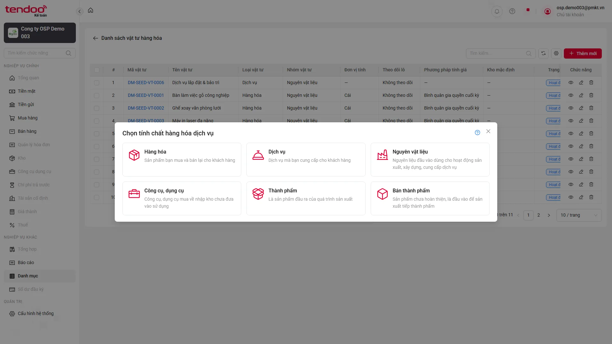

> Ảnh được chụp tại thời điểm kiểm tra. 

[⬆ Quay lại đầu trang](#top)

---

### BUG-VTHH-02 — Nội dung validate trường bắt buộc không khớp testcase

#### 1. Thông tin lỗi

- Module: Danh mục vật tư / Thêm mới Hàng hóa
- Phân loại: Bug sản phẩm
- Mức độ: Thấp
- Testcase ảnh hưởng: `TC_PMKT-U-00106-14`, `TC_PMKT-U-00106-20`, `TC_PMKT-U-00106-329`

#### 2. Điều kiện tiên quyết

- Đăng nhập môi trường PMKT bằng tài khoản cấu hình; mở Danh mục vật tư.

#### 3. Các bước tái hiện

1. Mở form Hàng hóa, bỏ trống trường bắt buộc rồi nhấn Lưu.
2. Đối chiếu kết quả với testcase.

#### 4. So sánh kết quả

- **Expected:** Mã/Tên/Đơn vị tính hiển thị lần lượt “Mã không được để trống”, “Tên không được để trống”, “Đơn vị tính không được để trống”.
- **Actual:** UI hiển thị “Mã vật tư không được để trống”, “Tên vật tư không được để trống”, “Đơn vị tính chính không được để trống”.

#### 5. Tần suất

- 3/3 testcase liên quan trong lần chạy này.

#### 6. Test data

- Các trường bắt buộc để trống.

#### 7. Evidence

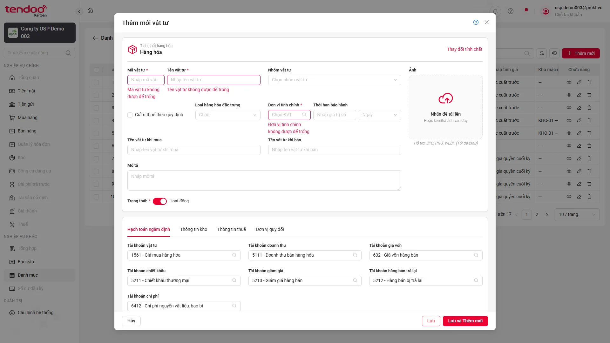

> Ảnh được chụp tại thời điểm kiểm tra. 

[⬆ Quay lại đầu trang](#top)

---

### BUG-VTHH-03 — Phím Up/Down không làm thay đổi vùng chọn trên combogrid

#### 1. Thông tin lỗi

- Module: Danh mục vật tư / Thêm mới Hàng hóa
- Phân loại: Bug sản phẩm
- Mức độ: Cao
- Testcase ảnh hưởng: `TC_PMKT-U-00106-40`, `TC_PMKT-U-00106-99`, `TC_PMKT-U-00106-114`, `TC_PMKT-U-00106-129`, `TC_PMKT-U-00106-142`, `TC_PMKT-U-00106-155`, `TC_PMKT-U-00106-168`, `TC_PMKT-U-00106-181`, `TC_PMKT-U-00106-196`

#### 2. Điều kiện tiên quyết

- Đăng nhập môi trường PMKT bằng tài khoản cấu hình; mở Danh mục vật tư.

#### 3. Các bước tái hiện

1. Mở combogrid tương ứng, ghi nhận dòng đang chọn, nhấn ArrowDown/ArrowUp và đối chiếu vùng chọn.
2. Đối chiếu kết quả với testcase.

#### 4. So sánh kết quả

- **Expected:** Mỗi lần nhấn ArrowUp/ArrowDown, vùng chọn di chuyển đúng một dòng.
- **Actual:** Trạng thái hiển thị của toàn bộ các dòng không thay đổi sau khi nhấn phím.

#### 5. Tần suất

- 9/9 testcase liên quan trong lần chạy này.

#### 6. Test data

- Đơn vị tính, tài khoản và kho lấy từ dữ liệu UI/DB thực tế.

#### 7. Evidence

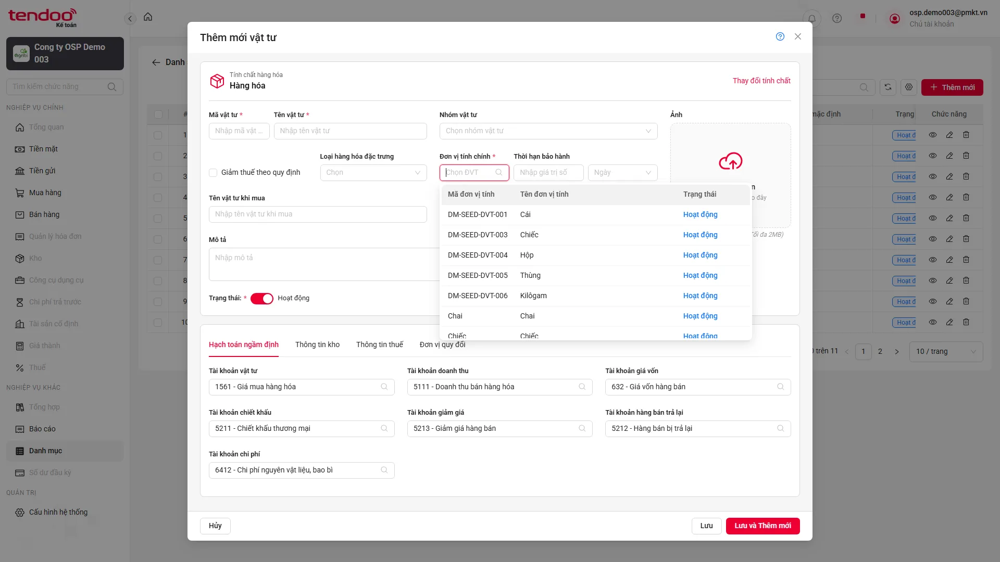

> Ảnh được chụp tại thời điểm kiểm tra. 

[⬆ Quay lại đầu trang](#top)

---

### BUG-VTHH-04 — Tài khoản full quyền không thấy nút Thêm nhanh Đơn vị tính

#### 1. Thông tin lỗi

- Module: Danh mục vật tư / Thêm mới Hàng hóa
- Phân loại: Bug sản phẩm
- Mức độ: Cao
- Testcase ảnh hưởng: `TC_PMKT-U-00106-43`, `TC_PMKT-U-00106-289`

#### 2. Điều kiện tiên quyết

- Đăng nhập môi trường PMKT bằng tài khoản cấu hình; mở Danh mục vật tư.

#### 3. Các bước tái hiện

1. Đăng nhập tài khoản full quyền, mở form Hàng hóa và mở combogrid Đơn vị tính.
2. Đối chiếu kết quả với testcase.

#### 4. So sánh kết quả

- **Expected:** Hiển thị nút (+) Thêm nhanh tại combogrid Đơn vị tính.
- **Actual:** Combogrid chỉ hiển thị ô tìm kiếm và danh sách; không có nút Thêm nhanh.

#### 5. Tần suất

- 2/2 testcase liên quan trong lần chạy này.

#### 6. Test data

- Tài khoản cấu hình trong biến môi trường.

#### 7. Evidence

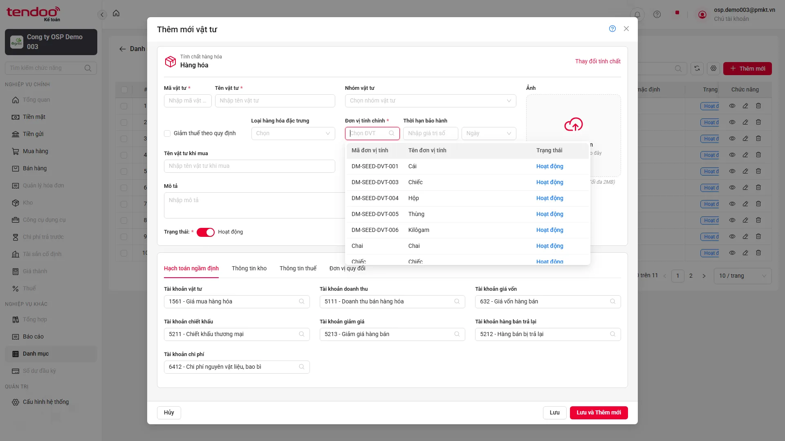

> Ảnh được chụp tại thời điểm kiểm tra. 

[⬆ Quay lại đầu trang](#top)

---

### BUG-VTHH-05 — Tài khoản Ngừng hoạt động có trong DB nhưng không hiển thị trên combogrid

#### 1. Thông tin lỗi

- Module: Danh mục vật tư / Thêm mới Hàng hóa
- Phân loại: Bug sản phẩm
- Mức độ: Cao
- Testcase ảnh hưởng: `TC_PMKT-U-00106-90`, `TC_PMKT-U-00106-91`, `TC_PMKT-U-00106-97`, `TC_PMKT-U-00106-105`, `TC_PMKT-U-00106-106`, `TC_PMKT-U-00106-120`, `TC_PMKT-U-00106-121`, `TC_PMKT-U-00106-133`, `TC_PMKT-U-00106-134`, `TC_PMKT-U-00106-146`, `TC_PMKT-U-00106-147`, `TC_PMKT-U-00106-159`, `TC_PMKT-U-00106-160`, `TC_PMKT-U-00106-172`, `TC_PMKT-U-00106-173`

#### 2. Điều kiện tiên quyết

- Đăng nhập môi trường PMKT bằng tài khoản cấu hình; mở Danh mục vật tư.

#### 3. Các bước tái hiện

1. Mở từng combogrid tài khoản, cuộn hết dữ liệu và tìm theo mã/trạng thái Ngừng hoạt động.
2. Đối chiếu kết quả với testcase.

#### 4. So sánh kết quả

- **Expected:** Tài khoản 1113 — Vàng tiền tệ (Ngừng hoạt động) hiển thị dưới nhóm Hoạt động và có thể tìm theo trạng thái.
- **Actual:** Tìm 1113 trả về “Không có dữ liệu”; các kiểm tra danh sách/tìm kiếm theo trạng thái đều không thấy bản ghi.

#### 5. Tần suất

- 15/15 testcase liên quan trong lần chạy này.

#### 6. Test data

- DB: 1113 — Vàng tiền tệ, trạng thái Ngừng hoạt động.

#### 7. Evidence

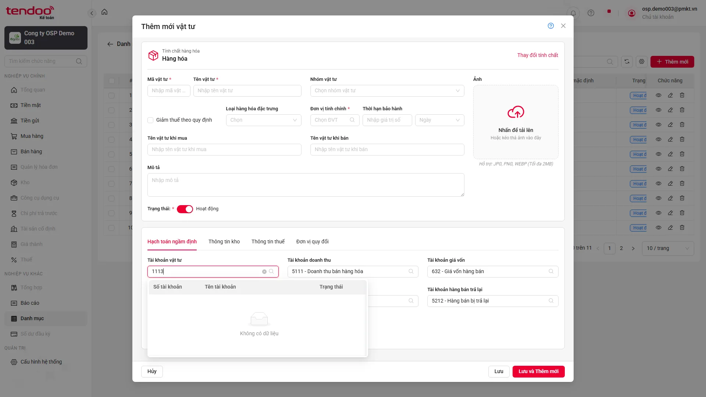

> Ảnh được chụp tại thời điểm kiểm tra. 

[⬆ Quay lại đầu trang](#top)

---

### BUG-VTHH-06 — Thông báo bắt buộc Phương pháp tính giá khác testcase

#### 1. Thông tin lỗi

- Module: Danh mục vật tư / Thêm mới Hàng hóa
- Phân loại: Bug sản phẩm
- Mức độ: Thấp
- Testcase ảnh hưởng: `TC_PMKT-U-00106-216`

#### 2. Điều kiện tiên quyết

- Đăng nhập môi trường PMKT bằng tài khoản cấu hình; mở Danh mục vật tư.

#### 3. Các bước tái hiện

1. Để trống Phương pháp tính giá và nhấn Lưu.
2. Đối chiếu kết quả với testcase.

#### 4. So sánh kết quả

- **Expected:** “Phương pháp tính giá không được để trống”.
- **Actual:** “Phương pháp tính giá không được bỏ trống”.

#### 5. Tần suất

- 1/1 testcase liên quan trong lần chạy này.

#### 6. Test data

- Mã/tên unique; Phương pháp tính giá để trống.

#### 7. Evidence

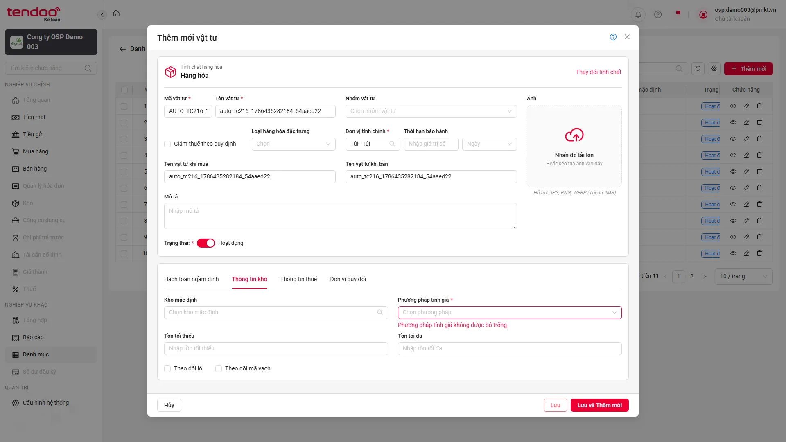

> Ảnh được chụp tại thời điểm kiểm tra. 

[⬆ Quay lại đầu trang](#top)

---

### BUG-VTHH-07 — Thuế nhập khẩu/xuất khẩu không reset khi đổi sang Nguyên vật liệu

#### 1. Thông tin lỗi

- Module: Danh mục vật tư / Thêm mới Hàng hóa
- Phân loại: Bug sản phẩm
- Mức độ: Cao
- Testcase ảnh hưởng: `TC_PMKT-U-00106-236`, `TC_PMKT-U-00106-240`

#### 2. Điều kiện tiên quyết

- Đăng nhập môi trường PMKT bằng tài khoản cấu hình; mở Danh mục vật tư.

#### 3. Các bước tái hiện

1. Nhập thuế ở Hàng hóa, đổi tính chất sang Nguyên vật liệu và quan sát tab Thông tin thuế.
2. Đối chiếu kết quả với testcase.

#### 4. So sánh kết quả

- **Expected:** Hai giá trị thuế được xóa về rỗng sau khi đổi tính chất.
- **Actual:** Thuế nhập khẩu vẫn là 5.5; Thuế xuất khẩu vẫn là 2.

#### 5. Tần suất

- 2/2 testcase liên quan trong lần chạy này.

#### 6. Test data

- Thuế nhập khẩu 5.5; Thuế xuất khẩu 2.

#### 7. Evidence

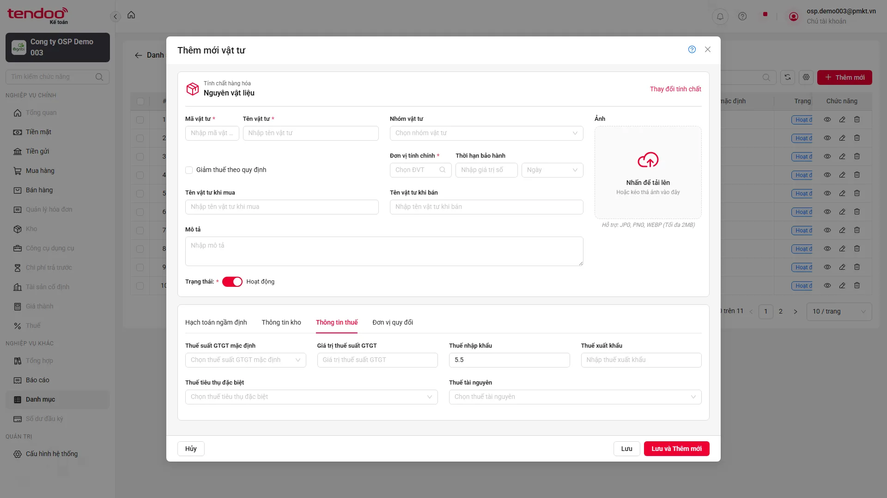

> Ảnh được chụp tại thời điểm kiểm tra. 

[⬆ Quay lại đầu trang](#top)

---

### BUG-VTHH-08 — Nhãn Thuế Tài nguyên sai kiểu chữ so với testcase

#### 1. Thông tin lỗi

- Module: Danh mục vật tư / Thêm mới Hàng hóa
- Phân loại: Bug sản phẩm
- Mức độ: Thấp
- Testcase ảnh hưởng: `TC_PMKT-U-00106-241`

#### 2. Điều kiện tiên quyết

- Đăng nhập môi trường PMKT bằng tài khoản cấu hình; mở Danh mục vật tư.

#### 3. Các bước tái hiện

1. Mở form Hàng hóa, chuyển tab Thông tin thuế.
2. Đối chiếu kết quả với testcase.

#### 4. So sánh kết quả

- **Expected:** Nhãn “Thuế Tài nguyên”.
- **Actual:** Nhãn “Thuế tài nguyên”.

#### 5. Tần suất

- 1/1 testcase liên quan trong lần chạy này.

#### 6. Test data

- Không phát sinh dữ liệu nhập.

#### 7. Evidence

> Ảnh được chụp tại thời điểm kiểm tra. 

[⬆ Quay lại đầu trang](#top)

---

### BUG-VTHH-09 — Dropdown Thuế Tài nguyên không hiển thị cấu trúc combogrid bốn cột

#### 1. Thông tin lỗi

- Module: Danh mục vật tư / Thêm mới Hàng hóa
- Phân loại: Bug sản phẩm
- Mức độ: Trung bình
- Testcase ảnh hưởng: `TC_PMKT-U-00106-242`, `TC_PMKT-U-00106-258`

#### 2. Điều kiện tiên quyết

- Đăng nhập môi trường PMKT bằng tài khoản cấu hình; mở Danh mục vật tư.

#### 3. Các bước tái hiện

1. Mở dropdown Thuế tài nguyên và kiểm tra header/dữ liệu sau khi cuộn.
2. Đối chiếu kết quả với testcase.

#### 4. So sánh kết quả

- **Expected:** Có bốn cột Mã thuế tài nguyên, Tên thuế tài nguyên, Thuế suất (%), Trạng thái và dữ liệu khớp DB.
- **Actual:** Dropdown hiển thị danh sách một cột dạng “Mã — Tên”, không có hàng tiêu đề.

#### 5. Tần suất

- 2/2 testcase liên quan trong lần chạy này.

#### 6. Test data

- Danh mục Thuế tài nguyên lấy trực tiếp từ DB.

#### 7. Evidence

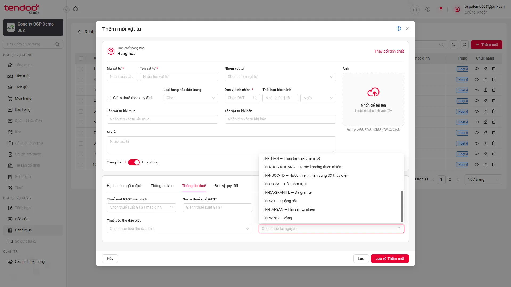

> Ảnh được chụp tại thời điểm kiểm tra. 

[⬆ Quay lại đầu trang](#top)

---

### BUG-VTHH-10 — Lưới Đơn vị quy đổi sai tên cột và thiếu dấu bắt buộc

#### 1. Thông tin lỗi

- Module: Danh mục vật tư / Thêm mới Hàng hóa
- Phân loại: Bug sản phẩm
- Mức độ: Trung bình
- Testcase ảnh hưởng: `TC_PMKT-U-00106-275`

#### 2. Điều kiện tiên quyết

- Đăng nhập môi trường PMKT bằng tài khoản cấu hình; mở Danh mục vật tư.

#### 3. Các bước tái hiện

1. Mở form Hàng hóa và chuyển tab Đơn vị quy đổi.
2. Đối chiếu kết quả với testcase.

#### 4. So sánh kết quả

- **Expected:** Cột đầu là “Đơn vị tính”; ba cột đầu có dấu bắt buộc.
- **Actual:** Cột đầu hiển thị “Đơn vị quy đổi”; không cột nào trong ba cột đầu có dấu bắt buộc.

#### 5. Tần suất

- 1/1 testcase liên quan trong lần chạy này.

#### 6. Test data

- Không phát sinh dữ liệu nhập.

#### 7. Evidence

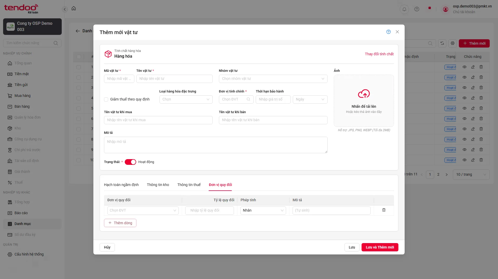

> Ảnh được chụp tại thời điểm kiểm tra. 

[⬆ Quay lại đầu trang](#top)

---

### BUG-VTHH-11 — Dropdown Đơn vị quy đổi thiếu header và không tìm được dữ liệu theo trạng thái

#### 1. Thông tin lỗi

- Module: Danh mục vật tư / Thêm mới Hàng hóa
- Phân loại: Bug sản phẩm
- Mức độ: Trung bình
- Testcase ảnh hưởng: `TC_PMKT-U-00106-277`, `TC_PMKT-U-00106-284`

#### 2. Điều kiện tiên quyết

- Đăng nhập môi trường PMKT bằng tài khoản cấu hình; mở Danh mục vật tư.

#### 3. Các bước tái hiện

1. Mở dropdown Đơn vị quy đổi, cuộn danh sách rồi tìm theo trạng thái.
2. Đối chiếu kết quả với testcase.

#### 4. So sánh kết quả

- **Expected:** Hiển thị ba cột Mã, Tên, Trạng thái; dữ liệu khớp DB và tìm được theo trạng thái.
- **Actual:** Dropdown không có header, hiển thị dạng “Mã — Tên”; tìm theo trạng thái trả về 0 dòng.

#### 5. Tần suất

- 2/2 testcase liên quan trong lần chạy này.

#### 6. Test data

- Danh mục Đơn vị tính lấy trực tiếp từ DB.

#### 7. Evidence

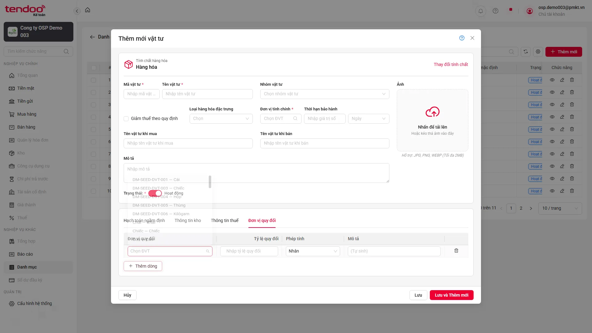

> Ảnh được chụp tại thời điểm kiểm tra. 

[⬆ Quay lại đầu trang](#top)

---

### BUG-VTHH-12 — Không hiện xác nhận khi chọn Đơn vị quy đổi Ngừng hoạt động

#### 1. Thông tin lỗi

- Module: Danh mục vật tư / Thêm mới Hàng hóa
- Phân loại: Bug sản phẩm
- Mức độ: Cao
- Testcase ảnh hưởng: `TC_PMKT-U-00106-279`, `TC_PMKT-U-00106-280`

#### 2. Điều kiện tiên quyết

- Đăng nhập môi trường PMKT bằng tài khoản cấu hình; mở Danh mục vật tư.

#### 3. Các bước tái hiện

1. Chọn một Đơn vị tính Ngừng hoạt động trong dòng quy đổi.
2. Đối chiếu kết quả với testcase.

#### 4. So sánh kết quả

- **Expected:** Hiện hộp thoại “Bản ghi đang ở trạng thái Ngừng hoạt động. Bạn có chắc chắn muốn sử dụng?”.
- **Actual:** Đơn vị DM-SEED-DVT-002 — Bộ được chọn trực tiếp, không xuất hiện hộp thoại xác nhận.

#### 5. Tần suất

- 2/2 testcase liên quan trong lần chạy này.

#### 6. Test data

- DM-SEED-DVT-002 — Bộ, trạng thái Ngừng hoạt động.

#### 7. Evidence

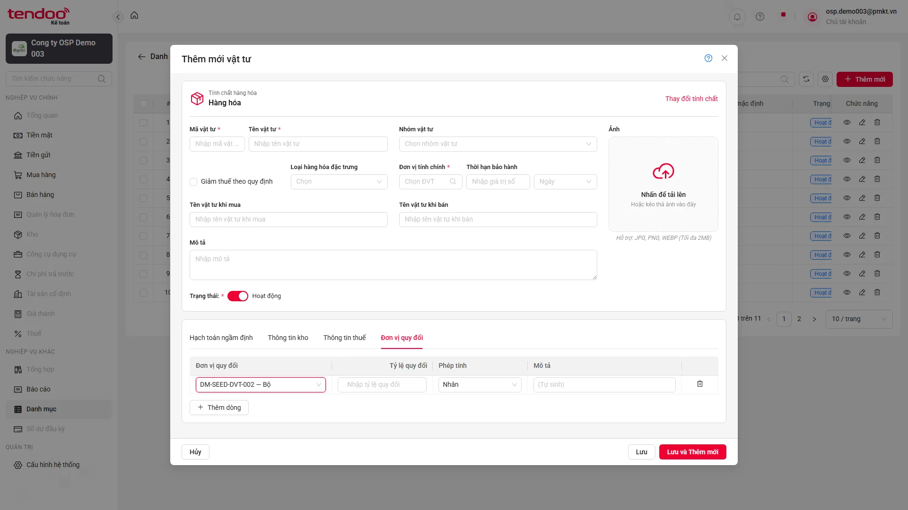

> Ảnh được chụp tại thời điểm kiểm tra. 

[⬆ Quay lại đầu trang](#top)

---

### BUG-VTHH-13 — Lưới Đơn vị quy đổi không hiển thị thông báo validate

#### 1. Thông tin lỗi

- Module: Danh mục vật tư / Thêm mới Hàng hóa
- Phân loại: Bug sản phẩm
- Mức độ: Cao
- Testcase ảnh hưởng: `TC_PMKT-U-00106-298`, `TC_PMKT-U-00106-299`, `TC_PMKT-U-00106-300`, `TC_PMKT-U-00106-301`

#### 2. Điều kiện tiên quyết

- Đăng nhập môi trường PMKT bằng tài khoản cấu hình; mở Danh mục vật tư.

#### 3. Các bước tái hiện

1. Nhập từng bộ dữ liệu không hợp lệ vào lưới Đơn vị quy đổi rồi nhấn Lưu.
2. Đối chiếu kết quả với testcase.

#### 4. So sánh kết quả

- **Expected:** Hiển thị đúng thông báo cho đơn vị trùng, đơn vị/tỷ lệ trống và tỷ lệ bằng 0.
- **Actual:** Trường bị viền đỏ và chặn lưu nhưng không hiển thị nội dung thông báo theo testcase.

#### 5. Tần suất

- 4/4 testcase liên quan trong lần chạy này.

#### 6. Test data

- Đơn vị trùng đơn vị chính; đơn vị trống; tỷ lệ trống; tỷ lệ 0.

#### 7. Evidence

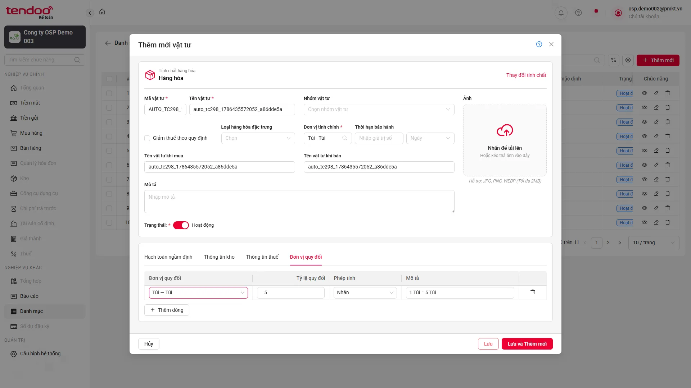

> Ảnh được chụp tại thời điểm kiểm tra. 

[⬆ Quay lại đầu trang](#top)

---

### BUG-VTHH-14 — Giá trị thuế suất hiển thị 0 trên UI nhưng lưu NULL trong DB

#### 1. Thông tin lỗi

- Module: Danh mục vật tư / Thêm mới Hàng hóa
- Phân loại: Bug sản phẩm
- Mức độ: Cao
- Testcase ảnh hưởng: `TC_PMKT-U-00106-308`, `TC_PMKT-U-00106-309`, `TC_PMKT-U-00106-311`, `TC_PMKT-U-00106-312`

#### 2. Điều kiện tiên quyết

- Đăng nhập môi trường PMKT bằng tài khoản cấu hình; mở Danh mục vật tư.

#### 3. Các bước tái hiện

1. Tạo mới thành công, tìm bản ghi trên danh sách, truy vấn DB theo mã unique và tenant rồi đối chiếu toàn bộ trường UI.
2. Đối chiếu kết quả với testcase.

#### 4. So sánh kết quả

- **Expected:** Các trường thuế suất mặc định hiển thị 0 trên UI phải lưu DB bằng 0.
- **Actual:** UI thêm mới thành công, nhưng truy vấn bản ghi bằng mã unique nhận NULL thay vì 0.

#### 5. Tần suất

- 4/4 testcase liên quan trong lần chạy này.

#### 6. Test data

- Mã vật tư unique do từng testcase sinh; đối chiếu đúng tenant.

#### 7. Evidence

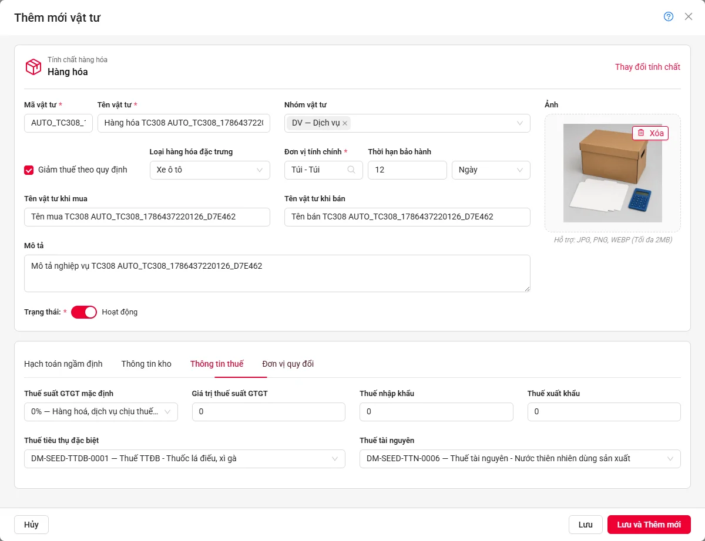

> Ảnh được chụp tại thời điểm kiểm tra. Ảnh chụp trước khi lưu tại tab Thông tin thuế, thể hiện Giá trị thuế suất GTGT, Thuế nhập khẩu và Thuế xuất khẩu đều bằng 0; Actual NULL lấy từ assertion DB theo mã unique.

[⬆ Quay lại đầu trang](#top)

## Thông tin kỹ thuật

- Preflight: `npm run preflight:evidence -- src/tests/danh-muc/pmkt-u-00106_vat_tu/them-moi-vat-tu-hang-hoa.spec.ts` — PASS.
- Command: `HEADLESS=true npx playwright test src/tests/danh-muc/pmkt-u-00106_vat_tu/them-moi-vat-tu-hang-hoa.spec.ts --retries=0 --workers=1` (không ghi đè reporter).
- Run ID: `20260811T074309Z`; nguồn số liệu: JSON reporter ghi theo từng testcase.
- Tổng kiểm tra sau rerun TC212: `219 + 50 + 29 = 298`; PASS rate: `219 / 298 = 73.49%`.
- TC212 được rerun riêng sau khi sửa locator và đã PASS; 29 runner SKIP được phân loại nghiệp vụ là BLOCK; không có testcase SKIP thông thường.

[⬆ Quay lại đầu trang](#top)

