

# Báo cáo kiểm thử — Thêm mới Vật tư — Hàng hóa

## Thông tin kiểm thử

| Hạng mục | Giá trị |
|---|---|
| **Môi trường** | https://pmkt-staging.ospgroup.vn |
| **Tài khoản test** | demo@pmkt.vn |
| **Ngày** | 12/08/2026 |
| **Tổng TCs** | 323 |
| **Tổng thời gian** | N/A |

## Tổng quan kết quả

| Tổng test | PASS | FAIL | SKIP | BLOCK | Tỷ lệ PASS | Automation Bugs |
|---:|---:|---:|---:|---:|---:|---:|
| **323** | **233** | **62** | **0** | **28** | **72.14%** | **18** |

## Tổng hợp Bugs

| Bug ID | Mức độ | Số case ảnh hưởng | Tên case ảnh hưởng | Tóm tắt bug |
|---|:---:|---:|---|---|
| [BUG-VTHH-01](#bug-vthh-01) | Trung bình | 2 | TC_PMKT-U-00106-4, TC_PMKT-U-00106-7 | Mô tả tính chất Bán thành phẩm không khớp testcase |
| [BUG-VTHH-02](#bug-vthh-02) | Thấp | 3 | TC_PMKT-U-00106-14, TC_PMKT-U-00106-20, TC_PMKT-U-00106-329 | Nội dung validate trường bắt buộc không khớp testcase |
| [BUG-VTHH-03](#bug-vthh-03) | Trung bình | 10 | TC_PMKT-U-00106-40, TC_PMKT-U-00106-99, TC_PMKT-U-00106-114, TC_PMKT-U-00106-129, TC_PMKT-U-00106-142, TC_PMKT-U-00106-155, TC_PMKT-U-00106-168, TC_PMKT-U-00106-181, TC_PMKT-U-00106-196, TC_PMKT-U-00106-286 | Phím Up/Down không làm thay đổi vùng chọn trên combogrid |
| [BUG-VTHH-04](#bug-vthh-04) | Cao | 2 | TC_PMKT-U-00106-43, TC_PMKT-U-00106-289 | Tài khoản full quyền không thấy nút Thêm nhanh |
| [BUG-VTHH-05](#bug-vthh-05) | Cao | 15 | TC_PMKT-U-00106-90, TC_PMKT-U-00106-91, TC_PMKT-U-00106-97, TC_PMKT-U-00106-105, TC_PMKT-U-00106-106, TC_PMKT-U-00106-120, TC_PMKT-U-00106-121, TC_PMKT-U-00106-133, TC_PMKT-U-00106-134, TC_PMKT-U-00106-146, TC_PMKT-U-00106-147, TC_PMKT-U-00106-159, TC_PMKT-U-00106-160, TC_PMKT-U-00106-172, TC_PMKT-U-00106-173 | Tài khoản Ngừng hoạt động có trong DB nhưng không hiển thị trên combogrid |
| [BUG-VTHH-06](#bug-vthh-06) | Thấp | 1 | TC_PMKT-U-00106-216 | Thông báo bắt buộc Phương pháp tính giá khác testcase |
| [BUG-VTHH-07](#bug-vthh-07) | Cao | 2 | TC_PMKT-U-00106-236, TC_PMKT-U-00106-240 | Thuế nhập khẩu/xuất khẩu không reset khi đổi sang Nguyên vật liệu |
| [BUG-VTHH-08](#bug-vthh-08) | Thấp | 1 | TC_PMKT-U-00106-241 | Nhãn Thuế Tài nguyên sai kiểu chữ so với testcase |
| [BUG-VTHH-09](#bug-vthh-09) | Cao | 2 | TC_PMKT-U-00106-242, TC_PMKT-U-00106-258 | Dropdown Thuế không hiển thị cấu trúc combogrid bốn cột |
| [BUG-VTHH-10](#bug-vthh-10) | Trung bình | 1 | TC_PMKT-U-00106-275 | Lưới Đơn vị quy đổi sai tên cột |
| [BUG-VTHH-11](#bug-vthh-11) | Cao | 2 | TC_PMKT-U-00106-277, TC_PMKT-U-00106-284 | Dropdown Đơn vị quy đổi thiếu header và không tìm được dữ liệu theo trạng thái |
| [BUG-VTHH-12](#bug-vthh-12) | Cao | 2 | TC_PMKT-U-00106-279, TC_PMKT-U-00106-280 | Không hiện xác nhận khi chọn Đơn vị quy đổi Ngừng hoạt động |
| [BUG-VTHH-13](#bug-vthh-13) | Cao | 4 | TC_PMKT-U-00106-298, TC_PMKT-U-00106-299, TC_PMKT-U-00106-300, TC_PMKT-U-00106-301 | Lưới Đơn vị quy đổi không hiển thị thông báo validate |
| [BUG-VTHH-14](#bug-vthh-14) | Cao | 4 | TC_PMKT-U-00106-308, TC_PMKT-U-00106-309, TC_PMKT-U-00106-311, TC_PMKT-U-00106-312 | Dữ liệu Kho trong DB không khớp lựa chọn trên UI |
| [BUG-VTHH-15](#bug-vthh-15) | Trung bình | 1 | TC_PMKT-U-00106-36 | Tìm Đơn vị tính theo Mã trả về thêm bản ghi không khớp mã |
| [BUG-VTHH-16](#bug-vthh-16) | Trung bình | 2 | TC_PMKT-U-00106-243, TC_PMKT-U-00106-259 | Thuế Ngừng hoạt động không hiển thị chữ màu xám |
| [BUG-VTHH-17](#bug-vthh-17) | Cao | 4 | TC_PMKT-U-00106-244, TC_PMKT-U-00106-245, TC_PMKT-U-00106-260, TC_PMKT-U-00106-261 | Không hiện xác nhận khi chọn Thuế Ngừng hoạt động |
| [BUG-VTHH-18](#bug-vthh-18) | Cao | 4 | TC_PMKT-U-00106-249, TC_PMKT-U-00106-250, TC_PMKT-U-00106-265, TC_PMKT-U-00106-266 | Tìm Thuế theo thuế suất hoặc trạng thái trả về rỗng |

[Lên đầu](#top)

---

## Chi tiết Bug

### BUG-VTHH-01

> 🤖 **AUTOMATION DETECTED · READ ONLY** · Trung bình · Tái hiện 2/2 testcase liên quan

| Hạng mục | Nội dung |
|---|---|
| **Tiêu đề bug** | Mô tả tính chất Bán thành phẩm không khớp testcase |
| **Điều kiện tiên quyết** | **Case đại diện: `TC_PMKT-U-00106-4`** Người dùng có quyền DMVatTu.Create. Đang ở màn hình danh sách Vật Tư. |
| **Các bước tái hiện** | 1. Nhấn nút "Thêm mới" trên thanh công cụ. 2. Kiểm tra hiển thị popup chọn tính chất. |
| **Data test** | N/A |
| **Kết quả mong đợi** | 1. Hiển thị popup "Chọn tính chất hàng hóa dịch vụ" (Select card) gồm 6 lựa chọn dạng card: - Hàng hóa (Sản phẩm bạn mua và bán lại cho khách hàng) - Dịch vụ (Dịch vụ mà bạn cung cấp cho khách hàng) - Nguyên vật liệu (Nguyên liệu đầu vào dùng cho hoạt động sản xuất, xây dựng, cung cấp dịch vụ) - Công cụ, dụng cụ (Công cụ, dụng cụ mua về nhập kho chưa đưa vào sử dụng) - Thành phẩm (Là sản phẩm đầu ra của quá trình sản xuất) - Bán thành phẩm (Sản phẩm đầu ra của một công đoạn sản xuất nhất định). |
| **Kết quả thực tế** | UI hiển thị mô tả “Sản phẩm chưa hoàn thiện, là đầu vào để sản xuất tiếp thành phẩm” thay vì nội dung trong testcase. Các testcase trong nhóm có cùng triệu chứng; root cause chung là suy luận từ kết quả chạy. |
| **Bằng chứng** | 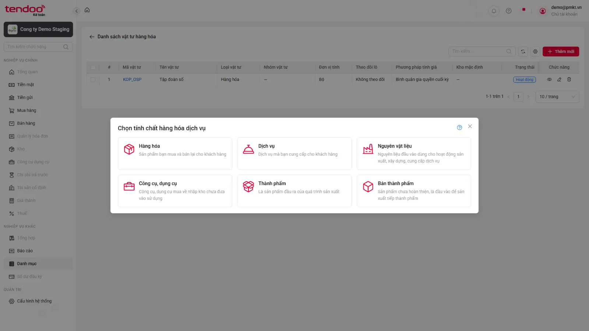 |

[Lên đầu](#top)

---

### BUG-VTHH-02

> 🤖 **AUTOMATION DETECTED · READ ONLY** · Thấp · Tái hiện 3/3 testcase liên quan

| Hạng mục | Nội dung |
|---|---|
| **Tiêu đề bug** | Nội dung validate trường bắt buộc không khớp testcase |
| **Điều kiện tiên quyết** | **Case đại diện: `TC_PMKT-U-00106-14`** Đang ở form Thêm mới loại Hàng hóa. |
| **Các bước tái hiện** | 1. Nhập đầy đủ thông tin hợp lệ khác. 2. Bỏ trống ô "Mã". 3. Nhấn "Lưu". |
| **Data test** | N/A |
| **Kết quả mong đợi** | 1. Hệ thống chặn lưu và hiển thị thông báo lỗi dưới chân trường Mã: "Mã không được để trống". |
| **Kết quả thực tế** | UI thêm tên đối tượng vào thông báo bắt buộc của Mã, Tên và Đơn vị tính. Các testcase trong nhóm có cùng triệu chứng; root cause chung là suy luận từ kết quả chạy. |
| **Bằng chứng** | 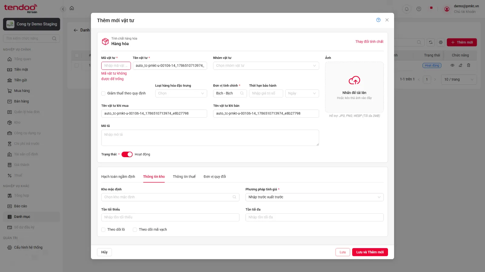 |

[Lên đầu](#top)

---

### BUG-VTHH-03

> 🤖 **AUTOMATION DETECTED · READ ONLY** · Trung bình · Tái hiện 10/10 testcase liên quan

| Hạng mục | Nội dung |
|---|---|
| **Tiêu đề bug** | Phím Up/Down không làm thay đổi vùng chọn trên combogrid |
| **Điều kiện tiên quyết** | **Case đại diện: `TC_PMKT-U-00106-40`** Đang ở form Thêm mới loại Hàng hóa. Dropdown combogrid Đơn vị tính chính đang mở. |
| **Các bước tái hiện** | 1. Nhấn phím Down (↓) nhiều lần. 2. Nhấn phím Up (↑). |
| **Data test** | N/A |
| **Kết quả mong đợi** | Vùng chọn di chuyển xuống/lên đúng từng dòng tương ứng; không thay đổi giá trị của trường cho đến khi người dùng nhấn Enter chọn. |
| **Kết quả thực tế** | Sau khi nhấn ArrowDown/ArrowUp, trạng thái hiển thị của các dòng không thay đổi. Các testcase trong nhóm có cùng triệu chứng; root cause chung là suy luận từ kết quả chạy. |
| **Bằng chứng** | 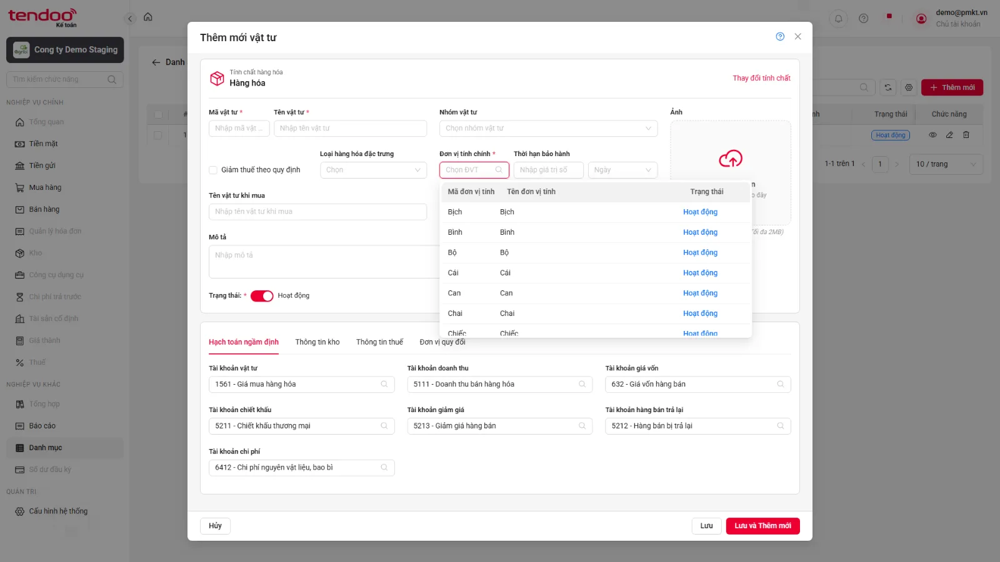 |

[Lên đầu](#top)

---

### BUG-VTHH-04

> 🤖 **AUTOMATION DETECTED · READ ONLY** · Cao · Tái hiện 2/2 testcase liên quan

| Hạng mục | Nội dung |
|---|---|
| **Tiêu đề bug** | Tài khoản full quyền không thấy nút Thêm nhanh |
| **Điều kiện tiên quyết** | **Case đại diện: `TC_PMKT-U-00106-43`** Đang ở form Thêm mới loại Hàng hóa. |
| **Các bước tái hiện** | 1. Đăng nhập bằng tài khoản có quyền thêm mới Đơn vị tính và quan sát combogrid Đơn vị tính chính. 2. Đăng nhập bằng tài khoản không có quyền và quan sát. |
| **Data test** | N/A |
| **Kết quả mong đợi** | 1. Có hiển thị nút biểu tượng dấu (+) thêm nhanh. 2. Nút dấu (+) bị ẩn hoàn toàn. |
| **Kết quả thực tế** | Dropdown Đơn vị tính và Đơn vị quy đổi không hiển thị nút (+) Thêm nhanh. Các testcase trong nhóm có cùng triệu chứng; root cause chung là suy luận từ kết quả chạy. |
| **Bằng chứng** |  |

[Lên đầu](#top)

---

### BUG-VTHH-05

> 🤖 **AUTOMATION DETECTED · READ ONLY** · Cao · Tái hiện 15/15 testcase liên quan

| Hạng mục | Nội dung |
|---|---|
| **Tiêu đề bug** | Tài khoản Ngừng hoạt động có trong DB nhưng không hiển thị trên combogrid |
| **Điều kiện tiên quyết** | **Case đại diện: `TC_PMKT-U-00106-90`** Đang ở form Thêm mới loại Hàng hóa. Có dữ liệu trong danh mục Hệ thống tài khoản (ENT_HeThongTaiKhoan) gồm bản ghi Hoạt động có Cho phép hạch toán = Có và bản ghi Ngừng hoạt động. |
| **Các bước tái hiện** | 1. Click mở combogrid Tài khoản vật tư. 2. Kiểm tra các cột hiển thị trong danh sách thả xuống. |
| **Data test** | N/A |
| **Kết quả mong đợi** | 1. Danh sách dropdown của combogrid Tài khoản vật tư hiển thị đúng các cột: Số tài khoản, Tên tài khoản, Trạng thái. 2. Dữ liệu trong danh sách thả xuống được lấy chính xác từ danh mục Hệ thống tài khoản (ENT_HeThongTaiKhoan) gồm bản ghi Hoạt động có Cho phép hạch toán = Có và bản ghi Ngừng hoạt động. 3. Các bản ghi ở trạng thái Hoạt động có Cho phép hạch toán = Có hiển thị ở trên và các bản ghi ở trạng thái Ngừng hoạt động hiển thị ở dưới. |
| **Kết quả thực tế** | Bản ghi tài khoản 1113 — Vàng tiền tệ có trong DB đúng tenant nhưng tìm trên UI trả về “Không có dữ liệu”. Các testcase trong nhóm có cùng triệu chứng; root cause chung là suy luận từ kết quả chạy. |
| **Bằng chứng** | 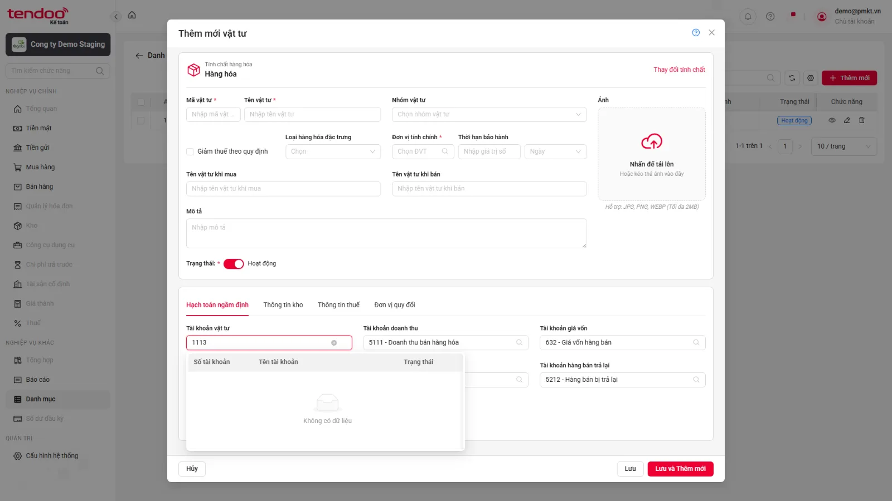 |

[Lên đầu](#top)

---

### BUG-VTHH-06

> 🤖 **AUTOMATION DETECTED · READ ONLY** · Thấp · Tái hiện 1/1 testcase liên quan

| Hạng mục | Nội dung |
|---|---|
| **Tiêu đề bug** | Thông báo bắt buộc Phương pháp tính giá khác testcase |
| **Điều kiện tiên quyết** | **Case đại diện: `TC_PMKT-U-00106-216`** Đang ở form Hàng hóa, Tab Thông tin kho. |
| **Các bước tái hiện** | 1. Bỏ trống ô phương pháp tính giá. 2. Nhấn "Lưu". |
| **Data test** | N/A |
| **Kết quả mong đợi** | 1. Hệ thống chặn lưu và báo lỗi dưới chân trường: "Phương pháp tính giá không được để trống". |
| **Kết quả thực tế** | UI hiển thị “Phương pháp tính giá không được bỏ trống” thay vì “không được để trống”. |
| **Bằng chứng** | 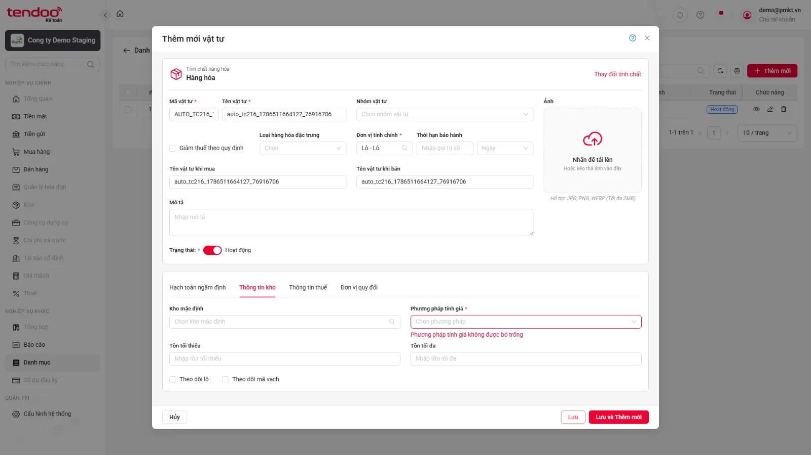 |

[Lên đầu](#top)

---

### BUG-VTHH-07

> 🤖 **AUTOMATION DETECTED · READ ONLY** · Cao · Tái hiện 2/2 testcase liên quan

| Hạng mục | Nội dung |
|---|---|
| **Tiêu đề bug** | Thuế nhập khẩu/xuất khẩu không reset khi đổi sang Nguyên vật liệu |
| **Điều kiện tiên quyết** | **Case đại diện: `TC_PMKT-U-00106-236`** Đang ở form tạo mới Hàng hóa, Tab Thông tin thuế. Trường Numeric Thuế nhập khẩu đã điền/chọn dữ liệu hợp lệ. |
| **Các bước tái hiện** | 1. Nhấn nút "Thay đổi tính chất". 2. Trên popup, chọn card "Nguyên vật liệu". 3. Chuyển sang Tab Thông tin thuế. |
| **Data test** | N/A |
| **Kết quả mong đợi** | 1. Trường Numeric Thuế nhập khẩu trên form mới tự động được xóa sạch dữ liệu (reset về mặc định) theo nghiệp vụ. |
| **Kết quả thực tế** | Giá trị thuế 5.5 vẫn còn sau khi đổi tính chất sang Nguyên vật liệu. Các testcase trong nhóm có cùng triệu chứng; root cause chung là suy luận từ kết quả chạy. |
| **Bằng chứng** | 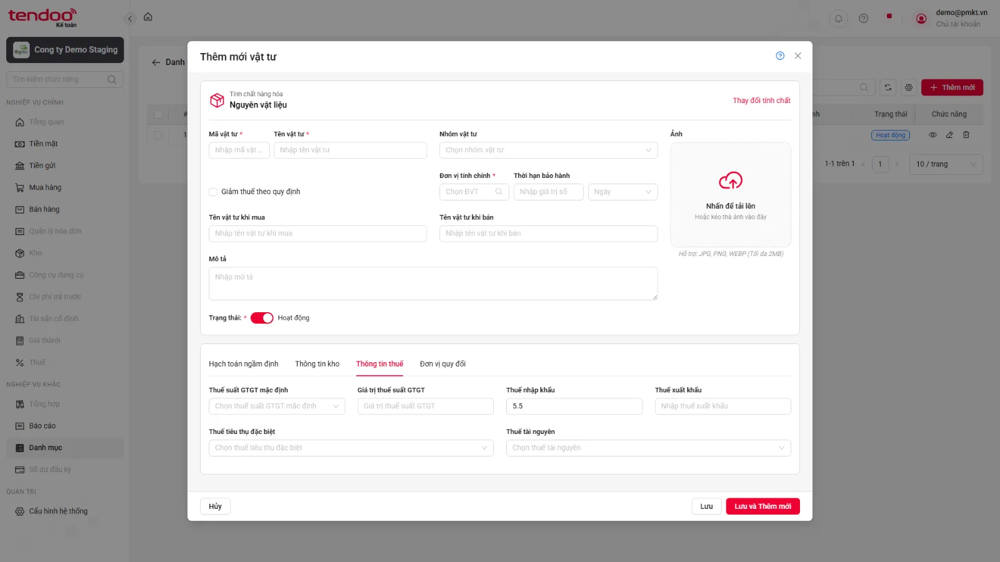 |

[Lên đầu](#top)

---

### BUG-VTHH-08

> 🤖 **AUTOMATION DETECTED · READ ONLY** · Thấp · Tái hiện 1/1 testcase liên quan

| Hạng mục | Nội dung |
|---|---|
| **Tiêu đề bug** | Nhãn Thuế Tài nguyên sai kiểu chữ so với testcase |
| **Điều kiện tiên quyết** | **Case đại diện: `TC_PMKT-U-00106-241`** Đang ở form Thêm mới loại Hàng hóa. |
| **Các bước tái hiện** | 1. Truy cập màn hình thêm mới Loại Hàng hóa. 2. Quan sát trường "Thuế Tài nguyên". |
| **Data test** | N/A |
| **Kết quả mong đợi** | - Loại phần tử (element control): Combogrid. - Label hiển thị đúng: "Thuế Tài nguyên" (không bắt buộc, không hiển thị dấu (`*`)). |
| **Kết quả thực tế** | UI hiển thị “Thuế tài nguyên” thay vì “Thuế Tài nguyên”. |
| **Bằng chứng** | 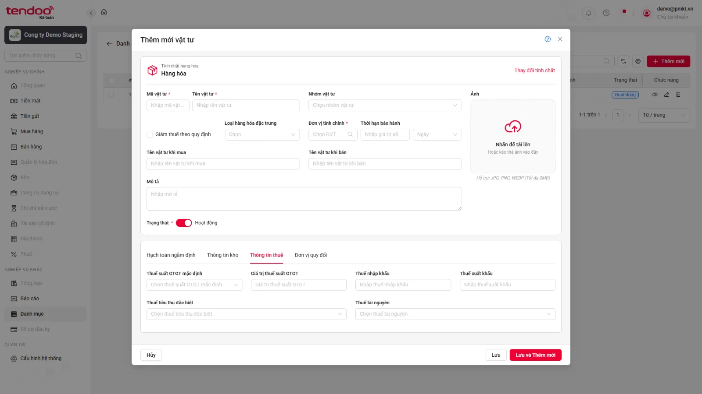 |

[Lên đầu](#top)

---

### BUG-VTHH-09

> 🤖 **AUTOMATION DETECTED · READ ONLY** · Cao · Tái hiện 2/2 testcase liên quan

| Hạng mục | Nội dung |
|---|---|
| **Tiêu đề bug** | Dropdown Thuế không hiển thị cấu trúc combogrid bốn cột |
| **Điều kiện tiên quyết** | **Case đại diện: `TC_PMKT-U-00106-242`** Đang ở form Thêm mới loại Hàng hóa. Có dữ liệu trong danh mục Thuế suất (ENT_ThueSuat). |
| **Các bước tái hiện** | 1. Click mở combogrid Thuế Tài nguyên. 2. Kiểm tra các cột hiển thị trong danh sách thả xuống. |
| **Data test** | N/A |
| **Kết quả mong đợi** | 1. Danh sách dropdown của combogrid Thuế Tài nguyên hiển thị đúng các cột: Mã thuế tài nguyên, Tên thuế tài nguyên, Thuế suất (%), Trạng thái. 2. Dữ liệu trong danh sách thả xuống được lấy chính xác từ danh mục Thuế suất (ENT_ThueSuat). 3. Các bản ghi ở trạng thái Hoạt động hiển thị ở trên và các bản ghi ở trạng thái Ngừng hoạt động hiển thị ở dưới. |
| **Kết quả thực tế** | Dropdown Thuế Tài nguyên và Thuế TTĐB chỉ hiển thị danh sách Mã — Tên, không có bốn header theo testcase. Các testcase trong nhóm có cùng triệu chứng; root cause chung là suy luận từ kết quả chạy. |
| **Bằng chứng** | 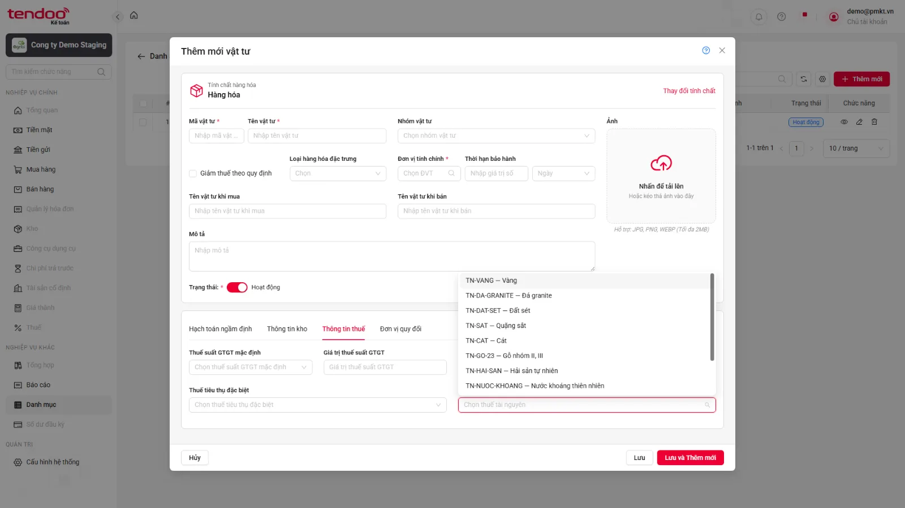 |

[Lên đầu](#top)

---

### BUG-VTHH-10

> 🤖 **AUTOMATION DETECTED · READ ONLY** · Trung bình · Tái hiện 1/1 testcase liên quan

| Hạng mục | Nội dung |
|---|---|
| **Tiêu đề bug** | Lưới Đơn vị quy đổi sai tên cột |
| **Điều kiện tiên quyết** | **Case đại diện: `TC_PMKT-U-00106-275`** Đang ở form Thêm mới loại Hàng hóa. |
| **Các bước tái hiện** | 1. Click chọn Tab "Đơn vị quy đổi". 2. Nhấn nút "Thêm dòng" trên lưới. 3. Quan sát các cột và các trường thông tin trên dòng lưới mới. |
| **Data test** | N/A |
| **Kết quả mong đợi** | 1. Cột Đơn vị tính: Element control dạng combogrid, bắt buộc chọn. 2. Cột Tỷ lệ quy đổi: Element control dạng numeric box, bắt buộc nhập. 3. Cột Phép tính: Element control dạng Select dropdown, bắt buộc chọn, mặc định hiển thị giá trị "Nhân". 4. Cột Mô tả: Element control dạng text box, ở trạng thái chỉ đọc (read-only), mặc định trống. |
| **Kết quả thực tế** | Header đầu tiên là “Đơn vị quy đổi” thay vì “Đơn vị tính”. |
| **Bằng chứng** | 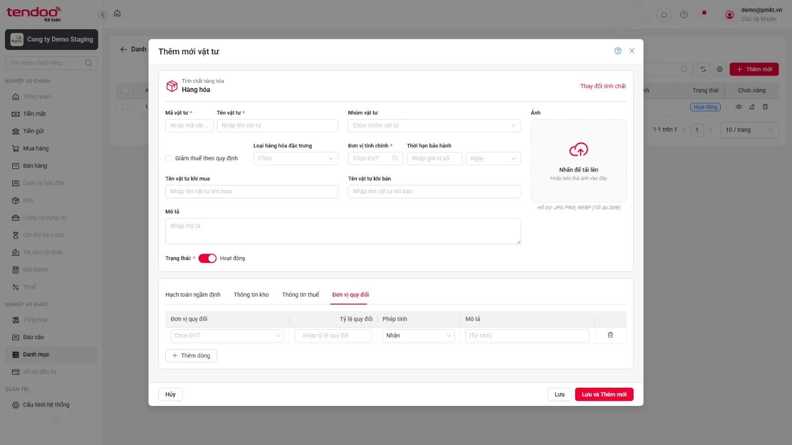 |

[Lên đầu](#top)

---

### BUG-VTHH-11

> 🤖 **AUTOMATION DETECTED · READ ONLY** · Cao · Tái hiện 2/2 testcase liên quan

| Hạng mục | Nội dung |
|---|---|
| **Tiêu đề bug** | Dropdown Đơn vị quy đổi thiếu header và không tìm được dữ liệu theo trạng thái |
| **Điều kiện tiên quyết** | **Case đại diện: `TC_PMKT-U-00106-277`** Đang ở form tạo mới Hàng hóa, Tab Đơn vị quy đổi. Đã nhấn "Thêm dòng" trên lưới. Có dữ liệu trong danh mục Đơn vị tính (ENT_DonViTinh). |
| **Các bước tái hiện** | 1. Click ô Đơn vị tính trên dòng lưới. 2. Kiểm tra các cột hiển thị trong danh sách thả xuống. |
| **Data test** | N/A |
| **Kết quả mong đợi** | 1. Danh sách dropdown của ô Đơn vị tính trên lưới hiển thị đúng các cột: Mã đơn vị tính, Tên đơn vị tính, Trạng thái. 2. Dữ liệu trong danh sách thả xuống được lấy chính xác từ danh mục Đơn vị tính (ENT_DonViTinh). 3. Các bản ghi ở trạng thái Hoạt động hiển thị ở trên và các bản ghi ở trạng thái Ngừng hoạt động hiển thị ở dưới. |
| **Kết quả thực tế** | Dropdown không có ba header và tìm theo trạng thái không trả về dữ liệu khớp DB. Các testcase trong nhóm có cùng triệu chứng; root cause chung là suy luận từ kết quả chạy. |
| **Bằng chứng** | 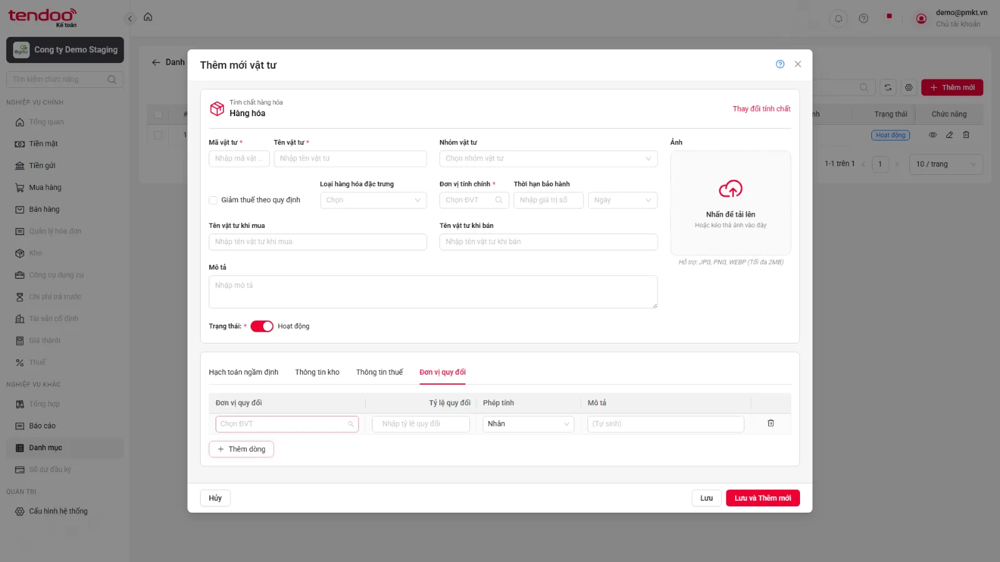 |

[Lên đầu](#top)

---

### BUG-VTHH-12

> 🤖 **AUTOMATION DETECTED · READ ONLY** · Cao · Tái hiện 2/2 testcase liên quan

| Hạng mục | Nội dung |
|---|---|
| **Tiêu đề bug** | Không hiện xác nhận khi chọn Đơn vị quy đổi Ngừng hoạt động |
| **Điều kiện tiên quyết** | **Case đại diện: `TC_PMKT-U-00106-279`** Đang ở form tạo mới Hàng hóa, Tab Đơn vị quy đổi. Đã nhấn "Thêm dòng" trên lưới. Có bản ghi trong danh mục Đơn vị tính (ENT_DonViTinh) ở trạng thái Ngừng hoạt động. |
| **Các bước tái hiện** | 1. Click ô Đơn vị tính trên lưới. 2. Chọn bản ghi ở trạng thái Ngừng hoạt động. 3. Kiểm tra hiển thị popup cảnh báo. 4. Nhấn nút "Xác nhận" trên popup. |
| **Data test** | N/A |
| **Kết quả mong đợi** | 1. Hệ thống hiển thị popup cảnh báo hiển thị chính xác nội dung thông báo: "Bản ghi đang ở trạng thái Ngừng hoạt động. Bạn có chắc chắn muốn sử dụng?" với 2 nút lựa chọn: Xác nhận / Hủy. 2. Sau khi nhấn Xác nhận, popup đóng và ô Đơn vị tính trên lưới chọn thành công bản ghi đó. |
| **Kết quả thực tế** | Bản ghi Ngừng hoạt động được áp dụng trực tiếp, không xuất hiện popup xác nhận. Các testcase trong nhóm có cùng triệu chứng; root cause chung là suy luận từ kết quả chạy. |
| **Bằng chứng** | 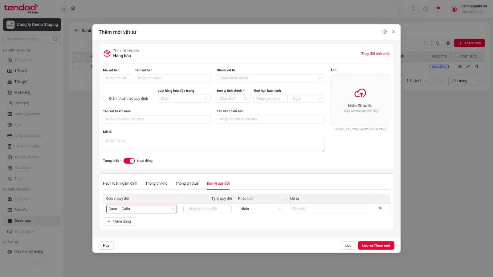 |

[Lên đầu](#top)

---

### BUG-VTHH-13

> 🤖 **AUTOMATION DETECTED · READ ONLY** · Cao · Tái hiện 4/4 testcase liên quan

| Hạng mục | Nội dung |
|---|---|
| **Tiêu đề bug** | Lưới Đơn vị quy đổi không hiển thị thông báo validate |
| **Điều kiện tiên quyết** | **Case đại diện: `TC_PMKT-U-00106-298`** Đang ở form Hàng hóa. Đã nhập ĐVT chính là "Cái" ở Tab Thông tin chung. Đang ở Tab Đơn vị quy đổi. |
| **Các bước tái hiện** | 1. Nhấn nút "Thêm dòng" trên lưới. 2. Ở cột Đơn vị tính, chọn đơn vị tính là "Cái" (trùng ĐVT chính). 3. Nhập Tỷ lệ quy đổi = 5 và nhấn "Lưu". |
| **Data test** | N/A |
| **Kết quả mong đợi** | 1. Hệ thống chặn lưu và hiển thị thông báo lỗi dưới chân lưới: "Đơn vị tính không được trùng với đơn vị tính chính" (MSG_PMKT-U-00106_012). |
| **Kết quả thực tế** | Không xuất hiện thông báo khi đơn vị trùng, tỷ lệ bằng 0, thiếu phép tính hoặc trùng dòng. Các testcase trong nhóm có cùng triệu chứng; root cause chung là suy luận từ kết quả chạy. |
| **Bằng chứng** | 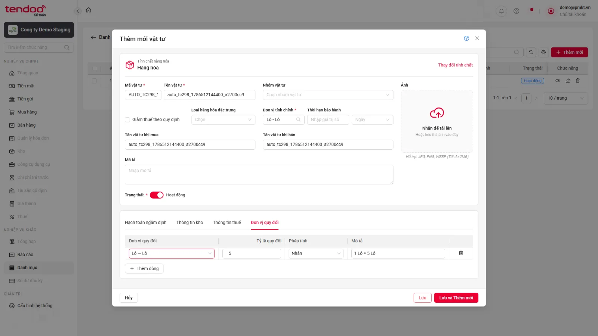 |

[Lên đầu](#top)

---

### BUG-VTHH-14

> 🤖 **AUTOMATION DETECTED · READ ONLY** · Cao · Tái hiện 4/4 testcase liên quan

| Hạng mục | Nội dung |
|---|---|
| **Tiêu đề bug** | Dữ liệu Kho trong DB không khớp lựa chọn trên UI |
| **Điều kiện tiên quyết** | **Case đại diện: `TC_PMKT-U-00106-308`** Đang ở form Thêm mới loại Hàng hóa. Dữ liệu nhập sử dụng Mã vật tư unique để truy vết bản ghi. |
| **Các bước tái hiện** | 1. Nhập đầy đủ thông tin hợp lệ trên form tạo mới Hàng hóa. 2. Tại Tab Đơn vị quy đổi, thêm một dòng hợp lệ rồi xóa dòng vừa thêm. 3. Nhấp nút "Lưu". 4. Tìm bản ghi vừa tạo trên lưới danh sách bằng Mã vật tư unique. 5. Truy vấn DB đúng tenant bằng Mã vật tư vừa tạo và đối chiếu toàn bộ thông tin đã nhập khi thêm mới. |
| **Data test** | N/A |
| **Kết quả mong đợi** | 1. Dòng Đơn vị quy đổi bị xóa ngay khỏi lưới hiển thị. 2. Hệ thống lưu vật tư mới thành công, hiển thị MSG_PMKT-U-00106_010 ("Thêm mới thành công") và đóng form. 3. Bản ghi vừa tạo hiển thị trên màn danh sách với đúng Mã vật tư unique; không cần mở Xem chi tiết. 4. Bản ghi DB thuộc đúng tenant và toàn bộ thông tin đã nhập khi thêm mới được lưu chính xác; không phát sinh dòng Đơn vị quy đổi đã xóa. |
| **Kết quả thực tế** | UI chọn “KHO-03 — Kho tổng — Hoạt động” nhưng dữ liệu đọc từ DB tại trường Kho là “Nhập trước xuất trước”. Các testcase trong nhóm có cùng triệu chứng; root cause chung là suy luận từ kết quả chạy. |
| **Bằng chứng** | 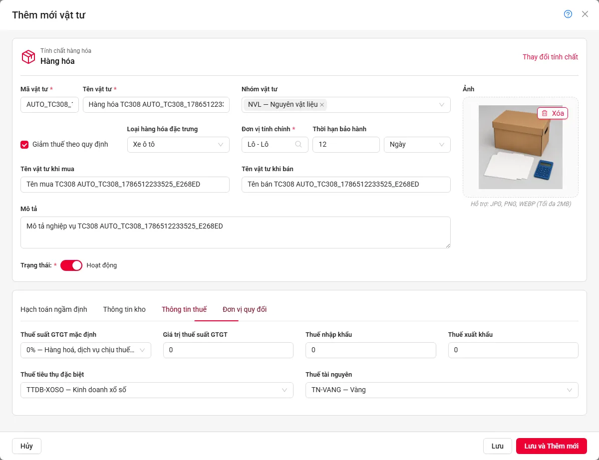 |

[Lên đầu](#top)

---

### BUG-VTHH-15

> 🤖 **AUTOMATION DETECTED · READ ONLY** · Trung bình · Tái hiện 1/1 testcase liên quan

| Hạng mục | Nội dung |
|---|---|
| **Tiêu đề bug** | Tìm Đơn vị tính theo Mã trả về thêm bản ghi không khớp mã |
| **Điều kiện tiên quyết** | **Case đại diện: `TC_PMKT-U-00106-36`** Đang ở form Thêm mới loại Hàng hóa. |
| **Các bước tái hiện** | 1. Mở combogrid Đơn vị tính chính. 2. Nhập từ khóa tìm kiếm khớp với một phần hoặc toàn bộ Mã đơn vị tính của bản ghi. |
| **Data test** | N/A |
| **Kết quả mong đợi** | Danh sách dropdown lọc đúng các bản ghi có Mã đơn vị tính chứa từ khóa đã gõ. |
| **Kết quả thực tế** | Tìm mã “Cuon” trả về cả “Cuộn — Cuộn” và “Cuon — Cuốn (Ngừng hoạt động)”, trong khi DB có một kết quả theo mã. |
| **Bằng chứng** | 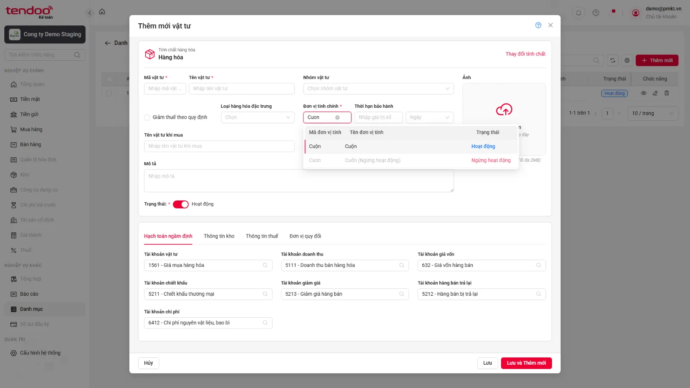 |

[Lên đầu](#top)

---

### BUG-VTHH-16

> 🤖 **AUTOMATION DETECTED · READ ONLY** · Trung bình · Tái hiện 2/2 testcase liên quan

| Hạng mục | Nội dung |
|---|---|
| **Tiêu đề bug** | Thuế Ngừng hoạt động không hiển thị chữ màu xám |
| **Điều kiện tiên quyết** | **Case đại diện: `TC_PMKT-U-00106-243`** Đang ở form Thêm mới loại Hàng hóa. Danh mục Thuế suất (ENT_ThueSuat) có bản ghi Hoạt động và Ngừng hoạt động. |
| **Các bước tái hiện** | 1. Click mở combogrid Thuế Tài nguyên. 2. Quan sát màu sắc hiển thị của các bản ghi Ngừng hoạt động. |
| **Data test** | N/A |
| **Kết quả mong đợi** | 1. Các bản ghi ở trạng thái Ngừng hoạt động hiển thị bằng chữ màu xám. |
| **Kết quả thực tế** | Bản ghi thuế Ngừng hoạt động có cùng màu và opacity với bản ghi Hoạt động. Các testcase trong nhóm có cùng triệu chứng; root cause chung là suy luận từ kết quả chạy. |
| **Bằng chứng** | 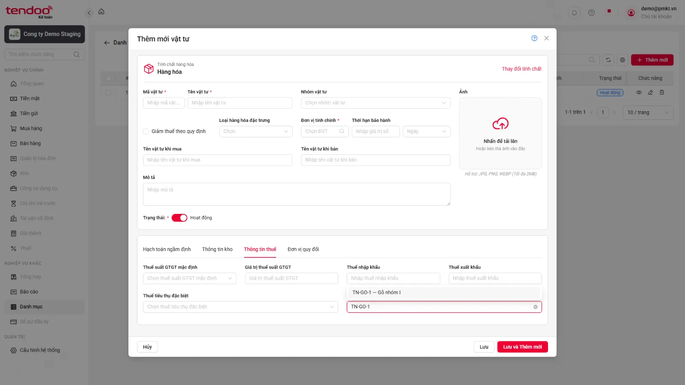 |

[Lên đầu](#top)

---

### BUG-VTHH-17

> 🤖 **AUTOMATION DETECTED · READ ONLY** · Cao · Tái hiện 4/4 testcase liên quan

| Hạng mục | Nội dung |
|---|---|
| **Tiêu đề bug** | Không hiện xác nhận khi chọn Thuế Ngừng hoạt động |
| **Điều kiện tiên quyết** | **Case đại diện: `TC_PMKT-U-00106-244`** Đang ở form Thêm mới loại Hàng hóa. Có bản ghi trong danh mục Thuế suất (ENT_ThueSuat) ở trạng thái Ngừng hoạt động. |
| **Các bước tái hiện** | 1. Mở combogrid Thuế Tài nguyên. 2. Chọn bản ghi ở trạng thái Ngừng hoạt động. 3. Kiểm tra hiển thị popup cảnh báo. 4. Nhấn nút "Xác nhận" trên popup. |
| **Data test** | N/A |
| **Kết quả mong đợi** | 1. Hệ thống hiển thị popup cảnh báo hiển thị chính xác nội dung thông báo: "Bản ghi đang ở trạng thái Ngừng hoạt động. Bạn có chắc chắn muốn sử dụng?" với 2 nút lựa chọn: Xác nhận / Hủy. 2. Sau khi nhấn Xác nhận, popup đóng và trường Thuế Tài nguyên chọn thành công bản ghi đó. |
| **Kết quả thực tế** | Thuế Tài nguyên/TTĐB Ngừng hoạt động được áp dụng trực tiếp, không có popup xác nhận. Các testcase trong nhóm có cùng triệu chứng; root cause chung là suy luận từ kết quả chạy. |
| **Bằng chứng** | 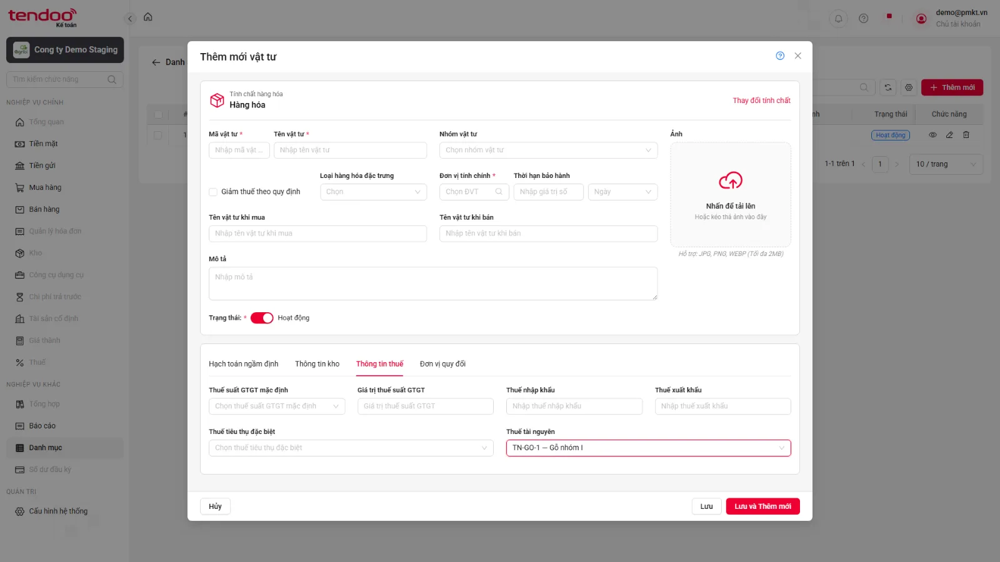 |

[Lên đầu](#top)

---

### BUG-VTHH-18

> 🤖 **AUTOMATION DETECTED · READ ONLY** · Cao · Tái hiện 4/4 testcase liên quan

| Hạng mục | Nội dung |
|---|---|
| **Tiêu đề bug** | Tìm Thuế theo thuế suất hoặc trạng thái trả về rỗng |
| **Điều kiện tiên quyết** | **Case đại diện: `TC_PMKT-U-00106-249`** Đang ở form Thêm mới loại Hàng hóa. |
| **Các bước tái hiện** | 1. Mở combogrid Thuế Tài nguyên. 2. Nhập từ khóa tìm kiếm khớp với một phần hoặc toàn bộ Thuế suất (%) của bản ghi. |
| **Data test** | N/A |
| **Kết quả mong đợi** | Danh sách dropdown lọc đúng các bản ghi có Thuế suất (%) chứa từ khóa đã gõ. |
| **Kết quả thực tế** | UI hiển thị “Không có dữ liệu” dù DB có bản ghi khớp điều kiện tìm. Các testcase trong nhóm có cùng triệu chứng; root cause chung là suy luận từ kết quả chạy. |
| **Bằng chứng** | 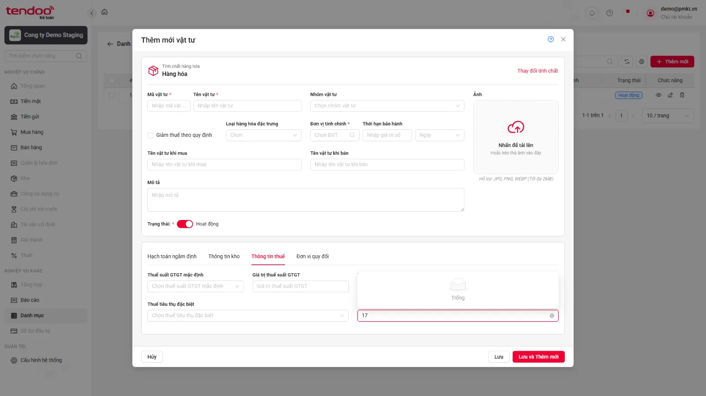 |

[Lên đầu](#top)
