

# Báo cáo kiểm thử — Thêm mới Vật tư — Nguyên vật liệu

## Thông tin kiểm thử

| Hạng mục | Giá trị |
|---|---|
| **Môi trường** | https://pmkt-staging.ospgroup.vn |
| **Tài khoản test** | demo@pmkt.vn |
| **Ngày** | 12/08/2026 |
| **Tổng TCs** | 320 |
| **Tổng thời gian** | 29 phút 08,91 giây |

## Tổng quan kết quả

| Tổng test | PASS | FAIL | SKIP | BLOCK | Tỷ lệ PASS | Automation Bugs |
|---:|---:|---:|---:|---:|---:|---:|
| **320** | **228** | **58** | **0** | **34** | **71.25%** | **18** |

## Tổng hợp Bugs

| Bug ID | Mức độ | Số case ảnh hưởng | Tên case ảnh hưởng | Tóm tắt bug |
|---|:---:|---:|---|---|
| [BUG-VTNVL-01](#bug-vtnvl-01) | Cao | 1 | TC_PMKT-U-00106-518 | Form Nguyên vật liệu thiếu trường Loại hàng hóa đặc trưng |
| [BUG-VTNVL-02](#bug-vtnvl-02) | Trung bình | 1 | TC_PMKT-U-00106-519 | Mô tả tính chất Bán thành phẩm không khớp testcase |
| [BUG-VTNVL-03](#bug-vtnvl-03) | Thấp | 3 | TC_PMKT-U-00106-526, TC_PMKT-U-00106-532, TC_PMKT-U-00106-839 | Nội dung validate trường bắt buộc không khớp testcase |
| [BUG-VTNVL-04](#bug-vtnvl-04) | Trung bình | 1 | TC_PMKT-U-00106-546 | Tìm Đơn vị tính theo Mã trả về thêm bản ghi không khớp mã |
| [BUG-VTNVL-05](#bug-vtnvl-05) | Trung bình | 10 | TC_PMKT-U-00106-550, TC_PMKT-U-00106-609, TC_PMKT-U-00106-624, TC_PMKT-U-00106-639, TC_PMKT-U-00106-652, TC_PMKT-U-00106-665, TC_PMKT-U-00106-678, TC_PMKT-U-00106-691, TC_PMKT-U-00106-706, TC_PMKT-U-00106-796 | Phím Up/Down không làm thay đổi vùng chọn trên combogrid |
| [BUG-VTNVL-06](#bug-vtnvl-06) | Cao | 2 | TC_PMKT-U-00106-553, TC_PMKT-U-00106-799 | Tài khoản full quyền không thấy nút Thêm nhanh Đơn vị tính |
| [BUG-VTNVL-07](#bug-vtnvl-07) | Cao | 15 | TC_PMKT-U-00106-600, TC_PMKT-U-00106-601, TC_PMKT-U-00106-607, TC_PMKT-U-00106-615, TC_PMKT-U-00106-616, TC_PMKT-U-00106-630, TC_PMKT-U-00106-631, TC_PMKT-U-00106-643, TC_PMKT-U-00106-644, TC_PMKT-U-00106-656, TC_PMKT-U-00106-657, TC_PMKT-U-00106-669, TC_PMKT-U-00106-670, TC_PMKT-U-00106-682, TC_PMKT-U-00106-683 | Tài khoản Ngừng hoạt động có trong DB nhưng không hiển thị trên combogrid |
| [BUG-VTNVL-08](#bug-vtnvl-08) | Thấp | 1 | TC_PMKT-U-00106-726 | Thông báo bắt buộc Phương pháp tính giá khác testcase |
| [BUG-VTNVL-09](#bug-vtnvl-09) | Cao | 2 | TC_PMKT-U-00106-746, TC_PMKT-U-00106-750 | Thuế nhập khẩu/xuất khẩu không reset khi đổi tính chất |
| [BUG-VTNVL-10](#bug-vtnvl-10) | Thấp | 1 | TC_PMKT-U-00106-751 | Nhãn Thuế Tài nguyên sai kiểu chữ so với testcase |
| [BUG-VTNVL-11](#bug-vtnvl-11) | Cao | 2 | TC_PMKT-U-00106-752, TC_PMKT-U-00106-768 | Dropdown Thuế không hiển thị cấu trúc combogrid bốn cột |
| [BUG-VTNVL-12](#bug-vtnvl-12) | Trung bình | 2 | TC_PMKT-U-00106-753, TC_PMKT-U-00106-769 | Thuế Ngừng hoạt động không hiển thị chữ màu xám |
| [BUG-VTNVL-13](#bug-vtnvl-13) | Cao | 4 | TC_PMKT-U-00106-754, TC_PMKT-U-00106-755, TC_PMKT-U-00106-770, TC_PMKT-U-00106-771 | Không hiện xác nhận khi chọn Thuế Ngừng hoạt động |
| [BUG-VTNVL-14](#bug-vtnvl-14) | Cao | 4 | TC_PMKT-U-00106-759, TC_PMKT-U-00106-760, TC_PMKT-U-00106-775, TC_PMKT-U-00106-776 | Tìm Thuế theo thuế suất hoặc trạng thái trả về rỗng |
| [BUG-VTNVL-15](#bug-vtnvl-15) | Trung bình | 1 | TC_PMKT-U-00106-785 | Lưới Đơn vị quy đổi sai tên cột |
| [BUG-VTNVL-16](#bug-vtnvl-16) | Cao | 2 | TC_PMKT-U-00106-787, TC_PMKT-U-00106-794 | Dropdown Đơn vị quy đổi thiếu header và không tìm được dữ liệu theo trạng thái |
| [BUG-VTNVL-17](#bug-vtnvl-17) | Cao | 2 | TC_PMKT-U-00106-789, TC_PMKT-U-00106-790 | Không hiện xác nhận khi chọn Đơn vị quy đổi Ngừng hoạt động |
| [BUG-VTNVL-18](#bug-vtnvl-18) | Cao | 4 | TC_PMKT-U-00106-808, TC_PMKT-U-00106-809, TC_PMKT-U-00106-810, TC_PMKT-U-00106-811 | Lưới Đơn vị quy đổi không hiển thị thông báo validate |

[Lên đầu](#top)

---

## Chi tiết Bug

### BUG-VTNVL-01

> 🤖 **AUTOMATION DETECTED · READ ONLY** · Cao · Tái hiện 1/1 testcase liên quan

| Hạng mục | Nội dung |
|---|---|
| **Tiêu đề bug** | Form Nguyên vật liệu thiếu trường Loại hàng hóa đặc trưng |
| **Điều kiện tiên quyết** | **Case đại diện: `TC_PMKT-U-00106-518`** Người dùng đang ở popup Chọn tính chất hàng hóa dịch vụ. |
| **Các bước tái hiện** | 1. Click chọn card "Nguyên vật liệu" trên popup. |
| **Data test** | N/A |
| **Kết quả mong đợi** | 1. Popup Chọn tính chất hàng hóa đóng lại. 2. Hiển thị popup Thêm mới vật tư. 3. Tính chất hàng hóa hiển thị: "Nguyên vật liệu" (textlabel, read-only). 4. Hiển thị đầy đủ các trường và các tab: Thông tin chung, Hạch toán ngầm định, Thông tin kho, Thuế, Đơn vị quy đổi. |
| **Kết quả thực tế** | Form Nguyên vật liệu hiển thị không có trường Loại hàng hóa đặc trưng; TC818–TC822 vì vậy bị BLOCK trước bước lưu. |
| **Bằng chứng** | 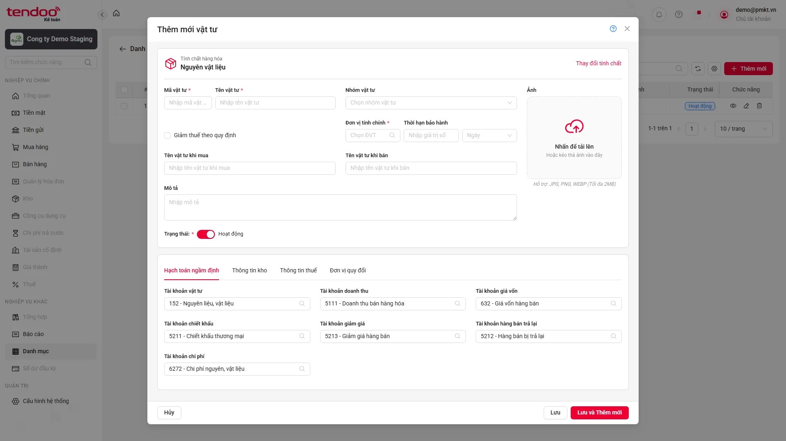 |

[Lên đầu](#top)

---

### BUG-VTNVL-02

> 🤖 **AUTOMATION DETECTED · READ ONLY** · Trung bình · Tái hiện 1/1 testcase liên quan

| Hạng mục | Nội dung |
|---|---|
| **Tiêu đề bug** | Mô tả tính chất Bán thành phẩm không khớp testcase |
| **Điều kiện tiên quyết** | **Case đại diện: `TC_PMKT-U-00106-519`** Đang ở form tạo mới Nguyên vật liệu. |
| **Các bước tái hiện** | 1. Nhấn nút "Thay đổi tính chất". 2. Kiểm tra hiển thị popup. |
| **Data test** | N/A |
| **Kết quả mong đợi** | 1. Hiển thị popup "Chọn tính chất hàng hóa dịch vụ" (Select card) gồm 6 lựa chọn dạng card: - Hàng hóa (Sản phẩm bạn mua và bán lại cho khách hàng) - Dịch vụ (Dịch vụ mà bạn cung cấp cho khách hàng) - Nguyên vật liệu (Nguyên liệu đầu vào dùng cho hoạt động sản xuất, xây dựng, cung cấp dịch vụ) - Công cụ, dụng cụ (Công cụ, dụng cụ mua về nhập kho chưa đưa vào sử dụng) - Thành phẩm (Là sản phẩm đầu ra của quá trình sản xuất) - Bán thành phẩm (Sản phẩm đầu ra của một công đoạn sản xuất nhất định). |
| **Kết quả thực tế** | UI hiển thị “Sản phẩm chưa hoàn thiện, là đầu vào để sản xuất tiếp thành phẩm” thay vì nội dung trong testcase. |
| **Bằng chứng** | 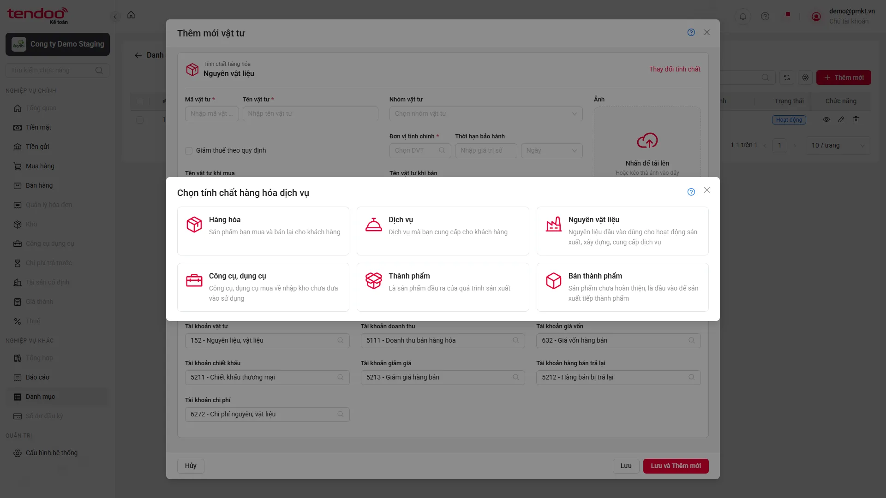 |

[Lên đầu](#top)

---

### BUG-VTNVL-03

> 🤖 **AUTOMATION DETECTED · READ ONLY** · Thấp · Tái hiện 3/3 testcase liên quan

| Hạng mục | Nội dung |
|---|---|
| **Tiêu đề bug** | Nội dung validate trường bắt buộc không khớp testcase |
| **Điều kiện tiên quyết** | **Case đại diện: `TC_PMKT-U-00106-526`** Đang ở form Thêm mới loại Nguyên vật liệu. |
| **Các bước tái hiện** | 1. Nhập đầy đủ thông tin hợp lệ khác. 2. Bỏ trống ô "Mã". 3. Nhấn "Lưu". |
| **Data test** | N/A |
| **Kết quả mong đợi** | 1. Hệ thống chặn lưu và hiển thị thông báo lỗi dưới chân trường Mã: "Mã không được để trống". |
| **Kết quả thực tế** | UI thêm tên đối tượng vào thông báo bắt buộc của Mã, Tên và Đơn vị tính. Các testcase trong nhóm có cùng triệu chứng; root cause chung là suy luận từ kết quả chạy. |
| **Bằng chứng** | 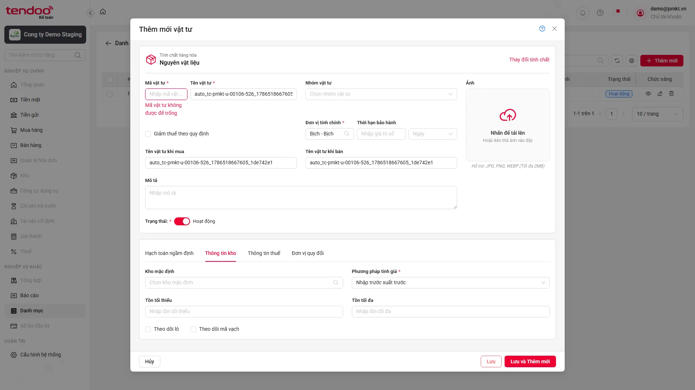 |

[Lên đầu](#top)

---

### BUG-VTNVL-04

> 🤖 **AUTOMATION DETECTED · READ ONLY** · Trung bình · Tái hiện 1/1 testcase liên quan

| Hạng mục | Nội dung |
|---|---|
| **Tiêu đề bug** | Tìm Đơn vị tính theo Mã trả về thêm bản ghi không khớp mã |
| **Điều kiện tiên quyết** | **Case đại diện: `TC_PMKT-U-00106-546`** Đang ở form Thêm mới loại Nguyên vật liệu. |
| **Các bước tái hiện** | 1. Mở combogrid Đơn vị tính chính. 2. Nhập từ khóa tìm kiếm khớp với một phần hoặc toàn bộ Mã đơn vị tính của bản ghi. |
| **Data test** | N/A |
| **Kết quả mong đợi** | Danh sách dropdown lọc đúng các bản ghi có Mã đơn vị tính chứa từ khóa đã gõ. |
| **Kết quả thực tế** | Khi tìm theo Mã, UI trả về nhiều bản ghi hơn tập dữ liệu DB khớp chính xác theo điều kiện testcase. |
| **Bằng chứng** | 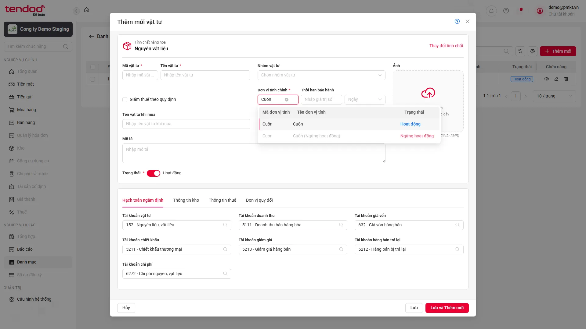 |

[Lên đầu](#top)

---

### BUG-VTNVL-05

> 🤖 **AUTOMATION DETECTED · READ ONLY** · Trung bình · Tái hiện 10/10 testcase liên quan

| Hạng mục | Nội dung |
|---|---|
| **Tiêu đề bug** | Phím Up/Down không làm thay đổi vùng chọn trên combogrid |
| **Điều kiện tiên quyết** | **Case đại diện: `TC_PMKT-U-00106-550`** Đang ở form Thêm mới loại Nguyên vật liệu. Dropdown combogrid Đơn vị tính chính đang mở. |
| **Các bước tái hiện** | 1. Nhấn phím Down (↓) nhiều lần. 2. Nhấn phím Up (↑). |
| **Data test** | N/A |
| **Kết quả mong đợi** | Vùng chọn di chuyển xuống/lên đúng từng dòng tương ứng; không thay đổi giá trị của trường cho đến khi người dùng nhấn Enter chọn. |
| **Kết quả thực tế** | Sau khi nhấn ArrowDown/ArrowUp, trạng thái hiển thị của các dòng không thay đổi. Các testcase trong nhóm có cùng triệu chứng; root cause chung là suy luận từ kết quả chạy. |
| **Bằng chứng** | 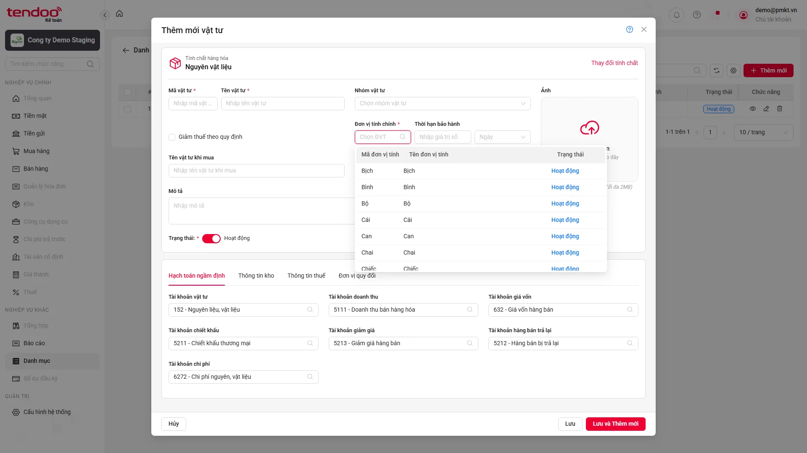 |

[Lên đầu](#top)

---

### BUG-VTNVL-06

> 🤖 **AUTOMATION DETECTED · READ ONLY** · Cao · Tái hiện 2/2 testcase liên quan

| Hạng mục | Nội dung |
|---|---|
| **Tiêu đề bug** | Tài khoản full quyền không thấy nút Thêm nhanh Đơn vị tính |
| **Điều kiện tiên quyết** | **Case đại diện: `TC_PMKT-U-00106-553`** Đang ở form Thêm mới loại Nguyên vật liệu. |
| **Các bước tái hiện** | 1. Đăng nhập bằng tài khoản có quyền thêm mới Đơn vị tính và quan sát combogrid Đơn vị tính chính. 2. Đăng nhập bằng tài khoản không có quyền và quan sát. |
| **Data test** | N/A |
| **Kết quả mong đợi** | 1. Có hiển thị nút biểu tượng dấu (+) thêm nhanh. 2. Nút dấu (+) bị ẩn hoàn toàn. |
| **Kết quả thực tế** | Dropdown Đơn vị tính chính và Đơn vị tính quy đổi không hiển thị nút (+) Thêm nhanh. |
| **Bằng chứng** |  |

[Lên đầu](#top)

---

### BUG-VTNVL-07

> 🤖 **AUTOMATION DETECTED · READ ONLY** · Cao · Tái hiện 15/15 testcase liên quan

| Hạng mục | Nội dung |
|---|---|
| **Tiêu đề bug** | Tài khoản Ngừng hoạt động có trong DB nhưng không hiển thị trên combogrid |
| **Điều kiện tiên quyết** | **Case đại diện: `TC_PMKT-U-00106-600`** Đang ở form Thêm mới loại Nguyên vật liệu. Có dữ liệu trong danh mục Hệ thống tài khoản (ENT_HeThongTaiKhoan) có Cho phép hạch toán = Có. |
| **Các bước tái hiện** | 1. Click mở combogrid Tài khoản vật tư. 2. Kiểm tra các cột hiển thị trong danh sách thả xuống. |
| **Data test** | N/A |
| **Kết quả mong đợi** | 1. Danh sách dropdown của combogrid Tài khoản vật tư hiển thị đúng các cột: Số hiệu TK, Tên TK, Trạng thái. 2. Dữ liệu trong danh sách thả xuống được lấy chính xác từ danh mục Hệ thống tài khoản (ENT_HeThongTaiKhoan) có Cho phép hạch toán = Có. 3. Các bản ghi ở trạng thái Hoạt động có Cho phép hạch toán = Có hiển thị ở trên và các bản ghi ở trạng thái Ngừng hoạt động có Cho phép hạch toán = Có hiển thị ở dưới. |
| **Kết quả thực tế** | Bản ghi tài khoản 1113 — Vàng tiền tệ có trong DB đúng tenant nhưng tìm trên UI trả về “Không có dữ liệu”. Các testcase trong nhóm có cùng triệu chứng; root cause chung là suy luận từ kết quả chạy. |
| **Bằng chứng** | 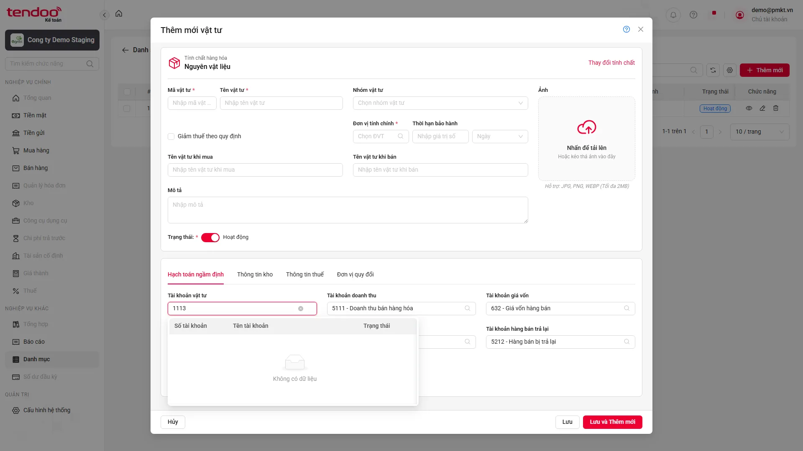 |

[Lên đầu](#top)

---

### BUG-VTNVL-08

> 🤖 **AUTOMATION DETECTED · READ ONLY** · Thấp · Tái hiện 1/1 testcase liên quan

| Hạng mục | Nội dung |
|---|---|
| **Tiêu đề bug** | Thông báo bắt buộc Phương pháp tính giá khác testcase |
| **Điều kiện tiên quyết** | **Case đại diện: `TC_PMKT-U-00106-726`** Đang ở form Nguyên vật liệu, Tab Thông tin kho. |
| **Các bước tái hiện** | 1. Bỏ trống ô phương pháp tính giá. 2. Nhấn "Lưu". |
| **Data test** | N/A |
| **Kết quả mong đợi** | 1. Hệ thống chặn lưu và báo lỗi dưới chân trường: "Phương pháp tính giá không được để trống". |
| **Kết quả thực tế** | UI hiển thị “Phương pháp tính giá không được bỏ trống” thay vì “không được để trống”. |
| **Bằng chứng** | 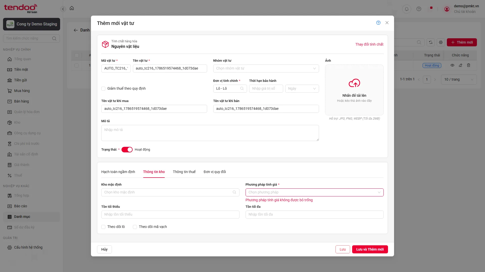 |

[Lên đầu](#top)

---

### BUG-VTNVL-09

> 🤖 **AUTOMATION DETECTED · READ ONLY** · Cao · Tái hiện 2/2 testcase liên quan

| Hạng mục | Nội dung |
|---|---|
| **Tiêu đề bug** | Thuế nhập khẩu/xuất khẩu không reset khi đổi tính chất |
| **Điều kiện tiên quyết** | **Case đại diện: `TC_PMKT-U-00106-746`** Đang ở form tạo mới Nguyên vật liệu, Tab Thông tin thuế. Trường Numeric Thuế nhập khẩu đã điền/chọn dữ liệu hợp lệ. |
| **Các bước tái hiện** | 1. Nhấn nút "Thay đổi tính chất". 2. Trên popup, chọn card "CCDC". 3. Chuyển sang Tab Thông tin thuế. |
| **Data test** | N/A |
| **Kết quả mong đợi** | 1. Trường Numeric Thuế nhập khẩu trên form mới tự động được xóa sạch dữ liệu (reset về mặc định) theo nghiệp vụ. |
| **Kết quả thực tế** | Giá trị thuế đã nhập vẫn còn sau khi đổi sang loại vật tư khác. Các testcase trong nhóm có cùng triệu chứng; root cause chung là suy luận từ kết quả chạy. |
| **Bằng chứng** | 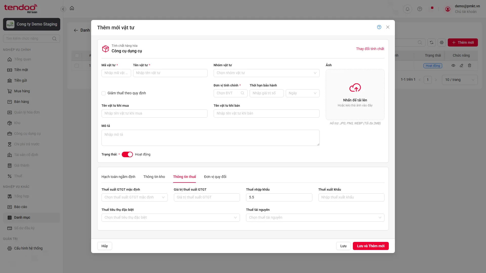 |

[Lên đầu](#top)

---

### BUG-VTNVL-10

> 🤖 **AUTOMATION DETECTED · READ ONLY** · Thấp · Tái hiện 1/1 testcase liên quan

| Hạng mục | Nội dung |
|---|---|
| **Tiêu đề bug** | Nhãn Thuế Tài nguyên sai kiểu chữ so với testcase |
| **Điều kiện tiên quyết** | **Case đại diện: `TC_PMKT-U-00106-751`** Đang ở form Thêm mới loại Nguyên vật liệu. |
| **Các bước tái hiện** | 1. Truy cập màn hình thêm mới Loại Nguyên vật liệu. 2. Quan sát trường "Thuế Tài nguyên". |
| **Data test** | N/A |
| **Kết quả mong đợi** | - Loại phần tử (element control): Combogrid. - Label hiển thị đúng: "Thuế Tài nguyên" (không bắt buộc, không hiển thị dấu (`*`)). |
| **Kết quả thực tế** | UI hiển thị “Thuế tài nguyên” thay vì “Thuế Tài nguyên”. |
| **Bằng chứng** |  |

[Lên đầu](#top)

---

### BUG-VTNVL-11

> 🤖 **AUTOMATION DETECTED · READ ONLY** · Cao · Tái hiện 2/2 testcase liên quan

| Hạng mục | Nội dung |
|---|---|
| **Tiêu đề bug** | Dropdown Thuế không hiển thị cấu trúc combogrid bốn cột |
| **Điều kiện tiên quyết** | **Case đại diện: `TC_PMKT-U-00106-752`** Đang ở form Thêm mới loại Nguyên vật liệu. Có dữ liệu trong danh mục Thuế suất (ENT_ThueSuat). |
| **Các bước tái hiện** | 1. Click mở combogrid Thuế Tài nguyên. 2. Kiểm tra các cột hiển thị trong danh sách thả xuống. |
| **Data test** | N/A |
| **Kết quả mong đợi** | 1. Danh sách dropdown của combogrid Thuế Tài nguyên hiển thị đúng các cột: Mã thuế tài nguyên, Tên thuế tài nguyên, Thuế suất (%), Trạng thái. 2. Dữ liệu trong danh sách thả xuống được lấy chính xác từ danh mục Thuế suất (ENT_ThueSuat). 3. Các bản ghi ở trạng thái Hoạt động hiển thị ở trên và các bản ghi ở trạng thái Ngừng hoạt động hiển thị ở dưới. |
| **Kết quả thực tế** | Dropdown Thuế Tài nguyên và Thuế tiêu thụ đặc biệt chỉ hiển thị danh sách Mã — Tên, không có bốn header theo testcase. |
| **Bằng chứng** | 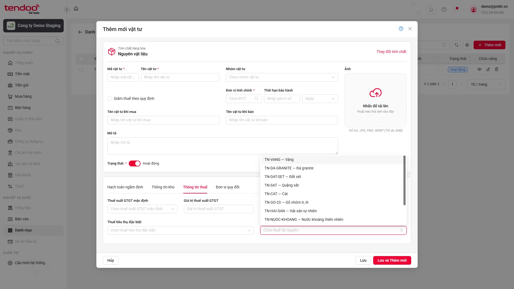 |

[Lên đầu](#top)

---

### BUG-VTNVL-12

> 🤖 **AUTOMATION DETECTED · READ ONLY** · Trung bình · Tái hiện 2/2 testcase liên quan

| Hạng mục | Nội dung |
|---|---|
| **Tiêu đề bug** | Thuế Ngừng hoạt động không hiển thị chữ màu xám |
| **Điều kiện tiên quyết** | **Case đại diện: `TC_PMKT-U-00106-753`** Đang ở form Thêm mới loại Nguyên vật liệu. Danh mục Thuế suất (ENT_ThueSuat) có bản ghi Hoạt động và Ngừng hoạt động. |
| **Các bước tái hiện** | 1. Click mở combogrid Thuế Tài nguyên. 2. Quan sát màu sắc hiển thị của các bản ghi Ngừng hoạt động. |
| **Data test** | N/A |
| **Kết quả mong đợi** | 1. Các bản ghi ở trạng thái Ngừng hoạt động hiển thị bằng chữ màu xám. |
| **Kết quả thực tế** | Bản ghi Thuế Ngừng hoạt động không có màu chữ xám khác biệt như Expected. |
| **Bằng chứng** | 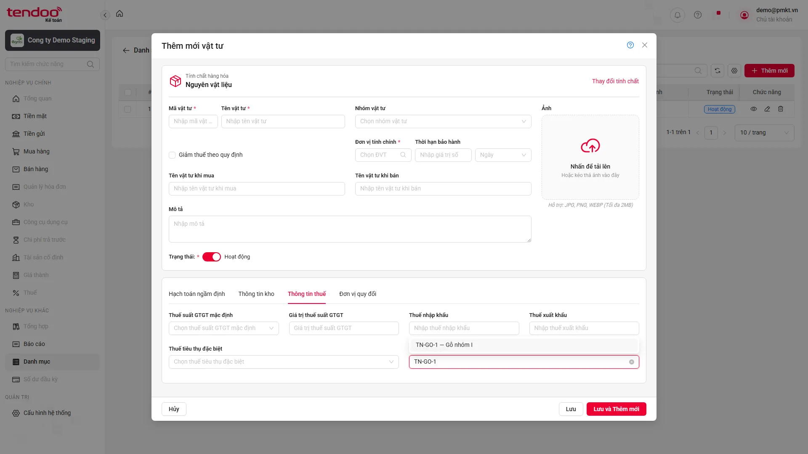 |

[Lên đầu](#top)

---

### BUG-VTNVL-13

> 🤖 **AUTOMATION DETECTED · READ ONLY** · Cao · Tái hiện 4/4 testcase liên quan

| Hạng mục | Nội dung |
|---|---|
| **Tiêu đề bug** | Không hiện xác nhận khi chọn Thuế Ngừng hoạt động |
| **Điều kiện tiên quyết** | **Case đại diện: `TC_PMKT-U-00106-754`** Đang ở form Thêm mới loại Nguyên vật liệu. Có bản ghi trong danh mục Thuế suất (ENT_ThueSuat) ở trạng thái Ngừng hoạt động. |
| **Các bước tái hiện** | 1. Mở combogrid Thuế Tài nguyên. 2. Chọn bản ghi ở trạng thái Ngừng hoạt động. 3. Kiểm tra hiển thị popup cảnh báo. 4. Nhấn nút "Xác nhận" trên popup. |
| **Data test** | N/A |
| **Kết quả mong đợi** | 1. Hệ thống hiển thị popup cảnh báo hiển thị chính xác nội dung thông báo: "Bản ghi đang ở trạng thái Ngừng hoạt động. Bạn có chắc chắn muốn sử dụng?" với 2 nút lựa chọn: Xác nhận / Hủy. 2. Sau khi nhấn Xác nhận, popup đóng và trường Thuế Tài nguyên chọn thành công bản ghi đó. |
| **Kết quả thực tế** | Bản ghi Thuế Ngừng hoạt động được áp dụng trực tiếp, không hiển thị popup xác nhận để người dùng Xác nhận hoặc Hủy. |
| **Bằng chứng** | 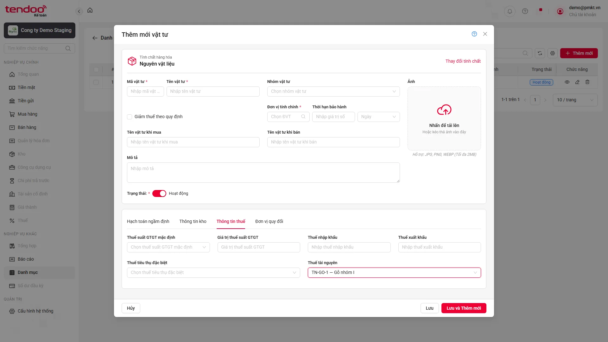 |

[Lên đầu](#top)

---

### BUG-VTNVL-14

> 🤖 **AUTOMATION DETECTED · READ ONLY** · Cao · Tái hiện 4/4 testcase liên quan

| Hạng mục | Nội dung |
|---|---|
| **Tiêu đề bug** | Tìm Thuế theo thuế suất hoặc trạng thái trả về rỗng |
| **Điều kiện tiên quyết** | **Case đại diện: `TC_PMKT-U-00106-759`** Đang ở form Thêm mới loại Nguyên vật liệu. |
| **Các bước tái hiện** | 1. Mở combogrid Thuế Tài nguyên. 2. Nhập từ khóa tìm kiếm khớp với một phần hoặc toàn bộ Thuế suất (%) của bản ghi. |
| **Data test** | N/A |
| **Kết quả mong đợi** | Danh sách dropdown lọc đúng các bản ghi có Thuế suất (%) chứa từ khóa đã gõ. |
| **Kết quả thực tế** | Tìm theo Thuế suất hoặc Trạng thái không trả về tập dữ liệu khớp DB; ảnh đại diện hiển thị danh sách rỗng. |
| **Bằng chứng** | 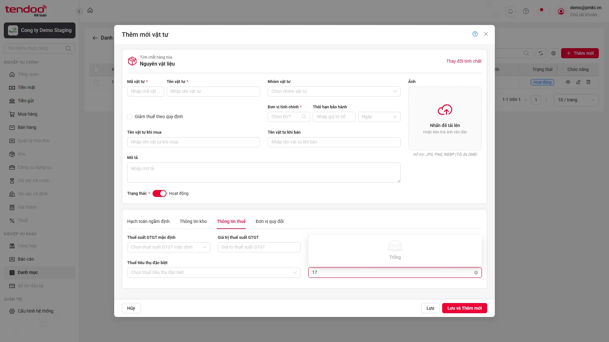 |

[Lên đầu](#top)

---

### BUG-VTNVL-15

> 🤖 **AUTOMATION DETECTED · READ ONLY** · Trung bình · Tái hiện 1/1 testcase liên quan

| Hạng mục | Nội dung |
|---|---|
| **Tiêu đề bug** | Lưới Đơn vị quy đổi sai tên cột |
| **Điều kiện tiên quyết** | **Case đại diện: `TC_PMKT-U-00106-785`** Đang ở form Thêm mới loại Nguyên vật liệu. |
| **Các bước tái hiện** | 1. Click chọn Tab "Đơn vị quy đổi". 2. Nhấn nút "Thêm dòng" trên lưới. 3. Quan sát các cột và các trường thông tin trên dòng lưới mới. |
| **Data test** | N/A |
| **Kết quả mong đợi** | 1. Cột Đơn vị tính: Element control dạng combogrid, bắt buộc chọn. 2. Cột Tỷ lệ quy đổi: Element control dạng numeric box, bắt buộc nhập. 3. Cột Phép tính: Element control dạng Select dropdown, bắt buộc chọn, mặc định hiển thị giá trị "Nhân". 4. Cột Mô tả: Element control dạng text box, ở trạng thái chỉ đọc (read-only), mặc định trống. |
| **Kết quả thực tế** | Header đầu tiên là “Đơn vị quy đổi” thay vì “Đơn vị tính”. |
| **Bằng chứng** | 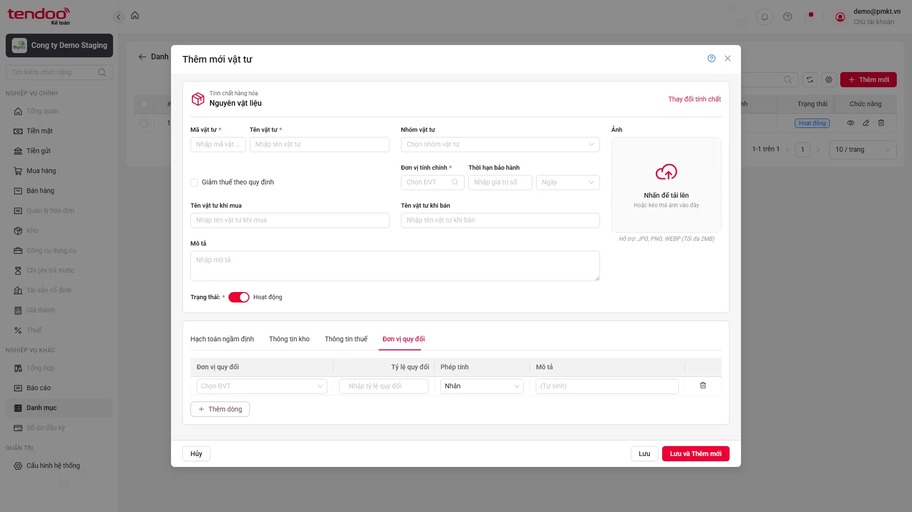 |

[Lên đầu](#top)

---

### BUG-VTNVL-16

> 🤖 **AUTOMATION DETECTED · READ ONLY** · Cao · Tái hiện 2/2 testcase liên quan

| Hạng mục | Nội dung |
|---|---|
| **Tiêu đề bug** | Dropdown Đơn vị quy đổi thiếu header và không tìm được dữ liệu theo trạng thái |
| **Điều kiện tiên quyết** | **Case đại diện: `TC_PMKT-U-00106-787`** Đang ở form tạo mới Nguyên vật liệu, Tab Đơn vị quy đổi. Đã nhấn "Thêm dòng" trên lưới. Có dữ liệu trong danh mục Đơn vị tính (ENT_DonViTinh). |
| **Các bước tái hiện** | 1. Click ô Đơn vị tính trên dòng lưới. 2. Kiểm tra các cột hiển thị trong danh sách thả xuống. |
| **Data test** | N/A |
| **Kết quả mong đợi** | 1. Danh sách dropdown của ô Đơn vị tính trên lưới hiển thị đúng các cột: Mã đơn vị tính, Tên đơn vị tính, Trạng thái. 2. Dữ liệu trong danh sách thả xuống được lấy chính xác từ danh mục Đơn vị tính (ENT_DonViTinh). 3. Các bản ghi ở trạng thái Hoạt động hiển thị ở trên và các bản ghi ở trạng thái Ngừng hoạt động hiển thị ở dưới. |
| **Kết quả thực tế** | Dropdown không có ba header và tìm theo trạng thái không trả về dữ liệu khớp DB. |
| **Bằng chứng** | 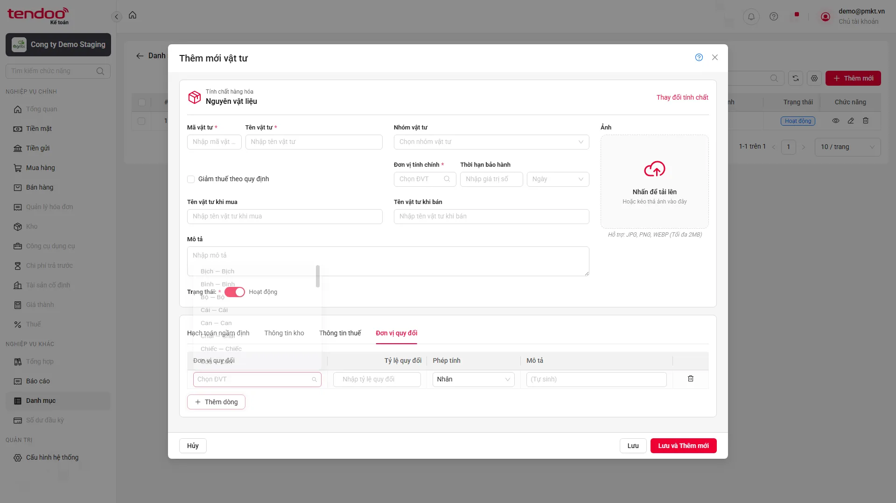 |

[Lên đầu](#top)

---

### BUG-VTNVL-17

> 🤖 **AUTOMATION DETECTED · READ ONLY** · Cao · Tái hiện 2/2 testcase liên quan

| Hạng mục | Nội dung |
|---|---|
| **Tiêu đề bug** | Không hiện xác nhận khi chọn Đơn vị quy đổi Ngừng hoạt động |
| **Điều kiện tiên quyết** | **Case đại diện: `TC_PMKT-U-00106-789`** Đang ở form tạo mới Nguyên vật liệu, Tab Đơn vị quy đổi. Đã nhấn "Thêm dòng" trên lưới. Có bản ghi trong danh mục Đơn vị tính (ENT_DonViTinh) ở trạng thái Ngừng hoạt động. |
| **Các bước tái hiện** | 1. Click ô Đơn vị tính trên lưới. 2. Chọn bản ghi ở trạng thái Ngừng hoạt động. 3. Kiểm tra hiển thị popup cảnh báo. 4. Nhấn nút "Xác nhận" trên popup. |
| **Data test** | N/A |
| **Kết quả mong đợi** | 1. Hệ thống hiển thị popup cảnh báo hiển thị chính xác nội dung thông báo: "Bản ghi đang ở trạng thái Ngừng hoạt động. Bạn có chắc chắn muốn sử dụng?" với 2 nút lựa chọn: Xác nhận / Hủy. 2. Sau khi nhấn Xác nhận, popup đóng và ô Đơn vị tính trên lưới chọn thành công bản ghi đó. |
| **Kết quả thực tế** | Bản ghi Ngừng hoạt động được áp dụng trực tiếp, không hiển thị popup xác nhận để người dùng Xác nhận hoặc Hủy. |
| **Bằng chứng** | 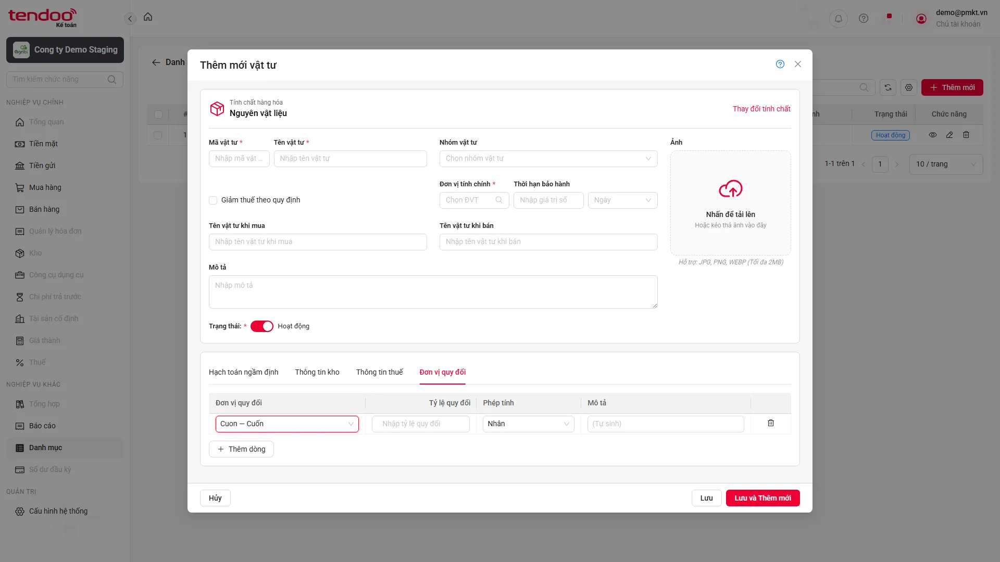 |

[Lên đầu](#top)

---

### BUG-VTNVL-18

> 🤖 **AUTOMATION DETECTED · READ ONLY** · Cao · Tái hiện 4/4 testcase liên quan

| Hạng mục | Nội dung |
|---|---|
| **Tiêu đề bug** | Lưới Đơn vị quy đổi không hiển thị thông báo validate |
| **Điều kiện tiên quyết** | **Case đại diện: `TC_PMKT-U-00106-808`** Đang ở form Nguyên vật liệu. Đã nhập ĐVT chính là "Cái" ở Tab Thông tin chung. Đang ở Tab Đơn vị quy đổi. |
| **Các bước tái hiện** | 1. Nhấn nút "Thêm dòng" trên lưới. 2. Ở cột Đơn vị tính, chọn đơn vị tính là "Cái" (trùng ĐVT chính). 3. Nhập Tỷ lệ quy đổi = 5 và nhấn "Lưu". |
| **Data test** | N/A |
| **Kết quả mong đợi** | 1. Hệ thống chặn lưu và hiển thị thông báo lỗi dưới chân lưới: "Đơn vị tính không được trùng với đơn vị tính chính" (MSG_PMKT-U-00106_012). |
| **Kết quả thực tế** | Sau khi lưu với Đơn vị tính trùng hoặc Tỷ lệ không hợp lệ, UI không hiển thị thông báo validation tại dòng quy đổi. |
| **Bằng chứng** | 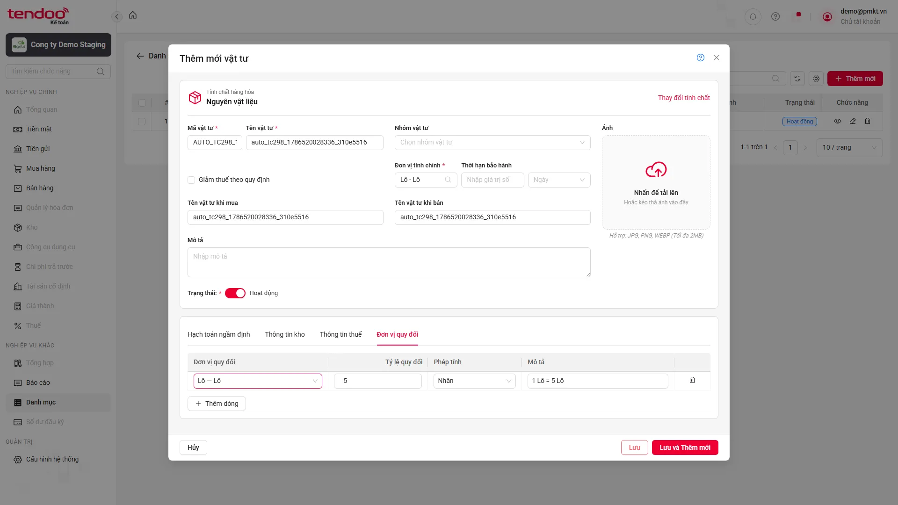 |

[Lên đầu](#top)

---
