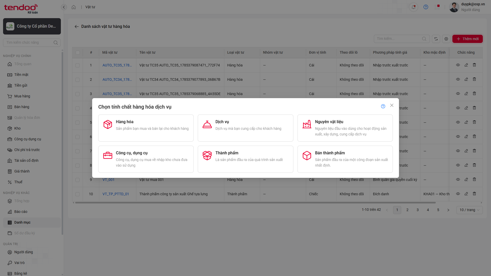
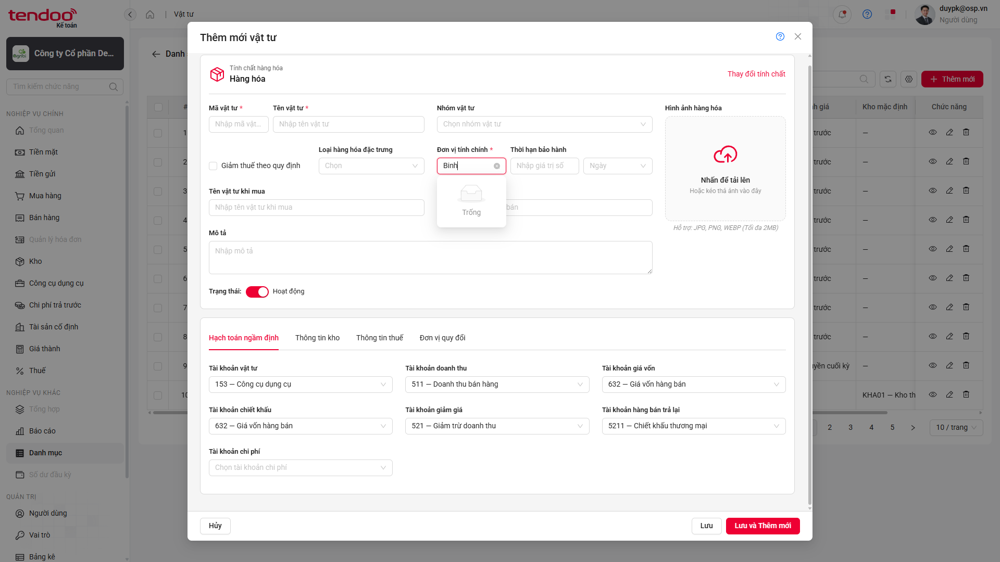
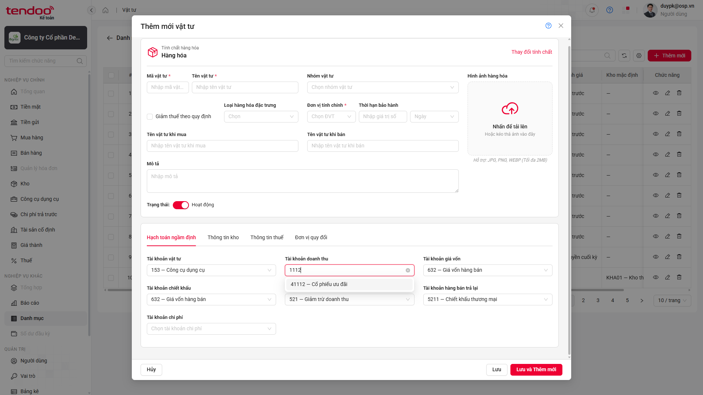
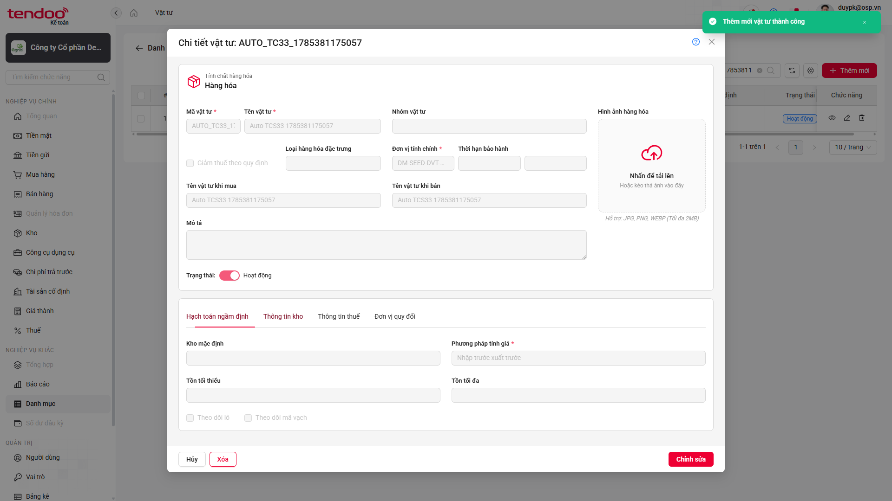

# 📋 Báo cáo kiểm thử — Thêm mới Vật tư

> **Kết luận:** 🔴 Bộ kiểm thử **chưa đạt** — có **10/16 test FAIL** và 4 nhóm lỗi cần xử lý hoặc xác nhận lại nghiệp vụ.

## Thông tin lần chạy

| Hạng mục | Chi tiết |
|---|---|
| 🗓️ Thời gian | 30/07/2026, 10:10–10:13 — Asia/Saigon |
| 🧪 Test suite | `src/tests/danh-muc/vat-tu-tao-moi.spec.ts` |
| 🌐 Trình duyệt | Chromium — headed mode |
| ⚙️ Cấu hình | `workers=1` · `retries=0` · reporter `line` |
| ⏱️ Thời lượng | 184,5 giây — khoảng 3 phút |

## Tổng quan kết quả

| Tổng test | ✅ PASS | ❌ FAIL | ⏭️ SKIP | Tỷ lệ PASS |
|:---:|:---:|:---:|:---:|:---:|
| **16** | **6** | **10** | **0** | **37,5%** |

<a id="dieu-huong-nhanh"></a>

### Điều hướng nhanh

- [Kết quả từng test case](#kết-quả-chi-tiết)
- [Tổng hợp nhóm lỗi](#tổng-hợp-nhóm-lỗi)
- [BUG-VT-01 — Mô tả Bán thành phẩm](#bug-vt-01--mô-tả-bán-thành-phẩm-thừa-dấu-chấm-cuối-câu)
- [BUG-VT-02 — Đơn vị tính ngừng hoạt động](#bug-vt-02--dropdown-đơn-vị-tính-chính-không-hiển-thị-dữ-liệu-ngừng-hoạt-động)
- [BUG-VT-03 — Combogrid tài khoản](#bug-vt-03--combogrid-tài-khoản-sai-cấu-trúc-và-thiếu-dữ-liệu-trạng-thái)
- [BUG-VT-04 — Nội dung toast](#bug-vt-04--nội-dung-toast-tạo-mới-không-đúng-expected)

---

## Kết quả chi tiết

| TC ID | Kết quả | Nội dung chính |
|---|---|---|
| `CL-UAT-U-00106-01` | ❌ FAIL | Mô tả Bán thành phẩm khác một dấu chấm cuối câu |
| `CL-UAT-U-00106-02` | ✅ PASS | Multiple select Nhóm vật tư |
| `CL-UAT-U-00106-03` | ❌ FAIL | Không hiển thị ĐVT ngừng hoạt động `Binh — Bình` |
| `CL-UAT-U-00106-04` | ❌ FAIL | Combogrid Tài khoản doanh thu sai cấu trúc/dữ liệu |
| `CL-UAT-U-00106-05` | ❌ FAIL | Combogrid Tài khoản hàng bán trả lại sai cấu trúc/dữ liệu |
| `CL-UAT-U-00106-06` | ❌ FAIL | Combogrid Tài khoản chi phí sai cấu trúc/dữ liệu |
| `CL-UAT-U-00106-07` | ❌ FAIL | Combogrid Tài khoản chiết khấu sai cấu trúc/dữ liệu |
| `CL-UAT-U-00106-08` | ❌ FAIL | Combogrid Tài khoản giảm giá sai cấu trúc/dữ liệu |
| `CL-UAT-U-00106-14` | ✅ PASS | Form Hàng hóa hiển thị đầy đủ tab và trường |
| `CL-UAT-U-00106-15` | ✅ PASS | Dropdown Loại hàng hóa đặc trưng |
| `CL-UAT-U-00106-33` | ❌ FAIL | Toast thực tế khác expected |
| `CL-UAT-U-00106-34` | ❌ FAIL | Toast thực tế khác expected |
| `CL-UAT-U-00106-35` | ❌ FAIL | Toast thực tế khác expected |
| `CL-UAT-U-00106-36` | ✅ PASS | Hủy khi chưa nhập dữ liệu |
| `CL-UAT-U-00106-37` | ✅ PASS | Hủy khi đã nhập dữ liệu và xử lý popup xác nhận |
| `CL-UAT-U-00106-38` | ✅ PASS | Đổi Hàng hóa sang Dịch vụ, ẩn/reset dữ liệu đặc thù |

[⬆️ Lên đầu](#dieu-huong-nhanh)
---

## Tổng hợp nhóm lỗi

| Bug | Mức độ | Test ảnh hưởng | Tần suất | Mô tả ngắn |
|---|:---:|:---:|:---:|---|
| `BUG-VT-01` | 🟢 Low | 1 | 1/1 | Thừa dấu chấm cuối mô tả Bán thành phẩm |
| `BUG-VT-02` | 🟡 Medium | 1 | 1/1 | Không hiển thị ĐVT ngừng hoạt động |
| `BUG-VT-03` | 🔴 High | 5 | 5/5 | Combogrid tài khoản thiếu cấu trúc và trạng thái |
| `BUG-VT-04` | 🟡 Medium | 3 | 3/3 | Nội dung toast tạo mới khác expected |

### 1. Sai khác nội dung hiển thị — 4 test

- TC01: UI thêm dấu chấm cuối mô tả Bán thành phẩm.
- TC33, TC34, TC35: UI dùng toast `Thêm mới vật tư thành công`, trong khi testcase/script yêu cầu `Thêm mới thành công`.
- Các luồng tạo mới của TC33–TC35 vẫn hoàn tất; lỗi được ghi nhận tại assertion wording.

### 2. Dữ liệu Đơn vị tính — 1 test

- TC03 yêu cầu hiển thị/chọn được đơn vị tính ngừng hoạt động `Binh — Bình`.
- Dropdown UI không tìm thấy giá trị này trong lần chạy.

### 3. Combogrid tài khoản — 5 test

TC04–TC08 cùng tái hiện ba sai lệch:

- Không thu được các cột `Số tài khoản`, `Tên tài khoản`, `Trạng thái`; actual headers là mảng rỗng.
- Option hoạt động chỉ hiển thị mã/tên, không hiển thị chữ `Hoạt động`.
- Không tìm thấy tài khoản ngừng hoạt động `1112 — Ngoại tệ`.

Do cả năm trường có cùng biểu hiện, khả năng cao đây là khác biệt chung của component/dữ liệu API thay vì năm lỗi độc lập.

[⬆️ Lên đầu](#dieu-huong-nhanh)

---

## Chi tiết lỗi

### BUG-VT-01 — Mô tả “Bán thành phẩm” thừa dấu chấm cuối câu

> 🟢 **Low** · UI/Content · Tái hiện **1/1**

#### Thông tin chung của bug

| Thuộc tính | Giá trị |
|---|---|
| Test case | CL-UAT-U-00106-01 |
| Module | Danh mục → Vật tư → Thêm mới |
| Phân loại | UI/Content |
| Mức độ đề xuất | 🟢 Low |
| Trạng thái | 🔵 Open — cần BA/PO xác nhận wording chuẩn |

#### Điều kiện ban đầu

- Đã đăng nhập bằng tài khoản có quyền Kế toán viên.
- Đang ở màn hình danh sách Vật tư và dữ liệu trang đã tải xong.

#### Các bước tái hiện

1. Truy cập **Danh mục → Vật tư**.
2. Nhấn **Thêm mới**.
3. Quan sát popup **Chọn tính chất hàng hóa dịch vụ**.
4. Kiểm tra mô tả của lựa chọn **Bán thành phẩm**.

#### So sánh kết quả

| Expected | Actual |
|---|---|
| `Sản phẩm đầu ra của một công đoạn sản xuất nhất định` | `Sản phẩm đầu ra của một công đoạn sản xuất nhất định.` |

Sai lệch là dấu chấm `.` cuối câu trên UI.

#### Tần suất bug

- **1/1 lần chạy (100%)** trong lần full run này.

#### Dữ liệu test

- Không có dữ liệu nhập; testcase chỉ kiểm tra nội dung popup.

#### Ảnh bằng chứng



*Ảnh 1 — Popup chọn tính chất, mô tả Bán thành phẩm có dấu chấm cuối câu.*  
[🔍 Mở ảnh gốc](./evidence/vat-tu-tao-moi-2026-07-30-101352/BUG-VT-01-TC01.png)

[⬆️ Lên đầu](#dieu-huong-nhanh)

---

### BUG-VT-02 — Dropdown Đơn vị tính chính không hiển thị dữ liệu ngừng hoạt động

> 🟡 **Medium** · Functional/Data filtering · Tái hiện **1/1**

#### Thông tin chung của bug

| Thuộc tính | Giá trị |
|---|---|
| Test case | CL-UAT-U-00106-03 |
| Module | Danh mục → Vật tư → Thêm mới → Thông tin chung |
| Phân loại | Functional/Data filtering |
| Mức độ đề xuất | 🟡 Medium |
| Trạng thái | 🔵 Open |

#### Điều kiện ban đầu

- Đã đăng nhập bằng tài khoản có quyền Kế toán viên.
- Danh mục Đơn vị tính có dữ liệu hoạt động và ngừng hoạt động.
- `Binh — Bình` tồn tại ở trạng thái ngừng hoạt động theo dữ liệu API dùng làm precondition.

#### Các bước tái hiện

1. Truy cập **Danh mục → Vật tư**.
2. Nhấn **Thêm mới**, chọn **Hàng hóa**.
3. Mở dropdown **Đơn vị tính chính**.
4. Tìm và kiểm tra đơn vị tính `Binh — Bình`.

#### So sánh kết quả

| Expected | Actual |
|---|---|
| Hiển thị và cho phép chọn ĐVT ngừng hoạt động `Binh — Bình`. | Không tìm thấy option `Binh — Bình`; timeout sau 10 giây. |

#### Tần suất bug

- **1/1 lần chạy (100%)** trong lần full run này.

#### Dữ liệu test

| Loại vật tư | Đơn vị tính ngừng hoạt động |
|---|---|
| `Hàng hóa` | `Binh — Bình` |

#### Ảnh bằng chứng



*Ảnh 2 — Dropdown Đơn vị tính chính không có option ngừng hoạt động cần kiểm tra.*  
[🔍 Mở ảnh gốc](./evidence/vat-tu-tao-moi-2026-07-30-101352/BUG-VT-02-TC03.png)

[⬆️ Lên đầu](#dieu-huong-nhanh)

---

### BUG-VT-03 — Combogrid tài khoản sai cấu trúc và thiếu dữ liệu trạng thái

> 🔴 **High** · Functional/UI component/Data filtering · Tái hiện **5/5 trường**

#### Thông tin chung của bug

| Thuộc tính | Giá trị |
|---|---|
| Test case ảnh hưởng | CL-UAT-U-00106-04, 05, 06, 07, 08 |
| Trường ảnh hưởng | TK doanh thu, hàng bán trả lại, chi phí, chiết khấu, giảm giá |
| Module | Danh mục → Vật tư → Thêm mới → Hạch toán ngầm định |
| Phân loại | Functional/UI component/Data filtering |
| Mức độ đề xuất | 🔴 High |
| Trạng thái | 🔵 Open |

#### Điều kiện ban đầu

- Đã đăng nhập bằng tài khoản có quyền Kế toán viên.
- Danh mục tài khoản có dữ liệu hoạt động, ngừng hoạt động và thuộc tính Cho phép hạch toán.
- Đang ở form tạo mới Vật tư loại **Hàng hóa**.

#### Các bước tái hiện

Lặp lại các bước sau với từng trường tài khoản bị ảnh hưởng:

1. Truy cập **Danh mục → Vật tư**.
2. Nhấn **Thêm mới**, chọn **Hàng hóa**.
3. Mở tab **Hạch toán ngầm định**.
4. Mở combogrid của trường tài khoản cần kiểm tra.
5. Kiểm tra tiêu đề các cột.
6. Tìm `3312 — Phải trả người bán - 2` và kiểm tra trạng thái.
7. Tìm tài khoản ngừng hoạt động `1112 — Ngoại tệ`.

#### So sánh kết quả

| Hạng mục | Expected | Actual |
|---|---|---|
| Cấu trúc grid | Có `Số tài khoản`, `Tên tài khoản`, `Trạng thái` | Không tìm thấy header; actual `[]` |
| Tài khoản hoạt động | Dòng option hiển thị trạng thái `Hoạt động` | Chỉ có `3312 — Phải trả người bán - 2`, không có trạng thái |
| Tài khoản ngừng hoạt động | Hiển thị/chọn được `1112 — Ngoại tệ` | Không tìm thấy option; timeout sau 10 giây |

#### Tần suất bug

- Tái hiện trên **5/5 trường (100%)** trong cùng lần chạy, mỗi test chạy một lần với `retries=0`.

#### Dữ liệu test

| Loại dữ liệu | Giá trị |
|---|---|
| Tài khoản hoạt động | `3312 — Phải trả người bán - 2` |
| Tài khoản ngừng hoạt động | `1112 — Ngoại tệ` |
| Các trường | Doanh thu; Hàng bán trả lại; Chi phí; Chiết khấu; Giảm giá |

#### Ảnh bằng chứng



*Ảnh 3 — Đại diện lỗi combogrid tại trường Tài khoản doanh thu.*

- [TC04 — Tài khoản doanh thu](./evidence/vat-tu-tao-moi-2026-07-30-101352/BUG-VT-03-TC04.png)
- [TC05 — Hàng bán trả lại](./evidence/vat-tu-tao-moi-2026-07-30-101352/BUG-VT-03-TC05.png)
- [TC06 — Tài khoản chi phí](./evidence/vat-tu-tao-moi-2026-07-30-101352/BUG-VT-03-TC06.png)
- [TC07 — Tài khoản chiết khấu](./evidence/vat-tu-tao-moi-2026-07-30-101352/BUG-VT-03-TC07.png)
- [TC08 — Tài khoản giảm giá](./evidence/vat-tu-tao-moi-2026-07-30-101352/BUG-VT-03-TC08.png)

[⬆️ Lên đầu](#dieu-huong-nhanh)

---

### BUG-VT-04 — Nội dung toast tạo mới không đúng expected

> 🟡 **Medium** · Functional message/Content · Tái hiện **3/3 test**

#### Thông tin chung của bug

| Thuộc tính | Giá trị |
|---|---|
| Test case ảnh hưởng | CL-UAT-U-00106-33, 34, 35 |
| Module | Danh mục → Vật tư → Thêm mới |
| Phân loại | Functional message/Content |
| Mức độ đề xuất | 🟡 Medium |
| Trạng thái | 🔵 Open — cần BA/PO xác nhận message chuẩn |

#### Điều kiện ban đầu

- Đã đăng nhập bằng tài khoản có quyền Kế toán viên.
- Có Đơn vị tính chính `Cái` ở trạng thái hoạt động.
- Người dùng có quyền tạo mới Vật tư.

#### Các bước tái hiện

1. Truy cập **Danh mục → Vật tư**.
2. Nhấn **Thêm mới**, chọn **Hàng hóa**.
3. Nhập Mã, Tên, Đơn vị tính chính và các trường bắt buộc.
4. Chọn **Nhập trước xuất trước**.
5. Với TC34, chuyển trạng thái sang **Ngừng hoạt động**.
6. Nhấn **Lưu** (TC33/TC34) hoặc **Lưu và Thêm mới** (TC35).
7. Quan sát toast thành công.

#### So sánh kết quả

| Expected | Actual |
|---|---|
| `Thêm mới thành công` | `Thêm mới vật tư thành công` |

Các thao tác tạo mới phía sau toast vẫn hoàn tất; testcase FAIL tại assertion nội dung thông báo.

#### Tần suất bug

- **3/3 test (100%)** trong lần full run; tái hiện với cả **Lưu** và **Lưu và Thêm mới**.

#### Dữ liệu test

| TC | Mã vật tư | Trạng thái | Thao tác |
|---|---|---|---|
| TC33 | `AUTO_TC33_1785381175057` | Hoạt động | Lưu |
| TC34 | `AUTO_TC34_1785381185624_949ED3` | Ngừng hoạt động | Lưu |
| TC35 | `AUTO_TC35_1785381195353_A57968` | Hoạt động | Lưu và Thêm mới |

Dữ liệu chung: Loại `Hàng hóa`, ĐVT chính `Cái`, phương pháp `Nhập trước xuất trước`.

#### Ảnh bằng chứng



*Ảnh 4 — Đại diện sai lệch nội dung toast tại TC33.*

- [TC33 — Tối thiểu trường bắt buộc](./evidence/vat-tu-tao-moi-2026-07-30-101352/BUG-VT-04-TC33.png)
- [TC34 — Trạng thái Ngừng hoạt động](./evidence/vat-tu-tao-moi-2026-07-30-101352/BUG-VT-04-TC34.png)
- [TC35 — Lưu và Thêm mới](./evidence/vat-tu-tao-moi-2026-07-30-101352/BUG-VT-04-TC35.png)

> Screenshot dùng trong báo cáo đã được sao chép vào `report/evidence/` để có thể commit lên Git. Video, Playwright trace và `error-context.md` vẫn là artifacts tạm trong `test-results/` và không được liên kết như bằng chứng lâu dài.

[⬆️ Lên đầu](#dieu-huong-nhanh)

---

## Thông tin kỹ thuật

### Lệnh đã chạy

```powershell
npx playwright test src/tests/danh-muc/vat-tu-tao-moi.spec.ts --headed --workers=1 --retries=0 --reporter=line
```

> [!NOTE]
> Báo cáo phản ánh nguyên trạng lần chạy với `retries=0`. Không sửa testcase hoặc automation để làm thay đổi kết quả.
