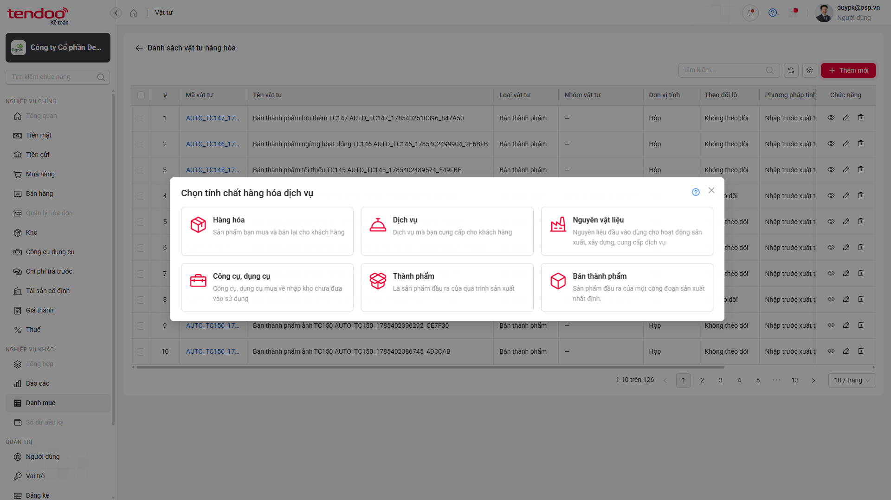
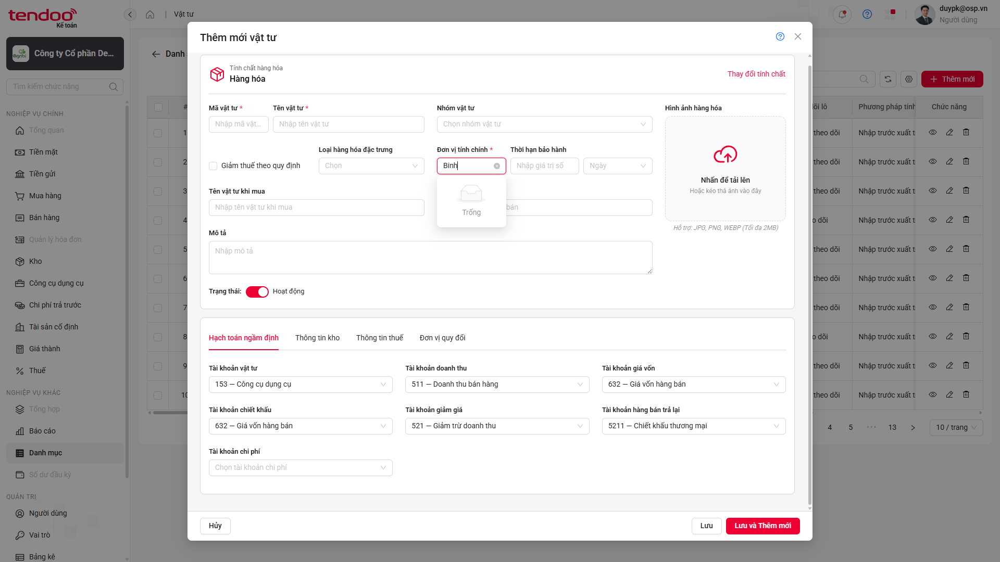
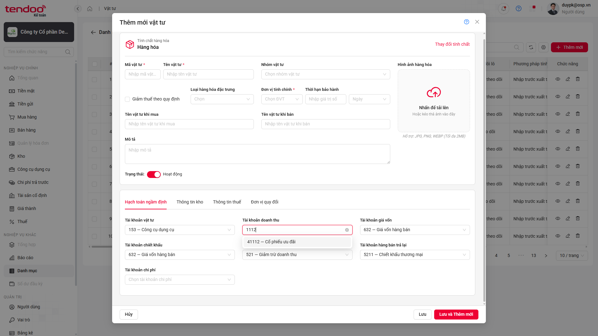
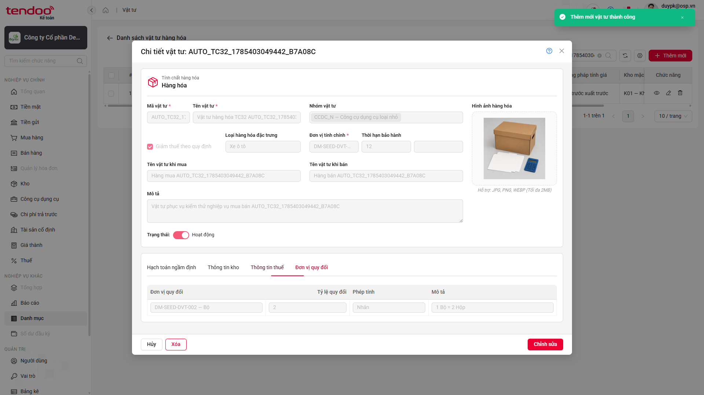
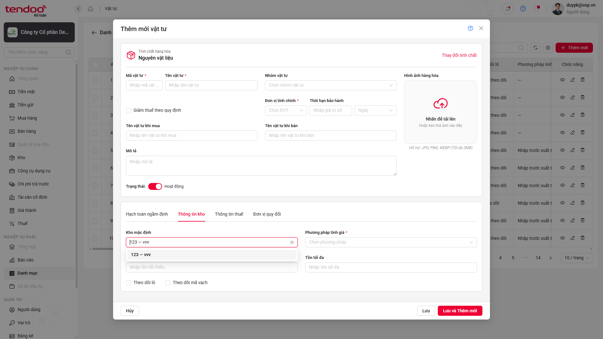
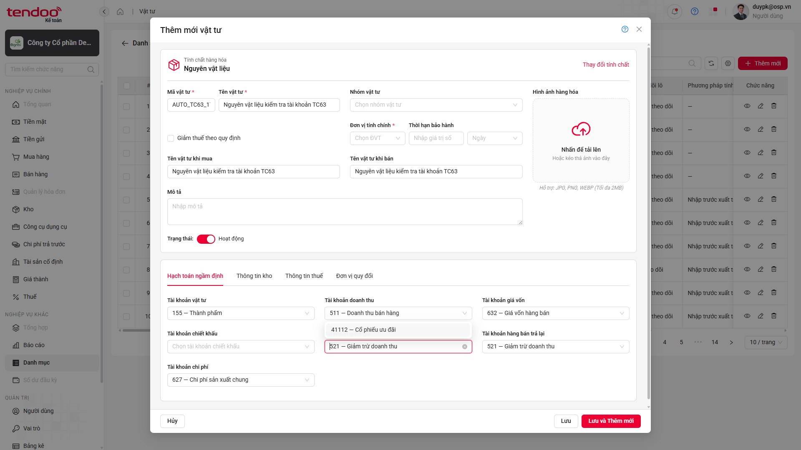
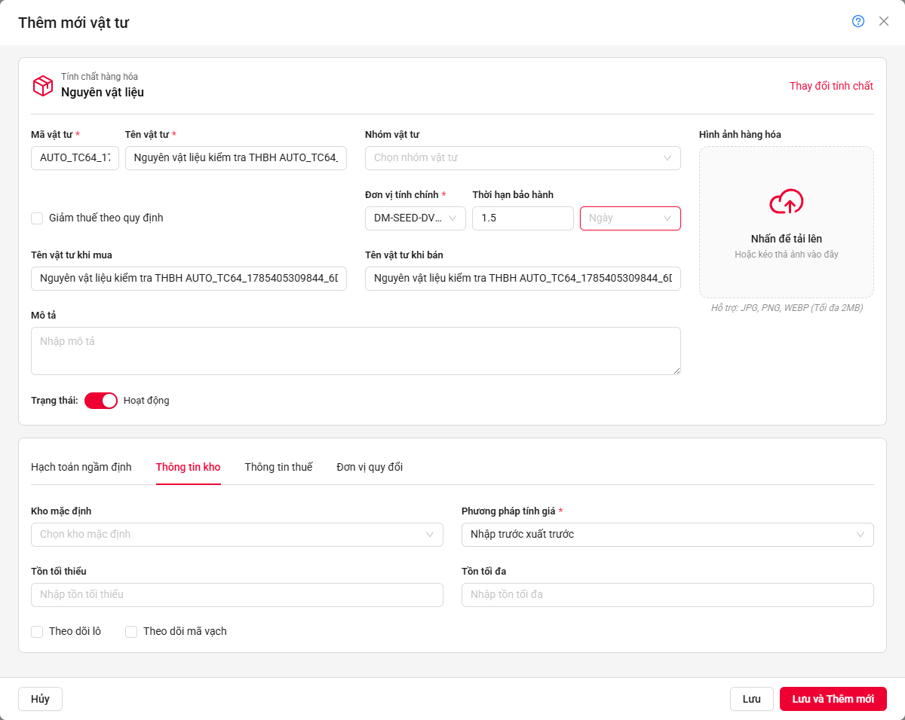
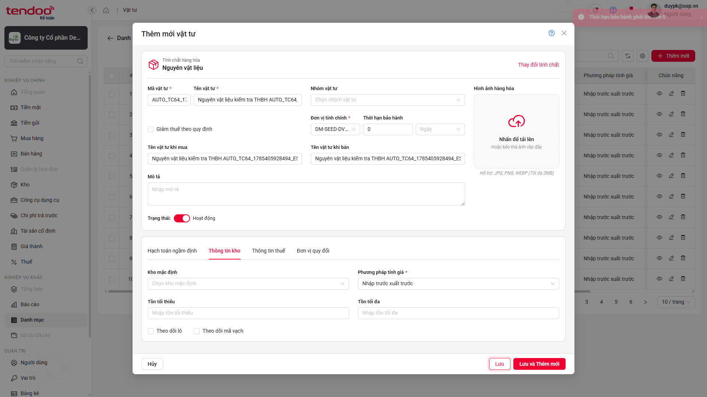
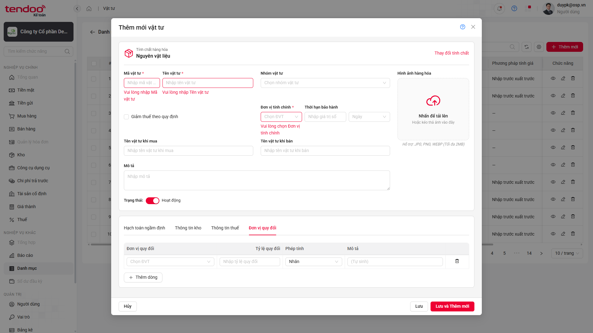

# 📋 Báo cáo kiểm thử — Thêm mới Vật tư

> **Kết luận:** ❌ Bộ kiểm thử **chưa đạt** — 37/67 testcase thất bại, tập trung ở 8 nhóm lỗi; rủi ro lớn nhất là dữ liệu danh mục/combogrid không đúng yêu cầu và thông báo lưu thành công sai nội dung trên tất cả loại vật tư.

## Thông tin lần chạy

| Hạng mục | Chi tiết |
|---|---|
| 🗓️ Thời gian | 30/07/2026, 16:15–16:27 — Asia/Saigon |
| 🧪 Test suite | `src/tests/danh-muc/vat-tu-tao-moi.spec.ts` |
| 🌐 Trình duyệt | Chromium — headed |
| ⚙️ Cấu hình | `workers=1` · `retries=0` · reporter `line,json` |
| ⏱️ Thời lượng | 735,44 giây — khoảng 12 phút 15 giây |

## Tổng quan kết quả

| Tổng test | ✅ PASS | ❌ FAIL | ⏭️ SKIP | Tỷ lệ PASS |
|:---:|:---:|:---:|:---:|:---:|
| **67** | **30** | **37** | **0** | **44,78%** |

<a id="dieu-huong-nhanh"></a>

### Điều hướng nhanh

- [Kết quả từng test case](#kết-quả-chi-tiết)
- [Tổng hợp nhóm lỗi](#tổng-hợp-nhóm-lỗi)
- [BUG-VT-01 — Mô tả Bán thành phẩm sai dấu câu](#bug-vt-01)
- [BUG-VT-02 — Không hiển thị dữ liệu danh mục ngừng hoạt động](#bug-vt-02)
- [BUG-VT-03 — Combogrid tài khoản thiếu cột](#bug-vt-03)
- [BUG-VT-04 — Toast thêm mới sai nội dung](#bug-vt-04)
- [BUG-VT-05 — Combogrid Kho mặc định thiếu cột](#bug-vt-05)
- [BUG-VT-06 — Tài khoản ngầm định không được tự động điền](#bug-vt-06)
- [BUG-VT-07 — Validation THBH sai với giá trị thập phân và 0](#bug-vt-07)
- [BUG-VT-08 — Sai thông báo bắt buộc của Đơn vị tính chính](#bug-vt-08)

---

## Kết quả chi tiết

| TC ID | Kết quả | Nội dung chính |
|---|---|---|
| `CL-UAT-U-00106-01` | ❌ FAIL | Popup đủ 6 loại nhưng mô tả Bán thành phẩm sai dấu câu |
| `CL-UAT-U-00106-02` | ✅ PASS | Multiple select Nhóm vật tư |
| `CL-UAT-U-00106-03` | ❌ FAIL | Không hiển thị Đơn vị tính ngừng hoạt động |
| `CL-UAT-U-00106-04` | ❌ FAIL | Combogrid Tài khoản doanh thu thiếu cột |
| `CL-UAT-U-00106-05` | ❌ FAIL | Combogrid Tài khoản hàng bán trả lại thiếu cột |
| `CL-UAT-U-00106-06` | ❌ FAIL | Combogrid Tài khoản chi phí thiếu cột |
| `CL-UAT-U-00106-07` | ❌ FAIL | Combogrid Tài khoản chiết khấu thiếu cột |
| `CL-UAT-U-00106-08` | ❌ FAIL | Combogrid Tài khoản giảm giá thiếu cột |
| `CL-UAT-U-00106-14` | ✅ PASS | Form Hàng hóa hiển thị đầy đủ tab và trường |
| `CL-UAT-U-00106-15` | ✅ PASS | Dropdown Loại hàng hóa đặc trưng |
| `CL-UAT-U-00106-32` | ❌ FAIL | Tạo Hàng hóa đầy đủ; sai toast thành công |
| `CL-UAT-U-00106-33` | ❌ FAIL | Tạo Hàng hóa tối thiểu; sai toast thành công |
| `CL-UAT-U-00106-34` | ❌ FAIL | Tạo Hàng hóa ngừng hoạt động; sai toast thành công |
| `CL-UAT-U-00106-35` | ❌ FAIL | Lưu và Thêm mới Hàng hóa; sai toast thành công |
| `CL-UAT-U-00106-36` | ✅ PASS | Hủy Hàng hóa khi chưa nhập dữ liệu |
| `CL-UAT-U-00106-37` | ✅ PASS | Hủy Hàng hóa khi đã nhập dữ liệu |
| `CL-UAT-U-00106-38` | ✅ PASS | Đổi Hàng hóa sang Dịch vụ và reset dữ liệu đặc thù |
| `CL-UAT-U-00106-48` | ❌ FAIL | Tạo Dịch vụ đầy đủ; sai toast thành công |
| `CL-UAT-U-00106-49` | ❌ FAIL | Tạo Dịch vụ tối thiểu; sai toast thành công |
| `CL-UAT-U-00106-50` | ❌ FAIL | Tạo Dịch vụ ngừng hoạt động; sai toast thành công |
| `CL-UAT-U-00106-51` | ❌ FAIL | Lưu và Thêm mới Dịch vụ; sai toast thành công |
| `CL-UAT-U-00106-52` | ✅ PASS | Hủy Dịch vụ khi chưa nhập dữ liệu |
| `CL-UAT-U-00106-53` | ✅ PASS | Hủy Dịch vụ khi đã nhập dữ liệu |
| `CL-UAT-U-00106-54` | ✅ PASS | Form Nguyên vật liệu hiển thị đầy đủ |
| `CL-UAT-U-00106-55` | ✅ PASS | Dropdown Đơn vị thời hạn bảo hành |
| `CL-UAT-U-00106-56` | ✅ PASS | Combogrid Tài khoản vật tư |
| `CL-UAT-U-00106-57` | ✅ PASS | Combogrid Tài khoản giá vốn |
| `CL-UAT-U-00106-58` | ❌ FAIL | Combogrid Kho mặc định thiếu cột |
| `CL-UAT-U-00106-59` | ✅ PASS | Dropdown Phương pháp tính giá |
| `CL-UAT-U-00106-60` | ❌ FAIL | Không hiển thị Thuế tài nguyên ngừng hoạt động |
| `CL-UAT-U-00106-61` | ✅ PASS | Đúng loại control các trường Thuế |
| `CL-UAT-U-00106-62` | ❌ FAIL | Đơn vị quy đổi không hiển thị đơn vị ngừng hoạt động |
| `CL-UAT-U-00106-63` | ❌ FAIL | Tài khoản vật tư không được tự động điền |
| `CL-UAT-U-00106-64` | ❌ FAIL | THBH `1.5` không được điều chỉnh thành số nguyên |
| `CL-UAT-U-00106-65` | ✅ PASS | Chặn Tồn tối thiểu âm và gán bằng 0 |
| `CL-UAT-U-00106-66` | ✅ PASS | Chặn Tồn tối đa âm và gán bằng 0 |
| `CL-UAT-U-00106-67` | ✅ PASS | Không lưu khi Tồn tối đa nhỏ hơn Tồn tối thiểu |
| `CL-UAT-U-00106-68` | ❌ FAIL | Sai nội dung lỗi bắt buộc của Đơn vị tính chính |
| `CL-UAT-U-00106-69` | ✅ PASS | Kiểm soát max length |
| `CL-UAT-U-00106-70` | ✅ PASS | Trim khoảng trắng khi lưu |
| `CL-UAT-U-00106-71` | ❌ FAIL | Tạo Nguyên vật liệu đầy đủ; sai toast |
| `CL-UAT-U-00106-72` | ❌ FAIL | Tạo Nguyên vật liệu tối thiểu; sai toast |
| `CL-UAT-U-00106-73` | ❌ FAIL | Tạo Nguyên vật liệu ngừng hoạt động; sai toast |
| `CL-UAT-U-00106-74` | ❌ FAIL | Lưu và Thêm mới Nguyên vật liệu; sai toast |
| `CL-UAT-U-00106-75` | ✅ PASS | Hủy Nguyên vật liệu khi chưa nhập dữ liệu |
| `CL-UAT-U-00106-76` | ✅ PASS | Hủy Nguyên vật liệu khi đã nhập dữ liệu |
| `CL-UAT-U-00106-96` | ❌ FAIL | Tạo CCDC đầy đủ; sai toast |
| `CL-UAT-U-00106-97` | ❌ FAIL | Tạo CCDC tối thiểu; sai toast |
| `CL-UAT-U-00106-98` | ❌ FAIL | Tạo CCDC ngừng hoạt động; sai toast |
| `CL-UAT-U-00106-99` | ❌ FAIL | Lưu và Thêm mới CCDC; sai toast |
| `CL-UAT-U-00106-100` | ✅ PASS | Hủy CCDC khi chưa nhập dữ liệu |
| `CL-UAT-U-00106-101` | ✅ PASS | Hủy CCDC khi đã nhập dữ liệu |
| `CL-UAT-U-00106-102` | ✅ PASS | Upload và lưu ảnh CCDC |
| `CL-UAT-U-00106-120` | ❌ FAIL | Tạo Thành phẩm đầy đủ; sai toast |
| `CL-UAT-U-00106-121` | ❌ FAIL | Tạo Thành phẩm tối thiểu; sai toast |
| `CL-UAT-U-00106-122` | ❌ FAIL | Tạo Thành phẩm ngừng hoạt động; sai toast |
| `CL-UAT-U-00106-123` | ❌ FAIL | Lưu và Thêm mới Thành phẩm; sai toast |
| `CL-UAT-U-00106-124` | ✅ PASS | Hủy Thành phẩm khi chưa nhập dữ liệu |
| `CL-UAT-U-00106-125` | ✅ PASS | Hủy Thành phẩm khi đã nhập dữ liệu |
| `CL-UAT-U-00106-126` | ✅ PASS | Upload và lưu ảnh Thành phẩm |
| `CL-UAT-U-00106-144` | ❌ FAIL | Tạo Bán thành phẩm đầy đủ; sai toast |
| `CL-UAT-U-00106-145` | ❌ FAIL | Tạo Bán thành phẩm tối thiểu; sai toast |
| `CL-UAT-U-00106-146` | ❌ FAIL | Tạo Bán thành phẩm ngừng hoạt động; sai toast |
| `CL-UAT-U-00106-147` | ❌ FAIL | Lưu và Thêm mới Bán thành phẩm; sai toast |
| `CL-UAT-U-00106-148` | ✅ PASS | Hủy Bán thành phẩm khi chưa nhập dữ liệu |
| `CL-UAT-U-00106-149` | ✅ PASS | Hủy Bán thành phẩm khi đã nhập dữ liệu |
| `CL-UAT-U-00106-150` | ✅ PASS | Upload và lưu ảnh Bán thành phẩm |

[⬆️ Lên đầu](#dieu-huong-nhanh)

---

## Tổng hợp nhóm lỗi

| Bug | Mức độ | Test ảnh hưởng | Tần suất | Mô tả ngắn |
|---|:---:|:---:|:---:|---|
| `BUG-VT-01` | 🟢 Low | 1 | 1/1 | Mô tả Bán thành phẩm thừa dấu chấm cuối câu |
| `BUG-VT-02` | 🟡 Medium | 3 | 3/3 | Dữ liệu danh mục ngừng hoạt động không xuất hiện |
| `BUG-VT-03` | 🟡 Medium | 5 | 5/5 | Năm combogrid tài khoản không có header yêu cầu |
| `BUG-VT-04` | 🟢 Low | 24 | 24/24 | Toast thêm mới có thêm từ “vật tư” |
| `BUG-VT-05` | 🟡 Medium | 1 | 1/1 | Combogrid Kho mặc định không có header yêu cầu |
| `BUG-VT-06` | 🔴 High | 1 | 1/1 | Tài khoản vật tư ngầm định không được tự động điền |
| `BUG-VT-07` | 🟡 Medium | 1 | 1/1 | THBH giữ nguyên số thập phân; toast của giá trị 0 sai nội dung |
| `BUG-VT-08` | 🟢 Low | 1 | 1/1 | Nội dung validation Đơn vị tính chính sai expected |

### 1. Nhóm lỗi nội dung — 26 test

- Gồm `BUG-VT-01`, `BUG-VT-04`, `BUG-VT-08`.
- Sai khác nằm ở dấu câu hoặc nội dung message; các luồng tạo mới thuộc `BUG-VT-04` vẫn lưu/reset/hiển thị chi tiết thành công.

### 2. Nhóm lỗi dữ liệu combobox/combogrid — 10 test

- Gồm `BUG-VT-02`, `BUG-VT-03`, `BUG-VT-05`, `BUG-VT-06`.
- Ảnh hưởng khả năng chọn dữ liệu ngừng hoạt động, đọc các cột nghiệp vụ và nhận tài khoản ngầm định.
- Suy luận từ triệu chứng: UI có thể đang lọc trạng thái hoặc không render cấu hình cột/default account đúng yêu cầu; cần xác nhận bằng API/config trước khi kết luận root cause.

### 3. Nhóm lỗi chuẩn hóa dữ liệu số — 1 test

- `BUG-VT-07`: trường THBH giữ nguyên số thập phân `1.5`; với giá trị `0`, hệ thống chặn lưu đúng nhưng nội dung toast khác testcase.

[⬆️ Lên đầu](#dieu-huong-nhanh)

---

## Chi tiết lỗi

<a id="bug-vt-01"></a>

### BUG-VT-01 — Mô tả Bán thành phẩm sai dấu câu

> 🟢 **LOW** · CONTENT · Tái hiện **1/1**

#### Thông tin chung của bug

| Thuộc tính | Giá trị |
|---|---|
| Test case | `CL-UAT-U-00106-01` |
| Module | Danh mục → Vật tư → Popup chọn tính chất hàng hóa dịch vụ |
| Phân loại | CONTENT |
| Mức độ đề xuất | 🟢 Low |
| Trạng thái | 🔵 Open |

#### Điều kiện ban đầu

- Đăng nhập bằng tài khoản có quyền Kế toán viên.
- Đang ở màn hình Danh sách vật tư hàng hóa.
- Popup “Chọn tính chất hàng hóa dịch vụ” đã mở.

#### Các bước tái hiện

1. Mở Danh mục → Vật tư.
2. Nhấn “Thêm mới”.
3. Quan sát lựa chọn “Bán thành phẩm”.
4. So sánh phần mô tả với manual testcase.

#### So sánh kết quả

| Hạng mục | Expected | Actual |
|---|---|---|
| Mô tả Bán thành phẩm | `Sản phẩm đầu ra của một công đoạn sản xuất nhất định` | `Sản phẩm đầu ra của một công đoạn sản xuất nhất định.` |

#### Tần suất bug

- **1/1 lần (100%)** trong lần chạy này.
- Chạy với `retries=0`.

#### Dữ liệu test

Không có dữ liệu nhập; testcase chỉ kiểm tra nội dung tĩnh trên popup.

#### Ảnh bằng chứng



*Ảnh 1 — Popup hiển thị mô tả Bán thành phẩm có dấu chấm cuối câu.*  
[🔍 Mở ảnh gốc](./evidence/vat-tu-tao-moi-2026-07-30-161512/BUG-VT-01-TC01.png)

[⬆️ Lên đầu](#dieu-huong-nhanh)

---

<a id="bug-vt-02"></a>

### BUG-VT-02 — Dữ liệu danh mục ngừng hoạt động không xuất hiện

> 🟡 **MEDIUM** · DATA/FUNCTIONAL · Tái hiện **3/3**

#### Thông tin chung của bug

| Thuộc tính | Giá trị |
|---|---|
| Test case | `CL-UAT-U-00106-03`, `CL-UAT-U-00106-60`, `CL-UAT-U-00106-62` |
| Module | Form thêm mới Vật tư → ĐVT chính / Thuế / Đơn vị quy đổi |
| Phân loại | DATA / FUNCTIONAL |
| Mức độ đề xuất | 🟡 Medium |
| Trạng thái | 🔵 Open |

#### Điều kiện ban đầu

- Đăng nhập bằng tài khoản có quyền Kế toán viên.
- Danh mục có đồng thời dữ liệu Hoạt động và Ngừng hoạt động.
- Đang mở form thêm mới Hàng hóa hoặc Nguyên vật liệu tại trường tương ứng.

#### Các bước tái hiện

1. Mở form thêm mới vật tư.
2. Mở dropdown Đơn vị tính chính, Thuế tài nguyên hoặc Đơn vị quy đổi.
3. Tìm kiếm dữ liệu danh mục có trạng thái Ngừng hoạt động.
4. Quan sát kết quả dropdown.

#### So sánh kết quả

| Hạng mục | Expected | Actual |
|---|---|---|
| Đơn vị tính ngừng hoạt động | Hiển thị và cho phép chọn `Binh — Bình` | Không tìm thấy option |
| Thuế tài nguyên ngừng hoạt động | Hiển thị `MT002 — Thuế Hà Nội 2` | Không tìm thấy option |

#### Tần suất bug

- **3/3 lần (100%)** trên ba trường kiểm tra trong lần chạy này.
- Suy luận: có thể dùng chung cơ chế lọc trạng thái; chưa kiểm chứng ở API/backend.

#### Dữ liệu test

| Trường dữ liệu | Giá trị |
|---|---|
| Đơn vị tính ngừng hoạt động | `Binh — Bình` |
| Thuế tài nguyên ngừng hoạt động | `MT002 — Thuế Hà Nội 2` |

#### Ảnh bằng chứng



*Ảnh 2 — Dropdown Đơn vị tính chính không trả về dữ liệu ngừng hoạt động khi tìm kiếm.*  
[🔍 Mở ảnh gốc](./evidence/vat-tu-tao-moi-2026-07-30-161512/BUG-VT-02-TC03.png)

[⬆️ Lên đầu](#dieu-huong-nhanh)

---

<a id="bug-vt-03"></a>

### BUG-VT-03 — Combogrid tài khoản thiếu các cột nghiệp vụ

> 🟡 **MEDIUM** · UI/FUNCTIONAL · Tái hiện **5/5**

#### Thông tin chung của bug

| Thuộc tính | Giá trị |
|---|---|
| Test case | `CL-UAT-U-00106-04` đến `CL-UAT-U-00106-08` |
| Module | Form thêm mới Vật tư → Hạch toán ngầm định |
| Phân loại | UI / FUNCTIONAL |
| Mức độ đề xuất | 🟡 Medium |
| Trạng thái | 🔵 Open |

#### Điều kiện ban đầu

- Đăng nhập bằng tài khoản có quyền Kế toán viên.
- Mở form thêm mới vật tư và tab Hạch toán ngầm định.
- Hệ thống có tài khoản cho phép hạch toán.

#### Các bước tái hiện

1. Mở từng combogrid Tài khoản doanh thu, hàng bán trả lại, chi phí, chiết khấu và giảm giá.
2. Quan sát header của bảng dữ liệu.
3. So sánh với các cột theo BR5.

#### So sánh kết quả

| Hạng mục | Expected | Actual |
|---|---|---|
| Header combogrid | `Số tài khoản`, `Tên tài khoản`, `Trạng thái` | Không thu được cột nào (`[]`) |

#### Tần suất bug

- **5/5 lần (100%)** trên năm trường tài khoản.
- Triệu chứng giống nhau trên toàn bộ combogrid được kiểm tra.

#### Dữ liệu test

Không nhập dữ liệu; testcase mở từng combogrid và kiểm tra cấu trúc bảng.

#### Ảnh bằng chứng



*Ảnh 3 — Combogrid Tài khoản doanh thu không hiển thị header yêu cầu.*  
[🔍 Mở ảnh gốc](./evidence/vat-tu-tao-moi-2026-07-30-161512/BUG-VT-03-TC04.png)

[⬆️ Lên đầu](#dieu-huong-nhanh)

---

<a id="bug-vt-04"></a>

### BUG-VT-04 — Toast thêm mới vật tư sai nội dung

> 🟢 **LOW** · CONTENT · Tái hiện **24/24**

#### Thông tin chung của bug

| Thuộc tính | Giá trị |
|---|---|
| Test case | `TC32–35`, `TC48–51`, `TC71–74`, `TC96–99`, `TC120–123`, `TC144–147` |
| Module | Form thêm mới Vật tư — cả 6 loại vật tư |
| Phân loại | CONTENT |
| Mức độ đề xuất | 🟢 Low |
| Trạng thái | 🔵 Open |

#### Điều kiện ban đầu

- Đăng nhập bằng tài khoản có quyền Kế toán viên.
- Mở form thêm mới một trong sáu loại vật tư.
- Điền đủ dữ liệu hợp lệ theo từng testcase.

#### Các bước tái hiện

1. Chọn loại vật tư cần tạo.
2. Nhập dữ liệu bắt buộc hoặc đầy đủ theo testcase.
3. Nhấn “Lưu” hoặc “Lưu và Thêm mới”.
4. Quan sát toast sau khi hệ thống lưu thành công.

#### So sánh kết quả

| Hạng mục | Expected | Actual |
|---|---|---|
| MSG_PMKT-U-00106_010 | `Thêm mới thành công` | `Thêm mới vật tư thành công` |

Các soft assertion xác nhận bản ghi vẫn được lưu, xuất hiện trên danh sách, reset form hoặc hiển thị chi tiết đúng; điểm fail chỉ là nội dung toast.

#### Tần suất bug

- **24/24 lần (100%)** trong lần chạy này.
- Xuất hiện với cả “Lưu” và “Lưu và Thêm mới”, trên cả sáu loại vật tư.

#### Dữ liệu test

| Trường dữ liệu | Giá trị |
|---|---|
| Mã vật tư | Sinh động theo mẫu `AUTO_TC<case>_<timestamp>_<suffix>` |
| Loại vật tư | Hàng hóa, Dịch vụ, Nguyên vật liệu, CCDC, Thành phẩm, Bán thành phẩm |

#### Ảnh bằng chứng



*Ảnh 4 — Trạng thái cuối của TC32 sau khi bản ghi đã được lưu; nội dung Actual được ghi nhận trực tiếp bởi assertion của runner.*  
[🔍 Mở ảnh gốc](./evidence/vat-tu-tao-moi-2026-07-30-161512/BUG-VT-04-TC32.png)

[⬆️ Lên đầu](#dieu-huong-nhanh)

---

<a id="bug-vt-05"></a>

### BUG-VT-05 — Combogrid Kho mặc định thiếu các cột nghiệp vụ

> 🟡 **MEDIUM** · UI/FUNCTIONAL · Tái hiện **1/1**

#### Thông tin chung của bug

| Thuộc tính | Giá trị |
|---|---|
| Test case | `CL-UAT-U-00106-58` |
| Module | Form Nguyên vật liệu → Thông tin kho → Kho mặc định |
| Phân loại | UI / FUNCTIONAL |
| Mức độ đề xuất | 🟡 Medium |
| Trạng thái | 🔵 Open |

#### Điều kiện ban đầu

- Đăng nhập bằng tài khoản có quyền Kế toán viên.
- Mở form Nguyên vật liệu và tab Thông tin kho.
- Danh mục Kho có dữ liệu.

#### Các bước tái hiện

1. Mở combogrid Kho mặc định.
2. Quan sát header bảng dữ liệu.
3. So sánh với cấu trúc yêu cầu.

#### So sánh kết quả

| Hạng mục | Expected | Actual |
|---|---|---|
| Header combogrid Kho | `Mã kho`, `Tên kho`, `Trạng thái` | Không thu được cột nào (`[]`) |

#### Tần suất bug

- **1/1 lần (100%)** trong lần chạy này.
- Chạy với `retries=0`.

#### Dữ liệu test

Không nhập dữ liệu; testcase kiểm tra cấu trúc combogrid Kho mặc định.

#### Ảnh bằng chứng



*Ảnh 5 — Combogrid Kho mặc định không hiển thị các cột yêu cầu.*  
[🔍 Mở ảnh gốc](./evidence/vat-tu-tao-moi-2026-07-30-161512/BUG-VT-05-TC58.png)

[⬆️ Lên đầu](#dieu-huong-nhanh)

---

<a id="bug-vt-06"></a>

### BUG-VT-06 — Tài khoản vật tư ngầm định không được tự động điền

> 🔴 **HIGH** · FUNCTIONAL · Tái hiện **1/1**

#### Thông tin chung của bug

| Thuộc tính | Giá trị |
|---|---|
| Test case | `CL-UAT-U-00106-63` |
| Module | Form Nguyên vật liệu → Hạch toán ngầm định |
| Phân loại | FUNCTIONAL |
| Mức độ đề xuất | 🔴 High |
| Trạng thái | 🔵 Open |

#### Điều kiện ban đầu

- Đăng nhập bằng tài khoản có quyền Kế toán viên.
- Loại Nguyên vật liệu có cấu hình tài khoản ngầm định.
- Mở form thêm mới Nguyên vật liệu.

#### Các bước tái hiện

1. Chọn loại “Nguyên vật liệu”.
2. Nhập Mã và Tên vật tư.
3. Chuyển sang tab Hạch toán ngầm định.
4. Quan sát trường Tài khoản vật tư.

#### So sánh kết quả

| Hạng mục | Expected | Actual |
|---|---|---|
| Tài khoản vật tư | Tự động fill từ cấu hình Loại vật tư | Không có giá trị được chọn |

#### Tần suất bug

- **1/1 lần (100%)** trong lần chạy này.
- Suy luận: cấu hình default account chưa được map hoặc chưa được UI nạp; cần kiểm tra API/config để kết luận.

#### Dữ liệu test

| Trường dữ liệu | Giá trị |
|---|---|
| Loại vật tư | `Nguyên vật liệu` |
| Tài khoản mong đợi | Giá trị cấu hình của Loại vật tư tại thời điểm chạy |

#### Ảnh bằng chứng



*Ảnh 6 — Tab Hạch toán ngầm định không có giá trị tại trường Tài khoản vật tư.*  
[🔍 Mở ảnh gốc](./evidence/vat-tu-tao-moi-2026-07-30-161512/BUG-VT-06-TC63.png)

[⬆️ Lên đầu](#dieu-huong-nhanh)

---

<a id="bug-vt-07"></a>

### BUG-VT-07 — Validation THBH sai với giá trị thập phân và 0

> 🟡 **MEDIUM** · VALIDATION · Tái hiện **1/1**

#### Thông tin chung của bug

| Thuộc tính | Giá trị |
|---|---|
| Test case | `CL-UAT-U-00106-64` |
| Module | Form Nguyên vật liệu → Thông tin chung → Thời hạn bảo hành |
| Phân loại | VALIDATION |
| Mức độ đề xuất | 🟡 Medium |
| Trạng thái | 🔵 Open |

#### Điều kiện ban đầu

- Đăng nhập bằng tài khoản có quyền Kế toán viên.
- Mở form thêm mới Nguyên vật liệu.
- Các trường bắt buộc khác có dữ liệu hợp lệ.

#### Các bước tái hiện

1. Nhập `1.5` vào Thời hạn bảo hành.
2. Rời khỏi trường để kích hoạt xử lý giá trị.
3. Quan sát giá trị còn lại trong input.
4. Nhập `0`, nhấn **Lưu** và quan sát toast.

#### So sánh kết quả

| Hạng mục | Expected | Actual |
|---|---|---|
| Giá trị THBH thập phân | Tự động điều chỉnh thành số nguyên | Giữ nguyên `1.5` |
| Toast khi THBH bằng 0 | `Thời hạn bảo hành phải là số nguyên dương` | `Thời hạn bảo hành phải lớn hơn 0` |

#### Tần suất bug

- **1/1 lần (100%)** trong lần chạy xác nhận.
- Với `0`, hệ thống có chặn lưu, giữ nguyên form và hiển thị toast; sai khác chỉ nằm ở nội dung toast.

#### Dữ liệu test

| Trường dữ liệu | Giá trị |
|---|---|
| Thời hạn bảo hành — biến thể 1 | `1.5` |
| Thời hạn bảo hành — biến thể 2 | `0` |

#### Ảnh bằng chứng



*Ảnh 7a — Trường Thời hạn bảo hành vẫn giữ giá trị thập phân 1.5.*

[🔍 Mở ảnh gốc](./evidence/vat-tu-tao-moi-2026-07-30-161512/BUG-VT-07-TC64-DECIMAL.png)



*Ảnh 7b — Giá trị THBH bằng 0, form vẫn mở và toast thực tế là “Thời hạn bảo hành phải lớn hơn 0”.*

[🔍 Mở ảnh gốc](./evidence/vat-tu-tao-moi-2026-07-30-161512/BUG-VT-07-TC64-ZERO-TOAST.png)

[⬆️ Lên đầu](#dieu-huong-nhanh)

---

<a id="bug-vt-08"></a>

### BUG-VT-08 — Sai thông báo bắt buộc của Đơn vị tính chính

> 🟢 **LOW** · CONTENT/VALIDATION · Tái hiện **1/1**

#### Thông tin chung của bug

| Thuộc tính | Giá trị |
|---|---|
| Test case | `CL-UAT-U-00106-68` |
| Module | Form Nguyên vật liệu → Thông tin chung |
| Phân loại | CONTENT / VALIDATION |
| Mức độ đề xuất | 🟢 Low |
| Trạng thái | 🔵 Open |

#### Điều kiện ban đầu

- Đăng nhập bằng tài khoản có quyền Kế toán viên.
- Mở form thêm mới Nguyên vật liệu.
- Để trống Mã, Tên, Đơn vị tính chính và dòng Đơn vị quy đổi theo testcase.

#### Các bước tái hiện

1. Chọn loại “Nguyên vật liệu”.
2. Để trống các trường bắt buộc.
3. Thêm một dòng Đơn vị quy đổi và để trống dữ liệu bắt buộc.
4. Nhấn “Lưu”.
5. Quan sát lỗi tại Đơn vị tính chính.

#### So sánh kết quả

| Hạng mục | Expected | Actual |
|---|---|---|
| Validation Đơn vị tính chính | `Vui lòng chọn Đơn vị tính` | `Vui lòng chọn Đơn vị tính chính` |

Các validation Mã vật tư và Tên vật tư đã hiển thị; form vẫn mở và dữ liệu không bị mất.

#### Tần suất bug

- **1/1 lần (100%)** trong lần chạy này.
- Chạy với `retries=0`.

#### Dữ liệu test

| Trường dữ liệu | Giá trị |
|---|---|
| Mã vật tư | Trống |
| Tên vật tư | Trống |
| Đơn vị tính chính | Trống |

#### Ảnh bằng chứng



*Ảnh 8 — Form hiển thị “Vui lòng chọn Đơn vị tính chính” khác nội dung expected.*  
[🔍 Mở ảnh gốc](./evidence/vat-tu-tao-moi-2026-07-30-161512/BUG-VT-08-TC68.png)

[⬆️ Lên đầu](#dieu-huong-nhanh)

---

## Thông tin kỹ thuật

### Lệnh đã chạy

```powershell
npx playwright test src/tests/danh-muc/vat-tu-tao-moi.spec.ts --headed --workers=1 --retries=0 --reporter=line,json
```

### Artifacts

- Evidence lâu dài: `report/evidence/vat-tu-tao-moi-2026-07-30-161512/`
- Artifacts tạm: `test-results/`, `playwright-report/`, `allure-results/`

> [!NOTE]
> Báo cáo phản ánh nguyên trạng lần chạy với `retries=0`. Không sửa expected hoặc automation chỉ để làm thay đổi kết quả báo cáo.
