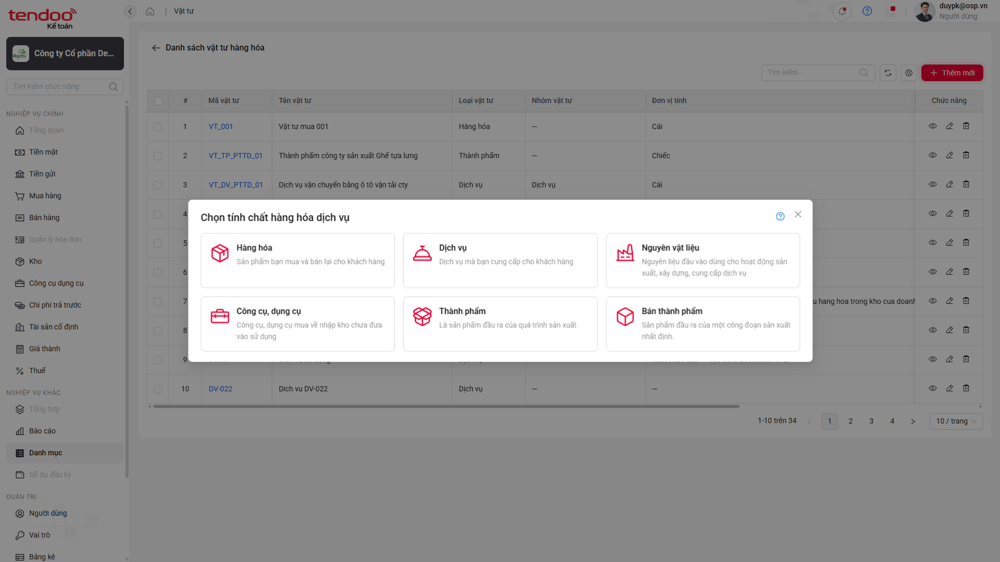
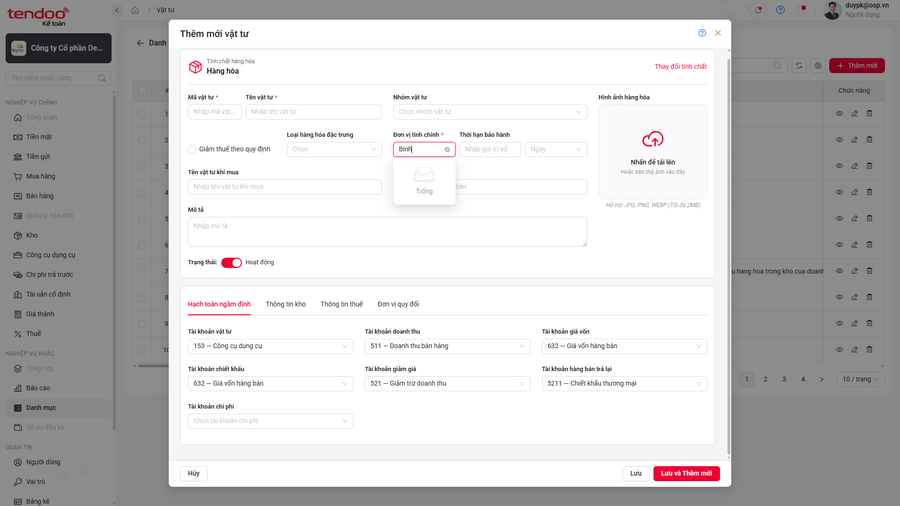
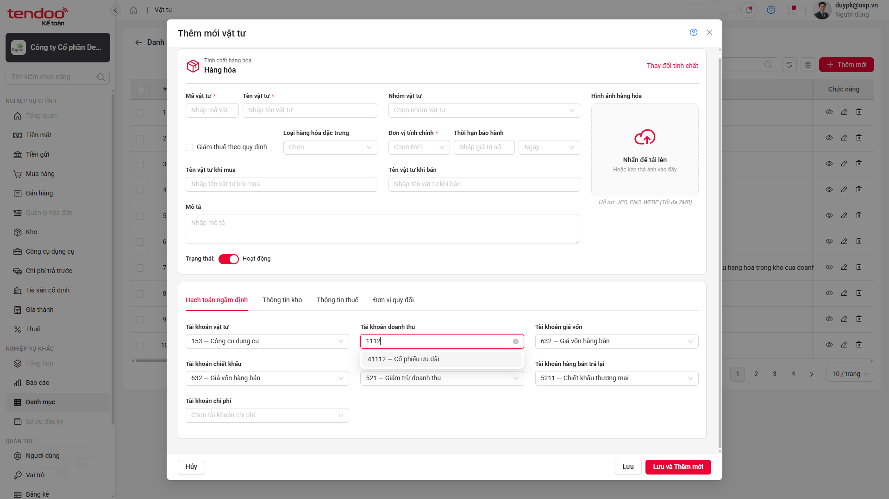
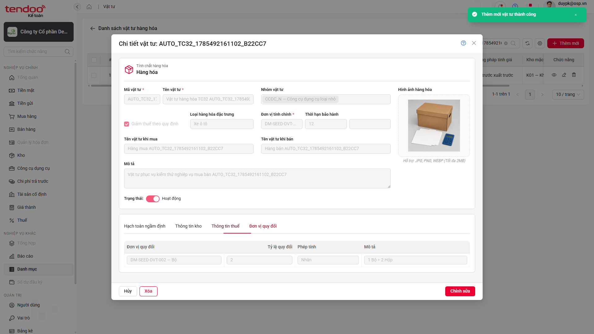
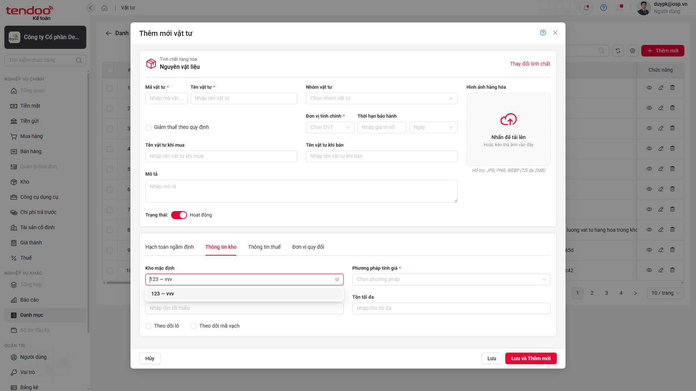
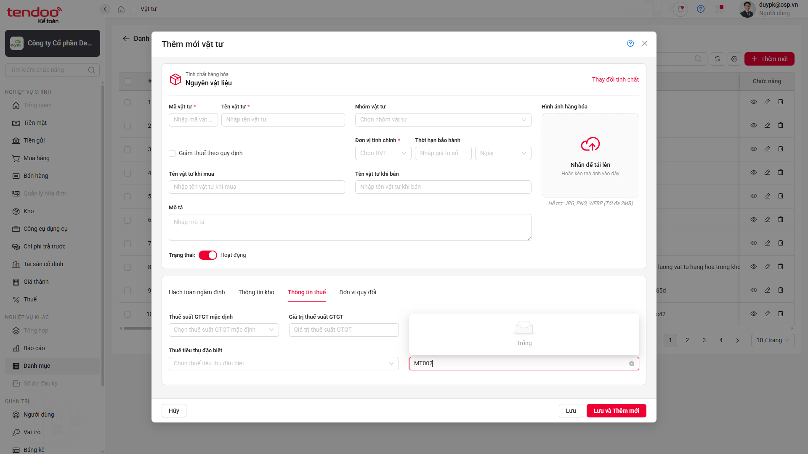
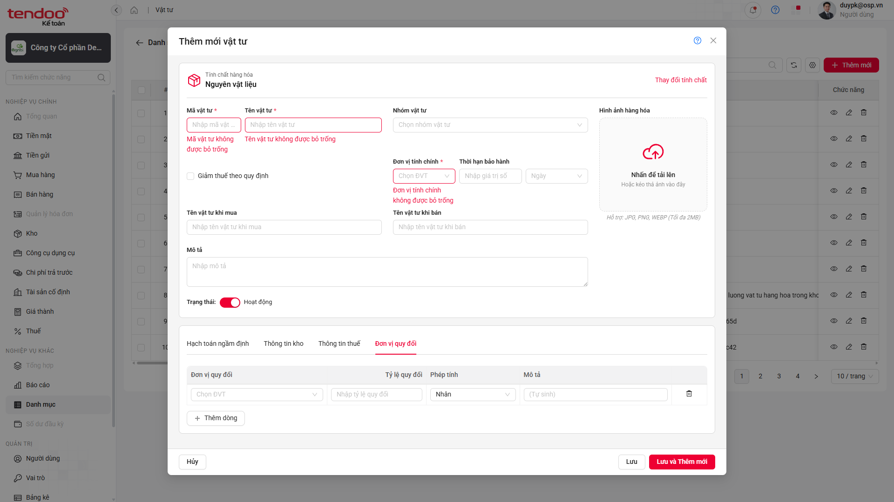

# 📋 Báo cáo kiểm thử — Thêm mới Danh mục Vật tư

> **Kết luận:** ❌ Bộ kiểm thử **CHƯA ĐẠT** — 37/67 test thất bại; nhóm ảnh hưởng lớn nhất là nội dung thông báo sau khi thêm mới (24 test).

## Thông tin lần chạy

| Hạng mục | Chi tiết |
|---|---|
| 🗓️ Thời gian | 31/07/2026, 17:00:25–17:14:24 — Asia/Saigon |
| 🧪 Test suite | `src/tests/danh-muc/vat-tu-tao-moi.spec.ts` |
| 🌐 Trình duyệt | Chromium — headed, viewport 1920×1080 |
| ⚙️ Cấu hình | `workers=1` · `retries=0` · reporters `list`, `html`, `allure-playwright` |
| ⏱️ Thời lượng | 838,6 giây — khoảng 14 phút |

## Tổng quan kết quả

| Tổng test | ✅ PASS | ❌ FAIL | ⏭️ SKIP | Tỷ lệ PASS |
|:---:|:---:|:---:|:---:|:---:|
| **67** | **30** | **37** | **0** | **44,78%** |

<a id="dieu-huong-nhanh"></a>

### Điều hướng nhanh

- [Kết quả từng test case](#kết-quả-chi-tiết)
- [Tổng hợp nhóm lỗi](#tổng-hợp-nhóm-lỗi)
- [BUG-VT-01 — Sai mô tả Bán thành phẩm](#bug-vt-01)
- [BUG-VT-02 — Thiếu đơn vị tính ngừng hoạt động](#bug-vt-02)
- [BUG-VT-03 — Combogrid tài khoản thiếu header](#bug-vt-03)
- [BUG-VT-04 — Sai nội dung thông báo thành công](#bug-vt-04)
- [BUG-VT-05 — Combogrid Kho mặc định thiếu header](#bug-vt-05)
- [BUG-VT-06 — Thiếu Thuế tài nguyên ngừng hoạt động](#bug-vt-06)
- [BUG-VT-07 — Không nhận diện tài khoản ngầm định](#bug-vt-07)
- [BUG-VT-08 — Không chuẩn hóa thời hạn bảo hành](#bug-vt-08)
- [BUG-VT-09 — Sai nội dung validation bắt buộc](#bug-vt-09)

---

## Kết quả chi tiết

| TC ID | Kết quả | Nội dung chính |
|---|---|---|
| `CL-UAT-U-00106-01` | ❌ FAIL | Mô tả Bán thành phẩm khác testcase |
| `CL-UAT-U-00106-02` | ✅ PASS | Multiple select Nhóm vật tư |
| `CL-UAT-U-00106-03` | ❌ FAIL | Không thấy đơn vị tính ngừng hoạt động |
| `CL-UAT-U-00106-04` | ❌ FAIL | Combogrid Tài khoản doanh thu không trả header |
| `CL-UAT-U-00106-05` | ❌ FAIL | Combogrid Tài khoản hàng bán trả lại không trả header |
| `CL-UAT-U-00106-06` | ❌ FAIL | Combogrid Tài khoản chi phí không trả header |
| `CL-UAT-U-00106-07` | ❌ FAIL | Combogrid Tài khoản chiết khấu không trả header |
| `CL-UAT-U-00106-08` | ❌ FAIL | Combogrid Tài khoản giảm giá không trả header |
| `CL-UAT-U-00106-14` | ✅ PASS | Form Hàng hóa đủ tab và trường |
| `CL-UAT-U-00106-15` | ✅ PASS | Dropdown Loại hàng hóa đặc trưng |
| `CL-UAT-U-00106-32` | ❌ FAIL | Sai nội dung thông báo thành công |
| `CL-UAT-U-00106-33` | ❌ FAIL | Sai nội dung thông báo thành công |
| `CL-UAT-U-00106-34` | ❌ FAIL | Sai nội dung thông báo thành công |
| `CL-UAT-U-00106-35` | ❌ FAIL | Sai nội dung thông báo thành công |
| `CL-UAT-U-00106-36` | ✅ PASS | Hủy khi chưa nhập dữ liệu |
| `CL-UAT-U-00106-37` | ✅ PASS | Hủy khi đã nhập dữ liệu |
| `CL-UAT-U-00106-38` | ✅ PASS | Đổi Hàng hóa sang Dịch vụ và reset dữ liệu |
| `CL-UAT-U-00106-48` | ❌ FAIL | Sai nội dung thông báo thành công |
| `CL-UAT-U-00106-49` | ❌ FAIL | Sai nội dung thông báo thành công |
| `CL-UAT-U-00106-50` | ❌ FAIL | Sai nội dung thông báo thành công |
| `CL-UAT-U-00106-51` | ❌ FAIL | Sai nội dung thông báo thành công |
| `CL-UAT-U-00106-52` | ✅ PASS | Hủy Dịch vụ khi chưa nhập dữ liệu |
| `CL-UAT-U-00106-53` | ✅ PASS | Hủy Dịch vụ khi đã nhập dữ liệu |
| `CL-UAT-U-00106-54` | ✅ PASS | Form Nguyên vật liệu đủ tab và trường |
| `CL-UAT-U-00106-55` | ✅ PASS | Dropdown đơn vị thời hạn bảo hành |
| `CL-UAT-U-00106-56` | ✅ PASS | Combogrid Tài khoản vật tư |
| `CL-UAT-U-00106-57` | ✅ PASS | Combogrid Tài khoản giá vốn |
| `CL-UAT-U-00106-58` | ❌ FAIL | Combogrid Kho mặc định không trả header |
| `CL-UAT-U-00106-59` | ✅ PASS | Dropdown Phương pháp tính giá |
| `CL-UAT-U-00106-60` | ❌ FAIL | Không thấy Thuế tài nguyên ngừng hoạt động |
| `CL-UAT-U-00106-61` | ✅ PASS | Đúng loại control các trường Thuế |
| `CL-UAT-U-00106-62` | ❌ FAIL | Không thấy đơn vị quy đổi ngừng hoạt động |
| `CL-UAT-U-00106-63` | ❌ FAIL | Không nhận diện tài khoản vật tư tự động fill |
| `CL-UAT-U-00106-64` | ❌ FAIL | Giá trị thập phân không được chuẩn hóa |
| `CL-UAT-U-00106-65` | ✅ PASS | Tồn tối thiểu âm được gán 0 |
| `CL-UAT-U-00106-66` | ✅ PASS | Tồn tối đa âm được gán 0 |
| `CL-UAT-U-00106-67` | ✅ PASS | Chặn Tồn tối đa nhỏ hơn Tồn tối thiểu |
| `CL-UAT-U-00106-68` | ❌ FAIL | Nội dung validation khác testcase |
| `CL-UAT-U-00106-69` | ✅ PASS | Kiểm soát maxlength |
| `CL-UAT-U-00106-70` | ✅ PASS | Trim khoảng trắng khi lưu |
| `CL-UAT-U-00106-71` | ❌ FAIL | Sai nội dung thông báo thành công |
| `CL-UAT-U-00106-72` | ❌ FAIL | Sai nội dung thông báo thành công |
| `CL-UAT-U-00106-73` | ❌ FAIL | Sai nội dung thông báo thành công |
| `CL-UAT-U-00106-74` | ❌ FAIL | Sai nội dung thông báo thành công |
| `CL-UAT-U-00106-75` | ✅ PASS | Hủy Nguyên vật liệu chưa nhập dữ liệu |
| `CL-UAT-U-00106-76` | ✅ PASS | Hủy Nguyên vật liệu đã nhập dữ liệu |
| `CL-UAT-U-00106-96` | ❌ FAIL | Sai nội dung thông báo thành công |
| `CL-UAT-U-00106-97` | ❌ FAIL | Sai nội dung thông báo thành công |
| `CL-UAT-U-00106-98` | ❌ FAIL | Sai nội dung thông báo thành công |
| `CL-UAT-U-00106-99` | ❌ FAIL | Sai nội dung thông báo thành công |
| `CL-UAT-U-00106-100` | ✅ PASS | Hủy CCDC chưa nhập dữ liệu |
| `CL-UAT-U-00106-101` | ✅ PASS | Hủy CCDC đã nhập dữ liệu |
| `CL-UAT-U-00106-102` | ✅ PASS | Upload và lưu ảnh CCDC |
| `CL-UAT-U-00106-120` | ❌ FAIL | Sai nội dung thông báo thành công |
| `CL-UAT-U-00106-121` | ❌ FAIL | Sai nội dung thông báo thành công |
| `CL-UAT-U-00106-122` | ❌ FAIL | Sai nội dung thông báo thành công |
| `CL-UAT-U-00106-123` | ❌ FAIL | Sai nội dung thông báo thành công |
| `CL-UAT-U-00106-124` | ✅ PASS | Hủy Thành phẩm chưa nhập dữ liệu |
| `CL-UAT-U-00106-125` | ✅ PASS | Hủy Thành phẩm đã nhập dữ liệu |
| `CL-UAT-U-00106-126` | ✅ PASS | Upload và lưu ảnh Thành phẩm |
| `CL-UAT-U-00106-144` | ❌ FAIL | Sai nội dung thông báo thành công |
| `CL-UAT-U-00106-145` | ❌ FAIL | Sai nội dung thông báo thành công |
| `CL-UAT-U-00106-146` | ❌ FAIL | Sai nội dung thông báo thành công |
| `CL-UAT-U-00106-147` | ❌ FAIL | Sai nội dung thông báo thành công |
| `CL-UAT-U-00106-148` | ✅ PASS | Hủy Bán thành phẩm chưa nhập dữ liệu |
| `CL-UAT-U-00106-149` | ✅ PASS | Hủy Bán thành phẩm đã nhập dữ liệu |
| `CL-UAT-U-00106-150` | ✅ PASS | Upload và lưu ảnh Bán thành phẩm |

[⬆️ Lên đầu](#dieu-huong-nhanh)

---

## Tổng hợp nhóm lỗi

| Bug | Mức độ | Test ảnh hưởng | Tần suất | Mô tả ngắn |
|---|:---:|:---:|:---:|---|
| `BUG-VT-01` | 🟢 Low | 1 | 1/1 | Mô tả Bán thành phẩm thừa dấu chấm và khác chữ hoa/thường |
| `BUG-VT-02` | 🟡 Medium | 2 | 2/2 | Option đơn vị tính ngừng hoạt động không xuất hiện |
| `BUG-VT-03` | 🟡 Medium | 5 | 5/5 | Combogrid tài khoản hiển thị như dropdown một cột |
| `BUG-VT-04` | 🟡 Medium | 24 | 24/24 | Toast thực tế thêm cụm “vật tư” |
| `BUG-VT-05` | 🟡 Medium | 1 | 1/1 | Combogrid Kho mặc định không có ba header yêu cầu |
| `BUG-VT-06` | 🟡 Medium | 1 | 1/1 | Thuế tài nguyên ngừng hoạt động không xuất hiện |
| `BUG-VT-07` | 🟡 Medium | 1 | 1/1 | Assertion không nhận diện giá trị tự động fill; cần xác minh lại automation |
| `BUG-VT-08` | 🟡 Medium | 1 | 1/1 | Giá trị `1.5` không tự chuyển thành số nguyên |
| `BUG-VT-09` | 🟢 Low | 1 | 1/1 | Validation thực tế khác nội dung testcase |

### 1. Sai nội dung/hiển thị — 26 test

- Gồm `BUG-VT-01`, `BUG-VT-04`, `BUG-VT-09`.
- `BUG-VT-04` có triệu chứng đồng nhất ở cả sáu loại vật tư; suy luận hợp lý là cùng một message dùng chung.

### 2. Dropdown/combogrid và tự động fill — 10 test

- Gồm `BUG-VT-02`, `BUG-VT-03`, `BUG-VT-05`, `BUG-VT-06`, `BUG-VT-07`.
- Với `BUG-VT-07`, ảnh cuối testcase không còn giữ đúng thời điểm mismatch do dùng `expect.soft()`; chưa đủ bằng chứng để kết luận là lỗi sản phẩm.

### 3. Chuẩn hóa số — 1 test

- `BUG-VT-08`: input vẫn giữ `1.5` thay vì chuyển thành số nguyên.

[⬆️ Lên đầu](#dieu-huong-nhanh)

---

## Chi tiết lỗi

<a id="bug-vt-01"></a>

### BUG-VT-01 — Mô tả Bán thành phẩm không khớp testcase

> 🟢 **Low** · CONTENT · Tái hiện **1/1**

#### Thông tin chung của bug

| Thuộc tính | Giá trị |
|---|---|
| Test case | `CL-UAT-U-00106-01` |
| Module | Danh mục → Vật tư → Chọn tính chất hàng hóa dịch vụ |
| Phân loại | CONTENT |
| Mức độ đề xuất | 🟢 Low |
| Trạng thái | 🔵 Open |

#### Điều kiện ban đầu

- Đăng nhập bằng tài khoản kiểm thử trong `.env`; mở Danh mục → Vật tư.
- Popup chọn tính chất đang hiển thị.

#### Các bước tái hiện

1. Nhấn **Thêm mới**.
2. Quan sát thẻ **Bán thành phẩm**.

#### So sánh kết quả

| Hạng mục | Expected | Actual |
|---|---|---|
| Mô tả | `Sản phẩm đầu ra của một công đoạn sản xuất nhất định` | `Sản phẩm đầu ra của một công đoạn sản xuất nhất định.` |

#### Tần suất bug

- **1/1 lần (100%)**; không retry.

#### Dữ liệu test

Không có dữ liệu nhập; testcase chỉ kiểm tra nội dung popup.

#### Ảnh bằng chứng



*Ảnh 1 — Thẻ Bán thành phẩm hiển thị nội dung thực tế có dấu chấm cuối câu.*  
[🔍 Mở ảnh gốc](./evidence/vat-tu-tao-moi-2026-07-31-170025/BUG-VT-01-TC01.png)

[⬆️ Lên đầu](#dieu-huong-nhanh)

---

<a id="bug-vt-02"></a>

### BUG-VT-02 — Không hiển thị đơn vị tính ngừng hoạt động

> 🟡 **Medium** · FUNCTIONAL/DATA · Tái hiện **2/2**

#### Thông tin chung của bug

| Thuộc tính | Giá trị |
|---|---|
| Test case | `CL-UAT-U-00106-03`, `CL-UAT-U-00106-62` |
| Module | Danh mục → Vật tư → Đơn vị tính chính/Đơn vị quy đổi |
| Phân loại | FUNCTIONAL/DATA |
| Mức độ đề xuất | 🟡 Medium |
| Trạng thái | 🔵 Open |

#### Điều kiện ban đầu

- Form thêm mới Hàng hóa hoặc Nguyên vật liệu đang mở.
- Dữ liệu có đơn vị tính ngừng hoạt động theo testcase.

#### Các bước tái hiện

1. Mở dropdown đơn vị tính.
2. Tìm `Binh — Bình`.

#### So sánh kết quả

| Hạng mục | Expected | Actual |
|---|---|---|
| Option ngừng hoạt động | Có thể tìm và chọn | Dropdown trả trạng thái `Trống` |

#### Tần suất bug

- **2/2 test (100%)**; không retry.

#### Dữ liệu test

| Trường dữ liệu | Giá trị |
|---|---|
| Đơn vị tính | `Binh — Bình` |

#### Ảnh bằng chứng



*Ảnh 1 — Tìm “Binh” nhưng dropdown hiển thị Trống.*  
[🔍 Mở ảnh gốc](./evidence/vat-tu-tao-moi-2026-07-31-170025/BUG-VT-02-TC03.png)

[⬆️ Lên đầu](#dieu-huong-nhanh)

---

<a id="bug-vt-03"></a>

### BUG-VT-03 — Combogrid tài khoản không hiển thị các cột yêu cầu

> 🟡 **Medium** · UI/FUNCTIONAL · Tái hiện **5/5**

#### Thông tin chung của bug

| Thuộc tính | Giá trị |
|---|---|
| Test case | `CL-UAT-U-00106-04` đến `08` |
| Module | Danh mục → Vật tư → Hạch toán ngầm định |
| Phân loại | UI/FUNCTIONAL |
| Mức độ đề xuất | 🟡 Medium |
| Trạng thái | 🔵 Open |

#### Điều kiện ban đầu

- Form thêm mới Hàng hóa đang mở tại tab Hạch toán ngầm định.

#### Các bước tái hiện

1. Mở một trường tài khoản.
2. Nhập số hiệu để tìm kiếm.
3. Quan sát tiêu đề các cột.

#### So sánh kết quả

| Hạng mục | Expected | Actual |
|---|---|---|
| Header | Số tài khoản, Tên tài khoản, Trạng thái | Không có header; chỉ hiện một option |

#### Tần suất bug

- **5/5 test (100%)**; không retry.

#### Dữ liệu test

| Trường dữ liệu | Giá trị đại diện |
|---|---|
| Số hiệu tìm kiếm | `1114` |

#### Ảnh bằng chứng



*Ảnh 1 — Dropdown tài khoản doanh thu chỉ hiện option, không có ba header.*  
[🔍 Mở ảnh gốc](./evidence/vat-tu-tao-moi-2026-07-31-170025/BUG-VT-03-TC04.png)

[⬆️ Lên đầu](#dieu-huong-nhanh)

---

<a id="bug-vt-04"></a>

### BUG-VT-04 — Nội dung thông báo thêm mới không khớp testcase

> 🟡 **Medium** · CONTENT · Tái hiện **24/24**

#### Thông tin chung của bug

| Thuộc tính | Giá trị |
|---|---|
| Test case | `32–35`, `48–51`, `71–74`, `96–99`, `120–123`, `144–147` |
| Module | Danh mục → Vật tư → Thêm mới |
| Phân loại | CONTENT |
| Mức độ đề xuất | 🟡 Medium |
| Trạng thái | 🔵 Open |

#### Điều kiện ban đầu

- Form thêm mới được nhập hợp lệ cho từng loại vật tư.

#### Các bước tái hiện

1. Nhập dữ liệu hợp lệ.
2. Nhấn **Lưu** hoặc **Lưu và Thêm mới**.
3. Quan sát toast.

#### So sánh kết quả

| Hạng mục | Expected | Actual |
|---|---|---|
| Toast thành công | `Thêm mới thành công` | `Thêm mới vật tư thành công` |

#### Tần suất bug

- **24/24 test (100%)**; không retry.
- Xuất hiện ở cả Hàng hóa, Dịch vụ, Nguyên vật liệu, CCDC, Thành phẩm và Bán thành phẩm.

#### Dữ liệu test

| Trường dữ liệu | Giá trị đại diện |
|---|---|
| Mã vật tư | `AUTO_TC32_1785492161102_B22CC7` |

#### Ảnh bằng chứng



*Ảnh 1 — Toast hiển thị “Thêm mới vật tư thành công”.*  
[🔍 Mở ảnh gốc](./evidence/vat-tu-tao-moi-2026-07-31-170025/BUG-VT-04-TC32.png)

[⬆️ Lên đầu](#dieu-huong-nhanh)

---

<a id="bug-vt-05"></a>

### BUG-VT-05 — Combogrid Kho mặc định không hiển thị các cột yêu cầu

> 🟡 **Medium** · UI/FUNCTIONAL · Tái hiện **1/1**

#### Thông tin chung của bug

| Thuộc tính | Giá trị |
|---|---|
| Test case | `CL-UAT-U-00106-58` |
| Module | Danh mục → Vật tư → Thông tin kho |
| Phân loại | UI/FUNCTIONAL |
| Mức độ đề xuất | 🟡 Medium |
| Trạng thái | 🔵 Open |

#### Điều kiện ban đầu

- Form Nguyên vật liệu mở tại tab Thông tin kho.

#### Các bước tái hiện

1. Mở Kho mặc định.
2. Nhập mã kho.
3. Quan sát tiêu đề cột.

#### So sánh kết quả

| Hạng mục | Expected | Actual |
|---|---|---|
| Header | Mã kho, Tên kho, Trạng thái | Không có header; chỉ hiện option |

#### Tần suất bug

- **1/1 lần (100%)**; không retry.

#### Dữ liệu test

| Trường dữ liệu | Giá trị |
|---|---|
| Từ khóa kho | `123` |

#### Ảnh bằng chứng



*Ảnh 1 — Kho mặc định chỉ hiển thị option `123 — vvv`, không có header.*  
[🔍 Mở ảnh gốc](./evidence/vat-tu-tao-moi-2026-07-31-170025/BUG-VT-05-TC58.png)

[⬆️ Lên đầu](#dieu-huong-nhanh)

---

<a id="bug-vt-06"></a>

### BUG-VT-06 — Không hiển thị Thuế tài nguyên ngừng hoạt động

> 🟡 **Medium** · FUNCTIONAL/DATA · Tái hiện **1/1**

#### Thông tin chung của bug

| Thuộc tính | Giá trị |
|---|---|
| Test case | `CL-UAT-U-00106-60` |
| Module | Danh mục → Vật tư → Thông tin thuế |
| Phân loại | FUNCTIONAL/DATA |
| Mức độ đề xuất | 🟡 Medium |
| Trạng thái | 🔵 Open |

#### Điều kiện ban đầu

- Form Nguyên vật liệu mở tại tab Thông tin thuế.

#### Các bước tái hiện

1. Mở trường Thuế tài nguyên.
2. Tìm `MT002`.

#### So sánh kết quả

| Hạng mục | Expected | Actual |
|---|---|---|
| Thuế ngừng hoạt động | Hiển thị `MT002 — Thuế Hà Nội 2` | Danh sách hiển thị `Trống` |

#### Tần suất bug

- **1/1 lần (100%)**; không retry.

#### Dữ liệu test

| Trường dữ liệu | Giá trị |
|---|---|
| Thuế tài nguyên | `MT002 — Thuế Hà Nội 2` |

#### Ảnh bằng chứng



*Ảnh 1 — Tìm MT002 nhưng danh sách trả về Trống.*  
[🔍 Mở ảnh gốc](./evidence/vat-tu-tao-moi-2026-07-31-170025/BUG-VT-06-TC60.png)

[⬆️ Lên đầu](#dieu-huong-nhanh)

---

<a id="bug-vt-07"></a>

### BUG-VT-07 — Automation không nhận diện tài khoản vật tư tự động fill

> 🟡 **Medium** · AUTOMATION/CONFIRMING · Tái hiện **1/1**

#### Thông tin chung của bug

| Thuộc tính | Giá trị |
|---|---|
| Test case | `CL-UAT-U-00106-63` |
| Module | Danh mục → Vật tư → Hạch toán ngầm định |
| Phân loại | AUTOMATION/CONFIRMING |
| Mức độ đề xuất | 🟡 Medium |
| Trạng thái | 🟠 Confirming |

#### Điều kiện ban đầu

- Form Nguyên vật liệu đã được nhập mã và tên.

#### Các bước tái hiện

1. Chọn loại Nguyên vật liệu.
2. Quan sát Tài khoản vật tư được cấu hình ngầm định.
3. Chạy assertion nhận diện giá trị.

#### So sánh kết quả

| Hạng mục | Expected | Actual |
|---|---|---|
| Tài khoản vật tư | Locator nhận diện được giá trị tự động fill | Locator không tìm thấy `.ant-select-selection-item` trong 1 giây |

Nhận định root cause là **suy luận**: có thể locator/timeout không phù hợp. Ảnh cuối testcase được chụp sau `expect.soft()` và hiển thị giá trị, nên chưa đủ cơ sở xác nhận lỗi sản phẩm.

#### Tần suất bug

- **1/1 lần (100%)**; không retry.

#### Dữ liệu test

| Trường dữ liệu | Giá trị |
|---|---|
| Mã vật tư | Tiền tố `AUTO_TC63_` |

#### Ảnh bằng chứng

- Không lưu screenshot cuối testcase vì ảnh không còn phản ánh đúng thời điểm mismatch.
- Evidence kỹ thuật gốc có trong trace tạm của lần chạy; cần chạy lại TC63 với milestone screenshot trước assertion để kết luận.

[⬆️ Lên đầu](#dieu-huong-nhanh)

---

<a id="bug-vt-08"></a>

### BUG-VT-08 — Thời hạn bảo hành thập phân không được chuẩn hóa

> 🟡 **Medium** · FUNCTIONAL · Tái hiện **1/1**

#### Thông tin chung của bug

| Thuộc tính | Giá trị |
|---|---|
| Test case | `CL-UAT-U-00106-64` |
| Module | Danh mục → Vật tư → Thời hạn bảo hành |
| Phân loại | FUNCTIONAL |
| Mức độ đề xuất | 🟡 Medium |
| Trạng thái | 🔵 Open |

#### Điều kiện ban đầu

- Form Nguyên vật liệu đang mở và đã nhập các trường bắt buộc.

#### Các bước tái hiện

1. Nhập `1.5` vào Thời hạn bảo hành.
2. Rời trường và quan sát giá trị.

#### So sánh kết quả

| Hạng mục | Expected | Actual |
|---|---|---|
| Giá trị thập phân | Tự điều chỉnh thành số nguyên | Input vẫn giữ `1.5` tại thời điểm assertion |

#### Tần suất bug

- **1/1 lần (100%)**; không retry.

#### Dữ liệu test

| Trường dữ liệu | Giá trị |
|---|---|
| Thời hạn bảo hành | `1.5` |

#### Ảnh bằng chứng

- Không lưu screenshot cuối testcase vì ảnh đã chuyển sang bước validation tiếp theo và không còn hiển thị `1.5`.
- Mismatch `Received string: "1.5"` được ghi nhận trực tiếp trong assertion và trace của lần chạy; cần thêm milestone screenshot nếu chạy xác minh lại TC64.

[⬆️ Lên đầu](#dieu-huong-nhanh)

---

<a id="bug-vt-09"></a>

### BUG-VT-09 — Nội dung validation trường bắt buộc không khớp testcase

> 🟢 **Low** · CONTENT · Tái hiện **1/1**

#### Thông tin chung của bug

| Thuộc tính | Giá trị |
|---|---|
| Test case | `CL-UAT-U-00106-68` |
| Module | Danh mục → Vật tư → Validation thêm mới |
| Phân loại | CONTENT |
| Mức độ đề xuất | 🟢 Low |
| Trạng thái | 🔵 Open |

#### Điều kiện ban đầu

- Form Nguyên vật liệu đang mở và các trường bắt buộc để trống.

#### Các bước tái hiện

1. Không nhập Mã vật tư, Tên vật tư và Đơn vị tính chính.
2. Nhấn **Lưu**.
3. Quan sát validation.

#### So sánh kết quả

| Hạng mục | Expected | Actual |
|---|---|---|
| Mã vật tư | `Vui lòng nhập Mã vật tư` | `Mã vật tư không được bỏ trống` |
| Tên vật tư | Nội dung theo testcase | `Tên vật tư không được bỏ trống` |
| Đơn vị tính chính | Nội dung theo testcase | `Đơn vị tính chính không được bỏ trống` |

#### Tần suất bug

- **1/1 lần (100%)**; không retry.

#### Dữ liệu test

Không có dữ liệu nhập; testcase kiểm tra validation bắt buộc.

#### Ảnh bằng chứng



*Ảnh 1 — Ba validation thực tế sử dụng cụm “không được bỏ trống”.*  
[🔍 Mở ảnh gốc](./evidence/vat-tu-tao-moi-2026-07-31-170025/BUG-VT-09-TC68.png)

[⬆️ Lên đầu](#dieu-huong-nhanh)

---

## Thông tin kỹ thuật

### Lệnh đã chạy

```powershell
npm run test:vat-tu-tao-moi:headed -- --workers=1 --retries=0
```

### Artifacts

- Evidence lâu dài: `report/evidence/vat-tu-tao-moi-2026-07-31-170025/`
- Artifacts tạm: `test-results/`, `playwright-report/`, `allure-results/`

> [!NOTE]
> Báo cáo phản ánh nguyên trạng lần chạy với `retries=0`. Không thay đổi expected hoặc automation để làm thay đổi kết quả báo cáo.
